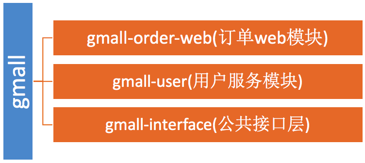

# 一、基础知识

## 1、分布式基础理论

### 1.1）、什么是分布式系统？

《分布式系统原理与范型》定义：

“分布式系统是若干独立计算机的集合，这些计算机对于用户来说就像单个相关系统”

分布式系统（distributed system）是建立在网络之上的软件系统。

 

随着互联网的发展，网站应用的规模不断扩大，常规的垂直应用架构已无法应对，分布式服务架构以及流动计算架构势在必行，亟需**一个治理系统**确保架构有条不紊的演进。

### 1.2）、发展演变

#### 单一应用架构

当网站流量很小时，只需一个应用，将所有功能都部署在一起，以减少部署节点和成本。此时，用于简化增删改查工作量的数据访问框架(ORM)是关键。

适用于小型网站，小型管理系统，将所有功能都部署到一个功能里，简单易用。

缺点： 1、性能扩展比较难 

​       2、协同开发问题

​       3、不利于升级维护

 

#### 垂直应用架构

当访问量逐渐增大，单一应用增加机器带来的加速度越来越小，将应用拆成互不相干的几个应用，以提升效率。此时，用于加速前端页面开发的Web框架(MVC)是关键。

   

通过切分业务来实现各个模块独立部署，降低了维护和部署的难度，团队各司其职更易管理，性能扩展也更方便，更有针对性。

缺点： 公用模块无法重复利用，开发性的浪费

#### 分布式服务架构

当垂直应用越来越多，应用之间交互不可避免，将核心业务抽取出来，作为独立的服务，逐渐形成稳定的服务中心，使前端应用能更快速的响应多变的市场需求。此时，用于提高业务复用及整合的**分布式服务框架****(RPC)**是关键。

   

#### 流动计算架构

当服务越来越多，容量的评估，小服务资源的浪费等问题逐渐显现，此时需增加一个调度中心基于访问压力实时管理集群容量，提高集群利用率。此时，用于**提高机器利用率的资源调度和治理中心****(SOA)[ Service Oriented Architecture]****是关键**。

   

 

 

### 1.3）、RPC

#### 什么叫RPC

RPC【Remote Procedure Call】是指远程过程调用，是一种进程间通信方式，他是一种技术的思想，而不是规范。它允许程序调用另一个地址空间（通常是共享网络的另一台机器上）的过程或函数，而不用程序员显式编码这个远程调用的细节。即程序员无论是调用本地的还是远程的函数，本质上编写的调用代码基本相同。

#### RPC基本原理

   

   

RPC两个核心模块：==通讯，序列化==。

 

## 2、dubbo核心概念

### 2.1）、简介

Apache Dubbo (incubating) |ˈdʌbəʊ| 是一款高性能、轻量级的开源Java RPC框架，它提供了三大核心能力：面向接口的远程方法调用，智能容错和负载均衡，以及服务自动注册和发现。

官网：

<http://dubbo.apache.org/>

### 2.2）、基本概念

   

**服务提供者（Provider****）**：暴露服务的服务提供方，服务提供者在启动时，向注册中心注册自己提供的服务。

**服务消费者（Consumer****）**: 调用远程服务的服务消费方，服务消费者在启动时，向注册中心订阅自己所需的服务，服务消费者，从提供者地址列表中，基于软负载均衡算法，选一台提供者进行调用，如果调用失败，再选另一台调用。

**注册中心（Registry****）**：注册中心返回服务提供者地址列表给消费者，如果有变更，注册中心将基于长连接推送变更数据给消费者

 **监控中心（Monitor****）**：服务消费者和提供者，在内存中累计调用次数和调用时间，定时每分钟发送一次统计数据到监控中心


**调用关系说明**

- l  服务容器负责启动，加载，运行服务提供者。
- l  服务提供者在启动时，向注册中心注册自己提供的服务。
- l  服务消费者在启动时，向注册中心订阅自己所需的服务。
- l  注册中心返回服务提供者地址列表给消费者，如果有变更，注册中心将基于长连接推送变更数据给消费者。
- l  服务消费者，从提供者地址列表中，基于软负载均衡算法，选一台提供者进行调用，如果调用失败，再选另一台调用。
- l  服务消费者和提供者，在内存中累计调用次数和调用时间，定时每分钟发送一次统计数据到监控中心。

使用dubbo前：


## 3、dubbo环境搭建

### 3.1）、【windows】-安装zookeeper

| 1、下载zookeeper   网址 <https://archive.apache.org/dist/zookeeper/zookeeper-3.4.13/> |
| ------------------------------------------------------------ |
| 2、解压zookeeper   解压运行zkServer.cmd ，初次运行会报错，没有zoo.cfg配置文件 |
| 3、修改zoo.cfg配置文件   将conf下的zoo_sample.cfg复制一份改名为zoo.cfg即可。   注意几个重要位置：   dataDir=./   临时数据存储的目录（可写相对路径）   clientPort=2181     zookeeper的端口号   修改完成后再次启动zookeeper |
| 4、使用zkCli.cmd测试   ls /：列出zookeeper根下保存的所有节点   create –e /atguigu 123：创建一个atguigu节点，值为123   get /atguigu：获取/atguigu节点的值 |

 

### 3.2）、【windows】-安装dubbo-admin管理控制台

dubbo本身并不是一个服务软件。它其实就是一个jar包能够帮你的java程序连接到zookeeper，并利用zookeeper消费、提供服务。所以你不用在Linux上启动什么dubbo服务。

但是为了让用户更好的管理监控众多的dubbo服务，官方提供了一个可视化的监控程序，不过这个监控即使不装也不影响使用。

| 1、下载dubbo-admin   <https://github.com/apache/incubator-dubbo-ops> |
| ------------------------------------------------------------ |
| 2、进入目录，修改dubbo-admin配置   修改 src\main\resources\application.properties 指定zookeeper地址 |
| 3、打包dubbo-admin   mvn clean package -Dmaven.test.skip=true |
| 4、运行dubbo-admin   java -jar dubbo-admin-0.0.1-SNAPSHOT.jar   **注意：【有可能控制台看着启动了，但是网页打不开，需要在控制台按下****ctrl+c****即可】**   默认使用root/root 登陆 |

 

### 3.3）、【linux】-安装zookeeper

#### 1、安装jdk

| 1、下载jdk   <http://www.oracle.com/technetwork/java/javase/downloads/jdk8-downloads-2133151.html>             不要使用wget命令获取jdk链接，这是默认不同意，导致下载来的jdk压缩内容错误 |
| ------------------------------------------------------------ |
| 2、上传到服务器并解压                                        |
| 3、设置环境变量   /usr/local/java/jdk1.8.0_171             文件末尾加入下面配置   export JAVA_HOME=/usr/local/java/jdk1.8.0_171   export JRE_HOME=${JAVA_HOME}/jre   export CLASSPATH=.:${JAVA_HOME}/lib:${JRE_HOME}/lib   export PATH=${JAVA_HOME}/bin:$PATH |
| 4、使环境变量生效&测试JDK                                    |

 

#### 2、安装zookeeper

| 1、下载zookeeper   网址 <https://archive.apache.org/dist/zookeeper/zookeeper-3.4.11/>      wget <https://archive.apache.org/dist/zookeeper/zookeeper-3.4.11/zookeeper-3.4.11.tar.gz> |
| ------------------------------------------------------------ |
| 2、解压                                                      |
| 3、移动到指定位置并改名为zookeeper                           |

 

 

#### 3、开机启动zookeeper

   1）-复制如下脚本   #!/bin/bash   #chkconfig:2345 20 90   #description:zookeeper   #processname:zookeeper   ZK_PATH=/usr/local/zookeeper   export JAVA_HOME=/usr/local/java/jdk1.8.0_171   case $1 in              start) sh    $ZK_PATH/bin/zkServer.sh start;;              stop)  sh  $ZK_PATH/bin/zkServer.sh stop;;              status) sh    $ZK_PATH/bin/zkServer.sh status;;              restart) sh $ZK_PATH/bin/zkServer.sh restart;;              *)  echo "require   start|stop|status|restart"  ;;   esac                     2）-把脚本注册为Service                 3）-增加权限             

 

#### 4、配置zookeeper

| 1、初始化zookeeper配置文件   拷贝/usr/local/zookeeper/conf/zoo_sample.cfg      到同一个目录下改个名字叫zoo.cfg |
| ------------------------------------------------------------ |
| 2、启动zookeeper                                             |

 

### 3.4）、【linux】-安装dubbo-admin管理控制台

#### 1、安装Tomcat8（旧版dubbo-admin是war，新版是jar不需要安装Tomcat）

| 1、下载Tomcat8并解压   <https://tomcat.apache.org/download-80.cgi>   wget <http://mirrors.shu.edu.cn/apache/tomcat/tomcat-8/v8.5.32/bin/apache-tomcat-8.5.32.tar.gz> |
| ------------------------------------------------------------ |
| 2、解压移动到指定位置                                        |
| 3、开机启动tomcat8             复制如下脚本   #!/bin/bash   #chkconfig:2345 21 90   #description:apache-tomcat-8   #processname:apache-tomcat-8   CATALANA_HOME=/opt/apache-tomcat-8.5.32   export JAVA_HOME=/opt/java/jdk1.8.0_171   case $1 in   start)       echo   "Starting Tomcat..."           $CATALANA_HOME/bin/startup.sh       ;;       stop)       echo   "Stopping Tomcat..."           $CATALANA_HOME/bin/shutdown.sh       ;;       restart)       echo   "Stopping Tomcat..."           $CATALANA_HOME/bin/shutdown.sh       sleep 2       echo         echo   "Starting Tomcat..."           $CATALANA_HOME/bin/startup.sh       ;;   *)       echo   "Usage: tomcat {start\|stop\|restart}"         ;; esac |
| 4、注册服务&添加权限                                         |
| 5、启动服务&访问tomcat测试                                   |

 

#### 2、安装dubbo-admin

dubbo本身并不是一个服务软件。它其实就是一个jar包能够帮你的java程序连接到zookeeper，并利用zookeeper消费、提供服务。所以你不用在Linux上启动什么dubbo服务。

但是为了让用户更好的管理监控众多的dubbo服务，官方提供了一个可视化的监控程序，不过这个监控即使不装也不影响使用。

| 1、下载dubbo-admin   <https://github.com/apache/incubator-dubbo-ops> |
| ------------------------------------------------------------ |
| 2、进入目录，修改dubbo-admin配置   修改 src\main\resources\application.properties 指定zookeeper地址 |
| 3、打包dubbo-admin   mvn clean package -Dmaven.test.skip=true |
| 4、运行dubbo-admin   java -jar dubbo-admin-0.0.1-SNAPSHOT.jar   默认使用root/root 登陆 |

 

 

 

 

## 4、dubbo-helloworld

### 4.1）、提出需求

某个电商系统，订单服务需要调用用户服务获取某个用户的所有地址；

我们现在 需要创建两个服务模块进行测试 

| 模块                | 功能           |
| ------------------- | -------------- |
| 订单服务web模块     | 创建订单等     |
| 用户服务service模块 | 查询用户地址等 |

测试预期结果：

​                  订单服务web模块在A服务器，用户服务模块在B服务器，A可以远程调用B的功能。

### 4.2）、工程架构

根据 dubbo《服务化最佳实践》 

#### 1、分包

建议将==服务接口，服务模型，服务异常==等均放在 API 包中，因为服务模型及异常也是 API 的一部分，同时，这样做也符合分包原则：重用发布等价原则(REP)，共同重用原则(CRP)。

如果需要，也可以考虑在 API 包中放置一份 spring 的引用配置，这样使用方，只需在 spring 加载过程中引用此配置即可，配置建议放在模块的包目录下，以免冲突，如：com/alibaba/china/xxx/dubbo-reference.xml。

#### 2、粒度

服务接口尽可能大粒度，每个服务方法应代表一个功能，而不是某功能的一个步骤，否则将面临分布式事务问题，Dubbo 暂未提供分布式事务支持。

服务接口建议以业务场景为单位划分，并对相近业务做抽象，防止接口数量爆炸。

不建议使用过于抽象的通用接口，如：Map query(Map)，这样的接口没有明确语义，会给后期维护带来不便。

  

### 4.3）、创建模块

#### 1、gmall-interface：

公共接口层（model，service，exception…）

作用：定义公共接口，也可以导入公共依赖 

```java
//1、Bean模型
public class UserAddress implements Serializable{
    private Integer id;
    private String userAddress;
    private String userId;
    private String consignee;
    private String phoneNum;
    private String isDefault;
}
```

```java
//3、Service接口
//UserService
public List<UserAddress> getUserAddressList(String userId)
```


#### 2、gmall-user：

用户模块（对用户接口的实现）

```xml
<!--pom.xml-->
  <dependencies>
  	<dependency>
  		<groupId>com.atguigu.dubbo</groupId>
  		<artifactId>gmall-interface</artifactId>
  		<version>0.0.1-SNAPSHOT</version>
  	</dependency>
  </dependencies>
```

```java
//2、Service
public class UserServiceImpl implements UserService {
	@Override
	public List<UserAddress> getUserAddressList(String userId) {
		// TODO Auto-generated method stub
		return userAddressDao.getUserAddressById(userId);
	}
} 
```

#### 4、gmall-order-web：

订单模块（调用用户模块）

 

```xml
<!--pom.xml-->
<dependencies>
  	<dependency>
  		<groupId>com.atguigu.dubbo</groupId>
  		<artifactId>gmall-interface</artifactId>
  		<version>0.0.1-SNAPSHOT</version>
  	</dependency>
   </dependencies>
```

```java
public class OrderService {
	
	UserService userService;
	/**
	 * 初始化订单，查询用户的所有地址并返回
	 * @param userId
	 * @return
	 */
	public List<UserAddress> initOrder(String userId){
		return userService.getUserAddressList(userId);
	}
}
```

现在这样是==无法进行调用==的。我们gmall-order-web引入了gmall-interface，但是interface的实现是gmall-user，我们并没有引入，而且实际他可能还在别的服务器中。

### 4.4）、使用dubbo改造

#### 1、改造gmall-user作为服务提供者

1、引入dubbo

```xml
		<!-- 引入dubbo -->
		<dependency>
			<groupId>com.alibaba</groupId>
			<artifactId>dubbo</artifactId>
			<version>2.6.2</version>
		</dependency>
	<!-- 由于我们使用zookeeper作为注册中心，所以需要操作zookeeper
dubbo 2.6以前的版本引入zkclient操作zookeeper 
dubbo 2.6及以后的版本引入curator操作zookeeper
下面两个zk客户端根据dubbo版本2选1即可
-->
		<dependency>
			<groupId>com.101tec</groupId>
			<artifactId>zkclient</artifactId>
			<version>0.10</version>
		</dependency>
		<!-- curator-framework -->
		<dependency>
			<groupId>org.apache.curator</groupId>
			<artifactId>curator-framework</artifactId>
			<version>2.12.0</version>
		</dependency>
```

2、配置提供者

```xml
<!--当前应用的名字  -->
	<dubbo:application name="gmall-user"></dubbo:application>
	<!--指定注册中心的地址  -->
    <dubbo:registry address="zookeeper://118.24.44.169:2181" />
    <!--使用dubbo协议，将服务暴露在20880端口  -->
    <dubbo:protocol name="dubbo" port="20880" />
    <!-- 指定需要暴露的服务 -->
    <dubbo:service interface="com.atguigu.gmall.service.UserService" ref="userServiceImpl" />
```

```java
public static void main(String[] args) throws IOException {
		ClassPathXmlApplicationContext context = 
				new ClassPathXmlApplicationContext("classpath:spring-beans.xml");
		
		System.in.read(); 
	}
```

 

#### 2、改造gmall-order-web作为服务消费者

   1、引入dubbo    

```xml
		<!-- 引入dubbo -->
		<dependency>
			<groupId>com.alibaba</groupId>
			<artifactId>dubbo</artifactId>
			<version>2.6.2</version>
		</dependency>
	<!-- 由于我们使用zookeeper作为注册中心，所以需要引入zkclient和curator操作zookeeper -->
		<dependency>
			<groupId>com.101tec</groupId>
			<artifactId>zkclient</artifactId>
			<version>0.10</version>
		</dependency>
		<!-- curator-framework -->
		<dependency>
			<groupId>org.apache.curator</groupId>
			<artifactId>curator-framework</artifactId>
			<version>2.12.0</version>
		</dependency>

```

2、配置消费者信息 

```xml
<!-- 应用名 -->
	<dubbo:application name="gmall-order-web"></dubbo:application>
	<!-- 指定注册中心地址 -->
	<dubbo:registry address="zookeeper://118.24.44.169:2181" />
	<!-- 生成远程服务代理，可以和本地bean一样使用demoService -->
	<dubbo:reference id="userService" interface="com.atguigu.gmall.service.UserService"></dubbo:reference>
```

 

#### 3、测试调用

访问gmall-order-web的initOrder请求，会调用UserService获取用户地址；

调用成功。说明我们order已经可以调用远程的UserService了；

#### 4、注解版

1、服务提供方

```java
	<dubbo:application name="gmall-user"></dubbo:application>
    <dubbo:registry address="zookeeper://118.24.44.169:2181" />
    <dubbo:protocol name="dubbo" port="20880" />
	<dubbo:annotation package="com.atguigu.gmall.user.impl"/>

import com.alibaba.dubbo.config.annotation.Service;
import com.atguigu.gmall.bean.UserAddress;
import com.atguigu.gmall.service.UserService;
import com.atguigu.gmall.user.mapper.UserAddressMapper;

@Service //使用dubbo提供的service注解，注册暴露服务
public class UserServiceImpl implements UserService {
	@Autowired
	UserAddressMapper userAddressMapper;
```


```java
	<dubbo:application name="gmall-order-web"></dubbo:application>
	<dubbo:registry address="zookeeper://118.24.44.169:2181" />
	<dubbo:annotation package="com.atguigu.gmall.order.controller"/>

@Controller
public class OrderController {
	@Reference  //使用dubbo提供的reference注解引用远程服务
	UserService userService;
```

  

## 5、监控中心

### 5.1）、dubbo-admin

图形化的服务管理页面；安装时需要指定注册中心地址，即可从注册中心中获取到所有的提供者/消费者进行配置管理

### 5.2）、dubbo-monitor-simple

简单的监控中心；

#### 1、安装

| 1、下载 dubbo-ops   <https://github.com/apache/incubator-dubbo-ops> |
| ------------------------------------------------------------ |
| 2、修改配置指定注册中心地址   进入 dubbo-monitor-simple\src\main\resources\conf   修改 dubbo.properties文件<br />         dubbo.registry.address=zookeeper : // 注册中心IP和端口<br />          dobbo.jetty.port = 8080 |
| 3、打包dubbo-monitor-simple   mvn clean package -Dmaven.test.skip=true |
| 4、解压   tar.gz 文件，并运行start.bat             如果缺少servlet-api，自行导入servlet-api再访问监控中心 |
| 5、启动访问8080                                              |

 

#### 2、监控中心配置

   所有服务配置连接监控中心，进行监控统计       <!-- 监控中心协议，如果为protocol="registry"，表示从注册中心发现监控中心地址，否则直连监控中心 -->          <dubbo:monitor protocol=*"registry"*></dubbo:monitor>       

```xml
   <!-- 监控中心协议，如果为protocol="registry"，表示从注册中心发现监控中心地址，否则直连监控中心 -->          
   <dubbo:monitor protocol=*"registry"*></dubbo:monitor>       
```

Simple Monitor 挂掉不会影响到 Consumer 和 Provider 之间的调用，所以用于生产环境不会有风险。

Simple Monitor 采用磁盘存储统计信息，请注意安装机器的磁盘限制，如果要集群，建议用mount共享磁盘。

 

## 6、整合SpringBoot

1、引入**spring-boot-starter以及dubbo和curator的依赖**

```xml
<dependency>
    <groupId>com.alibaba.boot</groupId>
    <artifactId>dubbo-spring-boot-starter</artifactId>
    <version>0.2.0</version>
</dependency>
```

2、配置application.properties

```properties
#提供者配置：
dubbo.application.name=gmall-user
dubbo.registry.protocol=zookeeper
dubbo.registry.address=192.168.67.159:2181
dubbo.scan.base-package=com.atguigu.gmall
dubbo.protocol.name=dubbo
#application.name就是服务名，不能跟别的dubbo提供端重复
#registry.protocol 是指定注册中心协议
#registry.address 是注册中心的地址加端口号
#protocol.name 是分布式固定是dubbo,不要改。
#base-package  注解方式要扫描的包

#消费者配置：
dubbo.application.name=gmall-order-web
dubbo.registry.protocol=zookeeper
dubbo.registry.address=192.168.67.159:2181
dubbo.scan.base-package=com.atguigu.gmall
dubbo.protocol.name=dubbo
```

3、dubbo注解

==@Service==        dubbo注解，注册暴露服务

@Reference      dubbo注解，引用远程服务

【如果没有在配置中写dubbo.scan.base-package,还需要使用==@EnableDubbo==注解】 

# 二、dubbo配置

## 1、配置原则

   

JVM 启动 -D 参数优先，这样可以使用户在部署和启动时进行参数重写，比如在启动时需改变协议的端口。

XML 次之，如果在 XML 中有配置，则 dubbo.properties 中的相应配置项无效。

Properties 最后，相当于缺省值，只有 XML 没有配置时，dubbo.properties 的相应配置项才会生效，通常用于共享公共配置，比如应用名。

## 2、重试次数

失败自动切换，当出现失败，重试其它服务器，但重试会带来更长延迟。可通过 retries="2" 来设置重试次数(不含第一次)。

```xml
<dubbo:service retries="2" />
或
<dubbo:reference retries="2" />
或
<dubbo:reference>
    <dubbo:method name="findFoo" retries="2" />
</dubbo:reference>
```

   重试次数配置如下：   <dubbo:service retries="2" />   或   <dubbo:reference retries="2" />   或   <dubbo:reference>       <dubbo:method   name="findFoo" retries="2" />   </dubbo:reference>   

## 3、超时时间

由于网络或服务端不可靠，会导致调用出现一种不确定的中间状态（超时）。为了避免超时导致客户端资源（线程）挂起耗尽，必须设置超时时间。

### 1、Dubbo消费端 

```xml
全局超时配置
<dubbo:consumer timeout="5000" />

指定接口以及特定方法超时配置
<dubbo:reference interface="com.foo.BarService" timeout="2000">
    <dubbo:method name="sayHello" timeout="3000" />
</dubbo:reference>
```

   全局超时配置   <dubbo:consumer timeout="5000" />       指定接口以及特定方法超时配置   <dubbo:reference   interface="com.foo.BarService" timeout="2000">         <dubbo:method name="sayHello" timeout="3000"   />   </dubbo:reference>   

### 2、Dubbo服务端 

```xml
全局超时配置
<dubbo:provider timeout="5000" />

指定接口以及特定方法超时配置
<dubbo:provider interface="com.foo.BarService" timeout="2000">
    <dubbo:method name="sayHello" timeout="3000" />
</dubbo:provider>
```

 

### 3、配置原则

dubbo推荐在Provider上尽量多配置Consumer端属性：

   1、作服务的提供者，比服务使用方更清楚服务性能参数，如调用的超时时间，合理的重试次数，等等  

   2、在Provider配置后，Consumer不配置则会使用Provider的配置值，即Provider配置可以作为Consumer的缺省值。否则，Consumer会使用Consumer端的全局设置，这对于Provider不可控的，并且往往是不合理的  

**配置的覆盖规则：**

1) 方法级配置别优于接口级别，即小Scope优先 

2) Consumer端配置 优于 Provider配置 优于 全局配置，

3) 最后是Dubbo Hard Code的配置值（见配置文档）

   

 

## 4、版本号

当一个接口实现，出现不兼容升级时，可以用版本号过渡，版本号不同的服务相互间不引用。

可以按照以下的步骤进行版本迁移：

在低压力时间段，先升级一半提供者为新版本

再将所有消费者升级为新版本

然后将剩下的一半提供者升级为新版本

```xml
老版本服务提供者配置：
<dubbo:service interface="com.foo.BarService" version="1.0.0" />

新版本服务提供者配置：
<dubbo:service interface="com.foo.BarService" version="2.0.0" />

老版本服务消费者配置：
<dubbo:reference id="barService" interface="com.foo.BarService" version="1.0.0" />

新版本服务消费者配置：
<dubbo:reference id="barService" interface="com.foo.BarService" version="2.0.0" />

如果不需要区分版本，可以按照以下的方式配置：
<dubbo:reference id="barService" interface="com.foo.BarService" version="*" />
```

   老版本服务提供者配置：   <dubbo:service interface="com.foo.BarService"   version="1.0.0" />       新版本服务提供者配置：   <dubbo:service   interface="com.foo.BarService" version="2.0.0" />       老版本服务消费者配置：   <dubbo:reference id="barService"   interface="com.foo.BarService" version="1.0.0" />       新版本服务消费者配置：   <dubbo:reference id="barService"   interface="com.foo.BarService" version="2.0.0" />       如果不需要区分版本，可以按照以下的方式配置：   <dubbo:reference id="barService"   interface="com.foo.BarService" version="*" />   

# 三、高可用

## 1、zookeeper宕机与dubbo直连

现象：zookeeper注册中心宕机，还可以消费dubbo暴露的服务。

原因：

健壮性

- l  监控中心宕掉不影响使用，只是丢失部分采样数据
- l  数据库宕掉后，注册中心仍能通过缓存提供服务列表查询，但不能注册新服务
- l  注册中心对等集群，任意一台宕掉后，将自动切换到另一台
- l  **注册中心全部宕掉后，服务提供者和服务消费者仍能通过本地缓存通讯**
- l  服务提供者无状态，任意一台宕掉后，不影响使用
- 服务提供者全部宕掉后，服务消费者应用将无法使用，并无限次重连等待服务提供者恢复

   健壮性   l  监控中心宕掉不影响使用，只是丢失部分采样数据   l  数据库宕掉后，注册中心仍能通过缓存提供服务列表查询，但不能注册新服务   l  注册中心对等集群，任意一台宕掉后，将自动切换到另一台   l  **注册中心全部宕掉后，服务提供者和服务消费者仍能通过本地缓存通讯**   l  服务提供者无状态，任意一台宕掉后，不影响使用   l  服务提供者全部宕掉后，服务消费者应用将无法使用，并无限次重连等待服务提供者恢复       

高可用：通过设计，减少系统不能提供服务的时间；


## 2、集群下dubbo负载均衡配置

在集群负载均衡时，Dubbo 提供了多种均衡策略，缺省为==random 随机调用==。

负载均衡策略

###Random LoadBalance

默认的，基于权重的随机负载均衡机制

==随机==，按权重设置随机概率。假设3台机器提供服务，根据权重大约算出请求落在每台机器的概率

在一个截面上碰撞的概率高，但调用量越大分布越均匀，而且按概率使用权重后也比较均匀，有利于动态调整提供者权重。


###RoundRobin LoadBalance

==轮循==，按公约后的权重设置轮循比率。

存在慢的提供者==累积请求==的问题，比如：第二台机器很慢，但没挂，当请求调到第二台时就卡在那，久而久之，所有请求都卡在调到第二台上。


###LeastActive LoadBalance**

==最少活跃调用数，相同活跃数的随机==

活跃数指调用前后计数差。

使慢的提供者收到更少请求，因为越慢的提供者的调用前后计数差会越大。

###ConsistentHash LoadBalance

==一致性 Hash==，相同参数的请求总是发到同一提供者。

当某一台提供者挂时，原本发往该提供者的请求，基于虚拟节点，平摊到其它提供者，不会引起剧烈变动。算法参见：http://en.wikipedia.org/wiki/Consistent_hashing

缺省只对==第一个参数 Hash==，如果要**修改**，请配置

```
 <dubbo:parameter key="hash.arguments" value="0,1" />
```

缺省用 160 份虚拟节点，如果要修改，请配置

```
 <dubbo:parameter key="hash.nodes" value="320" />
```

**xml 配置方式**

服务端服务级别

```
<dubbo:service interface="..." loadbalance="roundrobin" />
```

客户端服务级别

```
<dubbo:reference interface="..." loadbalance="roundrobin" />
```

服务端方法级别

```
<dubbo:service interface="...">
    <dubbo:method name="..." loadbalance="roundrobin"/>
</dubbo:service>
```

客户端方法级别

```
<dubbo:reference interface="...">
    <dubbo:method name="..." loadbalance="roundrobin"/>
</dubbo:reference>
```

**注解配置方式：**

消费方基于基于注解的服务级别配置方式：

```
@Reference(loadbalance = "roundrobin")
HelloService helloService;
```


## 3、整合hystrix，服务熔断与降级处理

### 1、服务降级

**什么是服务降级？**

**当服务器压力剧增的情况下，根据实际业务情况及流量，对一些服务和页面有策略的不处理或换种简单的方式处理，从而释放服务器资源以保证核心交易正常运作或高效运作。**

可以通过服务降级功能临时屏蔽某个出错的非关键服务，并定义降级后的返回策略。

向注册中心写入动态配置覆盖规则：

```properties
RegistryFactory registryFactory = ExtensionLoader.getExtensionLoader(RegistryFactory.class).getAdaptiveExtension();
Registry registry = registryFactory.getRegistry(URL.valueOf("zookeeper://10.20.153.10:2181"));
registry.register(URL.valueOf("override://0.0.0.0/com.foo.BarService?category=configurators&dynamic=false&application=foo&mock=force:return+null"));
```

   RegistryFactory   registryFactory =   ExtensionLoader.getExtensionLoader(RegistryFactory.class).getAdaptiveExtension();   Registry registry   =   registryFactory.getRegistry(URL.valueOf("zookeeper://10.20.153.10:2181"));   registry.register(URL.valueOf("override://0.0.0.0/com.foo.BarService?category=configurators&dynamic=false&application=foo&mock=force:return+null"));   

- mock=force:return+null 表示消费方对该服务的方法调用都直接返回 null 值，不发起远程调用。用来屏蔽不重要服务不可用时对调用方的影响。
- 还可以改为 mock=fail:return+null 表示消费方对该服务的方法调用在失败后，再返回 null 值，不抛异常。用来容忍不重要服务不稳定时对调用方的影响。


### 2、集群容错

在集群调用失败时，Dubbo 提供了多种容错方案，缺省为 ==failover 重试==。

**集群模式配置**

按照以下示例在服务提供方和消费方配置集群模式

```xml
<dubbo:service cluster="failsafe" />
或
<dubbo:reference cluster="failsafe" />
```

**集群容错模式**

####Failover Cluster

==失败自动切换==，当出现失败，重试其它服务器。通常用于读操作，但重试会带来更长延迟。可通过 retries="2" 来设置重试次数(不含第一次)。

重试次数配置如下：

```xml
<dubbo:service retries="2" />
或
<dubbo:reference retries="2" />
或
<dubbo:reference>
    <dubbo:method name="findFoo" retries="2" />
</dubbo:reference>
```

####Failfast Cluster**

快速失败，只发起一次调用，失败立即报错。通常用于非幂等性的写操作，比如新增记录。

####Failsafe Cluster**

失败安全，出现异常时，直接忽略。通常用于写入审计日志等操作。

####Failback Cluster

失败自动恢复，后台记录失败请求，定时重发。通常用于消息通知操作。

####Forking Cluster

并行调用多个服务器，只要一个成功即返回。通常用于实时性要求较高的读操作，但需要浪费更多服务资源。可通过 forks="2" 来设置最大并行数。

####Broadcast Cluster

广播调用所有提供者，逐个调用，任意一台报错则报错

通常用于通知所有提供者更新缓存或日志等本地资源信息。 

### 3、整合hystrix

Hystrix 旨在通过控制那些访问远程系统、服务和第三方库的节点，从而对延迟和故障提供更强大的容错能力。Hystrix具备拥有回退机制和断路器功能的线程和信号隔离，请求缓存和请求打包，以及监控和配置等功能

#### 1、配置spring-cloud-starter-netflix-hystrix

spring boot官方提供了对hystrix的集成，直接在pom.xml里加入依赖：

```xml
<dependency>
            <groupId>org.springframework.cloud</groupId>
            <artifactId>spring-cloud-starter-netflix-hystrix</artifactId>
            <version>1.4.4.RELEASE</version>
        </dependency>
```

 然后在Application类上增加@EnableHystrix来启用hystrix starter：

```java
@SpringBootApplication
@EnableHystrix
public class ProviderApplication {

```

   @SpringBootApplication   @EnableHystrix   public class ProviderApplication {       

```

```

#### 2、配置Provider端

在Dubbo的Provider上增加==@HystrixCommand配置==，这样子调用就会经过Hystrix代理。

```java
@Service(version = "1.0.0")
public class HelloServiceImpl implements HelloService {
    @HystrixCommand(commandProperties = {
     @HystrixProperty(name = "circuitBreaker.requestVolumeThreshold", value = "10"),
     @HystrixProperty(name = "execution.isolation.thread.timeoutInMilliseconds", value = "2000") })
    @Override
    public String sayHello(String name) {
        // System.out.println("async provider received: " + name);
        // return "annotation: hello, " + name;
        throw new RuntimeException("Exception to show hystrix enabled.");
    }
}
```

   @Service(version = "1.0.0")   public class HelloServiceImpl implements   HelloService {         @HystrixCommand(commandProperties = {        @HystrixProperty(name   = "circuitBreaker.requestVolumeThreshold", value = "10"),        @HystrixProperty(name   = "execution.isolation.thread.timeoutInMilliseconds", value =   "2000") })       @Override       public   String sayHello(String name) {           //   System.out.println("async provider received: " + name);           //   return "annotation: hello, " + name;           throw   new RuntimeException("Exception to show hystrix enabled.");       }   }   

```

```

#### 3、配置Consumer端

对于Consumer端，则可以增加一层method调用，并在method上配置@HystrixCommand。当调用出错时，会走到fallbackMethod = "reliable"的调用里。

```java
@Reference(version = "1.0.0")
    private HelloService demoService;

    @HystrixCommand(fallbackMethod = "reliable")
    public String doSayHello(String name) {
        return demoService.sayHello(name);
    }
    public String reliable(String name) {
        return "hystrix fallback value";
    }
```

​         @Reference(version = "1.0.0")       private   HelloService demoService;             @HystrixCommand(fallbackMethod = "reliable")       public   String doSayHello(String name) {           return   demoService.sayHello(name);       }       public   String reliable(String name) {           return   "hystrix fallback value";       }   


