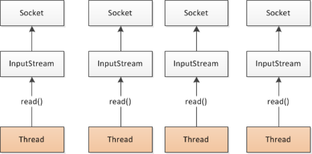
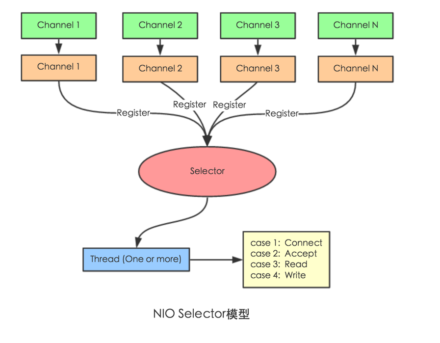

## 1、RPC原理

###RPC流程

<http://www.importnew.com/22003.html>

   

一次完整的RPC调用流程（同步调用，异步另说）如下： 

1. 服务消费方（client）调用以==本地调用==方式调用服务；
2. client stub接收到调用后负责将方法、参数等组装成能够进行网络传输的消息体； 
3. client stub找到服务地址，并将消息发送到服务端； 
4. server stub收到消息后进行解码； 
5. server stub根据解码结果调用本地的服务； 
6. 本地服务执行并将结果返回给server stub； 
7. server stub将返回结果打包成消息并发送至消费方； 
8. client stub接收到消息，并进行解码； 
9. 服务消费方得到最终结果。**

RPC框架的目标就是要==2~8==这些步骤都封装起来，这些细节对用户来说是透明的，不可见的。


### RPC异步调用


### dubbo支持的协议

默认使用dubbo协议，也支持其他：

rmi协议：

​	走java二进制序列化，多个短连接，适合消费者和提供者数量差不多，适用于文件的传输，一般较少用

hessian协议：

​	走hessian序列化协议，多个短连接，适用于提供者数量比消费者数量还多，适用于文件的传输，一般较少用

http协议

​	走json序列化

### SOA架构

SOA 面向服务的架构：把工程拆分成==服务层==、==表现层==两个工程。服务层中包含业务逻辑只对外提供服务。表现层处理和页面的交互。

SOA中有两个主要角色：==服务提供者（Provider）和服务使用者（Consumer）==

服务调用可以HTTP，为何要用dubbo？

服务治理！

1. **负载均衡**——同一个服务部署在不同的机器时该调用那一台机器上的服务。
2. **服务调用链路生成**——随着系统的发展，服务越来越多，服务间依赖关系变得错踪复杂，甚至分不清哪个应用要在哪个应用之前启动，架构师都不能完整的描述应用的架构关系。Dubbo 可以为我们解决服务之间互相是如何调用的。
3. **服务访问压力以及时长统计、资源调度和治理**——基于访问压力实时管理集群容量，提高集群利用率。
4. **服务降级**——某个服务挂掉之后调用备用服务。


## 2、netty通信原理

Netty是一个异步事件驱动的网络应用程序框架， 用于快速开发可维护的高性能协议服务器和客户端。它极大地简化并简化了TCP和UDP套接字服务器等网络编程。

BIO：(Blocking IO)

   

NIO (Non-Blocking IO)

   

Selector 一般称 为**选择器** ，也可以翻译为 **多路复用器，**

Connect（连接就绪）、Accept（接受就绪）、Read（读就绪）、Write（写就绪）

Netty基本原理：

   

 

## dubbo架构


- **Provider：** 暴露服务的服务提供方
- **Consumer：** 调用远程服务的服务消费方
- **Registry：** 服务注册与发现的注册中心
- **Monitor：** 统计服务的调用次数和调用时间的监控中心
- **Container：** 服务运行容器

调用关系：

1. 服务容器负责启动，加载，运行服务提供者。
2. 服务提供者在启动时，向注册中心注册自己提供的服务。
3. 服务消费者在启动时，向注册中心订阅自己所需的服务。
4. 注册中心返回服务提供者地址列表给消费者，如果有变更，注册中心将基于==长连接==推送变更数据给消费者。
5. 服务消费者，从提供者地址列表中，基于==软负载==均衡算法，选一台提供者进行调用，如果调用失败，再选另一台调用。
6. 服务消费者和提供者，在内存中累计调用次数和调用时间，定时每分钟发送一次统计数据到监控中心。

关键点：

- **注册中心负责服务地址的注册与查找，相当于目录服务，服务提供者和消费者只在启动时与注册中心交互，注册中心不转发请求，压力较小**
- **监控中心负责统计各服务调用次数，调用时间等，统计先在内存汇总后每分钟一次发送到监控中心服务器，并以报表展示**
- **注册中心，服务提供者，服务消费者三者之间均为长连接，监控中心除外**
- **注册中心通过长连接感知服务提供者的存在，服务提供者宕机，注册中心将立即推送事件通知消费者**
- **注册中心和监控中心全部宕机，不影响已运行的提供者和消费者，消费者在本地缓存了提供者列表**
- **注册中心和监控中心都是可选的，服务消费者可以直连服务提供者**
- **服务提供者无状态，任意一台宕掉后，不影响使用**
- **服务提供者全部宕掉后，服务消费者应用将无法使用，并无限次重连等待服务提供者恢复**


## 3、dubbo原理

### 为什么用dubbo不是http

dubbo可以服务治理，比如负载均衡，降级熔断等等


### 1、dubbo原理  -框架设计 


- ==service层==，接口层，给服务提供者和消费者来实现
- ==config 配置层==：对外配置接口，以 ServiceConfig, ReferenceConfig 为中心，可以直接初始化配置类，也可以通过 spring 解析配置生成配置类
- ==proxy 服务代理层==：服务接口透明代理，生成服务的客户端 Stub 和服务器端 Skeleton, 以 ServiceProxy 为中心，扩展接口为 ProxyFactory
- ==registry 注册中心层==：封装服务地址的注册与发现，以服务 URL 为中心，扩展接口为 RegistryFactory, Registry, RegistryService
- ==cluster 路由层==：封装多个提供者的路由及负载均衡，并桥接注册中心，以 Invoker 为中心，扩展接口为 Cluster, Directory, Router, LoadBalance
- ==monitor 监控层==：RPC 调用次数和调用时间监控，以 Statistics 为中心，扩展接口为 MonitorFactory, Monitor, MonitorService
- ==protocol 远程调用层==：封装 RPC 调用，以 Invocation, Result 为中心，扩展接口为 Protocol, Invoker, Exporter
- ==exchange 信息交换层==：封装请求响应模式，同步转异步，以 Request, Response 为中心，扩展接口为 Exchanger, ExchangeChannel, ExchangeClient, ExchangeServer
- ==transport 网络传输层==：抽象 mina 和 netty 为统一接口，以 Message 为中心，扩展接口为 Channel, Transporter, Client, Server, Codec
- ==serialize 数据序列化层==：可复用的一些工具，扩展接口为 Serialization, ObjectInput, ObjectOutput, ThreadPool


### 2、dubbo原理  -启动解析、加载配置信息 

   

### 3、dubbo原理  -服务暴露

   

### 4、dubbo原理  -服务引用

   

### 5、dubbo原理  -服务调用

   

 

### 6、集群下dubbo负载均衡配置

在集群负载均衡时，Dubbo 提供了多种均衡策略，缺省为==random 随机调用==。

负载均衡策略

#### Random LoadBalance

默认的，基于权重的随机负载均衡机制

==随机==，按权重设置随机概率。假设3台机器提供服务，根据权重大约算出请求落在每台机器的概率

在一个截面上碰撞的概率高，但调用量越大分布越均匀，而且按概率使用权重后也比较均匀，有利于动态调整提供者权重。


#### RoundRobin LoadBalance

==轮循==，按公约后的权重设置轮循比率。

存在慢的提供者==累积请求==的问题，比如：第二台机器很慢，但没挂，当请求调到第二台时就卡在那，久而久之，所有请求都卡在调到第二台上。


#### LeastActive LoadBalance**

==最少活跃调用数，相同活跃数的随机==

活跃数指调用前后计数差。

使慢的提供者收到更少请求，因为越慢的提供者的调用前后计数差会越大。

#### ConsistentHash LoadBalance

==一致性 Hash==，相同参数的请求总是发到同一提供者。

当某一台提供者挂时，原本发往该提供者的请求，基于虚拟节点，平摊到其它提供者，不会引起剧烈变动。算法参见：http://en.wikipedia.org/wiki/Consistent_hashing

缺省只对==第一个参数 Hash==，如果要**修改**，请配置

```
 <dubbo:parameter key="hash.arguments" value="0,1" />
```

缺省用 160 份虚拟节点，如果要修改，请配置

```
 <dubbo:parameter key="hash.nodes" value="320" />
```

**xml 配置方式**

服务端服务级别

```
<dubbo:service interface="..." loadbalance="roundrobin" />
```

客户端服务级别

```
<dubbo:reference interface="..." loadbalance="roundrobin" />
```

服务端方法级别

```
<dubbo:service interface="...">
    <dubbo:method name="..." loadbalance="roundrobin"/>
</dubbo:service>
```

客户端方法级别

```
<dubbo:reference interface="...">
    <dubbo:method name="..." loadbalance="roundrobin"/>
</dubbo:reference>
```

**注解配置方式：**

消费方基于基于注解的服务级别配置方式：

```
@Reference(loadbalance = "roundrobin")
HelloService helloService;
```


## zookeeper宕机与dubbo直连的情况

zookeeper宕机与dubbo直连的情况在面试中可能会被经常问到，所以要引起重视。

在实际生产中，假如zookeeper注册中心宕掉，一段时间内服务消费方还是能够调用提供方的服务的，实际上它使用的本地缓存进行通讯，这只是dubbo健壮性的一种体现。

**dubbo的健壮性表现：**

1. 监控中心宕掉不影响使用，只是丢失部分采样数据
2. 数据库宕掉后，注册中心仍能通过缓存提供服务列表查询，但不能注册新服务
3. 注册中心对等集群，任意一台宕掉后，将自动切换到另一台
4. 注册中心全部宕掉后，服务提供者和服务消费者仍能通过本地缓存通讯
5. 服务提供者无状态，任意一台宕掉后，不影响使用
6. 服务提供者全部宕掉后，服务消费者应用将无法使用，并无限次重连等待服务提供者恢复

我们前面提到过：注册中心负责服务地址的注册与查找，相当于目录服务，服务提供者和消费者只在启动时与注册中心交互，注册中心不转发请求，压力较小。所以，我们可以完全可以绕过注册中心——采用 **dubbo 直连** ，即在服务消费方配置服务提供方的位置信息。

**xml配置方式：**

```
<dubbo:reference id="userService" interface="com.zang.gmall.service.UserService" url="dubbo://localhost:20880" />
```

**注解方式：**

```
 @Reference(url = "127.0.0.1:20880")   
 HelloService helloService;
```

