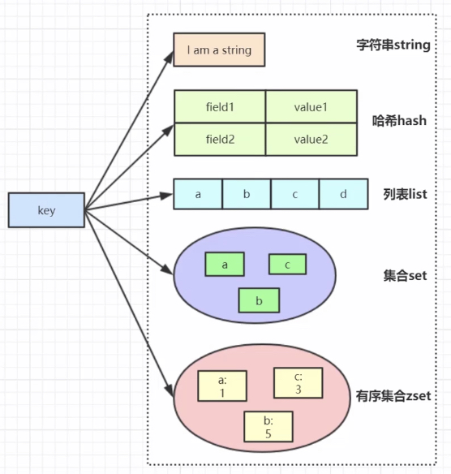
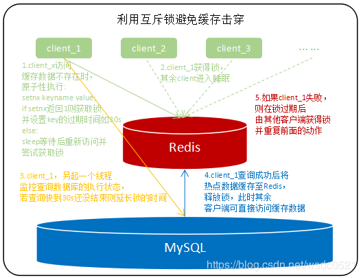
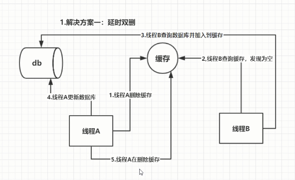

##redis 简介

- 是一种nosql，对比关系型数据库，没有表和列的概念，存储时可以不局限于表的字段。
- **内存型数据库**，响应速度快（读11万次/秒，写8万次/秒），广泛用来做缓存
- Redis是用C语言开发的一个开源的高性能键值对（key-value）数据库，数据类型：字符串类型、散列类型、列表类型、集合类型、有序集合类型
- 操作原子性，并发操作保证安全
- 支持持久化和数据备份，支持事务，常用来做分布式锁
- 因为非关系型，想进行联合查询，统计等来讲没有关系型好用

##redis数据类型：



字符串类型：key-value

hash类型：key-field-value【一个key可以有多个field，可用来存对象，key为对象名，field为属性，value为值】

列表类型：list，有序字符串列表，双向存取，基于双向链表实现，可实现消息队列功能。lpush+lpop 实现栈；lpush+rpop实现队列；

集合类型：set，不允许重复元素集合

有序集合类型：key-score-member，元素按照score，也就是权重进行排序


其他：

​	HyperLog：超级日志，字符串类型的改进，可用作大数据量计算唯一性的场景，统计大量的唯一的数据。比如统计某产品每天的独立用户数，或者某篇文章每天的独立点击数

​	BitMap：位图，是在字符串类型上定义的一组面向位的操作。比如海量数据表示是和否


## 有序集合Sorted Set

采用跳表的数据结构，

##redis常用命令

exist key：判断key是否存在

del key：删除key

expire key ：设置过期时间

ttl key：查询key剩余时间

string：set、setnx、get、incr、decr

hash：hset key field value，hget、hdel

set：sadd key member [member ...]、sinter（交集）

list：lpush、rpush，lpop、rpop

sorted set：zadd key score member [score member ...]（向有序集合中加入一个元素和该元素的分数，如果该元素已经存在则会用新的分数替换原有的分数。返回值是新加入到集合中的元素个数，不包含之前已经存在的元素）

##redis架构模式

单机：无法高可用

主从：允许一主多从，能缓解读压力无法缓解写压力

哨兵：不断检查主从服务器是否正常，当一个主服务器不能正常工作，哨兵会将一个从服务器晋升为主服务器，原来的主变成从

集群：多主多从，自带哨兵。集群的多个主使用哈希槽，分散写压力。数据异步复制，不能保证数据强一致


##  redis缓存

**高性能：** 将查询的数据放到缓存，再次查询时直接从缓存中获取。如果数据库中更新数据，需要同步到缓存

**高并发：** 由于操作缓存的并发数远大于访问数据库的


### 为什么用 redis ?


>下面的内容来自 segmentfault 一位网友的提问，地址：https://segmentfault.com/q/1010000009106416

缓存分为本地缓存和分布式缓存。以 Java 为例，使用自带的 map 或者 guava 实现的是本地缓存，最主要的特点是轻量以及快速，生命周期随着 jvm 的销毁而结束，并且在多实例的情况下，每个实例都需要各自保存一份缓存，缓存不具有一致性。

使用 redis 或 memcached 之类的称为分布式缓存，在多实例的情况下，各实例共用一份缓存数据，缓存具有一致性。缺点是需要保持 redis 或  memcached服务的高可用，整个程序架构上较为复杂。


## redis为什么是key，value的，为什么不是支持SQL的？

NOsql数据库


redis是多线程还是单线程？（回答单线程的请回吧，为什么请回，请往下看）

redis如果做集群该如何规划？AKF/CAP如何实现和设计？

10万用户一年365天的登录情况如何用redis存储，并快速检索任意时间窗内的活跃用户？

redis的5种Value类型你用过几种，能举例吗？

100万并发4G数据，10万并发400G数据，如何设计Redis存储方式？


## redis 的线程模型

> 参考地址:https://www.javazhiyin.com/22943.html

redis 内部使用**文件事件处理器** `file event handler`，这个文件事件处理器是单线程的，所以 redis 才叫做**单线程的模型**。

它采用 IO 多路复用机制同时监听多个 socket，根据 socket 上的事件来选择对应的事件处理器进行处理。

文件事件处理器的结构包含 4 个部分：

- 多个 socket
- IO 多路复用程序
- 文件事件分派器
- 事件处理器（连接应答处理器、命令请求处理器、命令回复处理器）

多个 socket 可能会并发产生不同的操作，每个操作对应不同的文件事件，但是 IO 多路复用程序会监听多个 socket，会将 socket 产生的事件放入队列中排队，事件分派器每次从队列中取出一个事件，把该事件交给对应的事件处理器进行处理。

### IO多路复用机制

redis快的原因：基于内存；IO多路复用

一个服务端进程可以同时处理多个套接字请求，可以分 **select->poll→epoll** 三个阶段来描述

Redis 服务器是一个事件驱动程序， 服务器处理的事件分为时间事件和文件事件两类。

- **文件事件**：Redis 主进程中，主要处理客户端的连接请求与相应。
- **时间事件**：fork 出的子进程中，处理如 AOF 持久化任务等。


###  redis 和 memcached 的区别

对于 redis 和 memcached 我总结了下面四点。现在公司一般都是用 redis 来实现缓存，而且 redis 自身也越来越强大了！

1. **redis支持更丰富的数据类型（支持更复杂的应用场景）**：Redis不仅仅支持简单的k/v类型的数据，同时还提供list，set，zset，hash等数据结构的存储。memcache支持简单的数据类型，String。
2. **Redis支持数据的持久化，可以将内存中的数据保持在磁盘中，重启的时候可以再次加载进行使用,而Memecache把数据全部存在内存之中。**
3. **集群模式**：memcached没有原生的集群模式，需要依靠客户端来实现往集群中分片写入数据；但是 redis 目前是原生支持 cluster 模式的.
4. **Memcached是多线程，非阻塞IO复用的网络模型；Redis使用单线程的多路 IO 复用模型。**


> 来自网络上的一张图，这里分享给大家！


## redis 常见数据结构以及使用场景分析

#### 1.String

> **常用命令:**  set,get，decr，incr（数值递增）,mget ，del（删除）

```c
//赋值
	SET key value
	127.0.0.1:6379> set test 123
//取值
赋值与取值： 
	127.0.0.1:6379> get test
//删除
	127.0.0.1:6379> del test
//递增数字 
//当存储的字符串是整数时，Redis提供了一个实用的命令INCR，其作用是让当前键值递增，并返回递增后的值。 
	127.0.0.1:6379> incr num
	(integer) 1
	127.0.0.1:6379> incr num
	(integer) 2
//增加指定的整数 
	127.0.0.1:6379> incrby num 2
	(integer) 4
//递减数值
	DECR key
//减少指定的整数 
	DECRBY key decrement
//向尾部追加值 
//APPEND的作用是向键值的末尾追加value。如果键不存在则将该键的值设置为value，即相当于 SET key value。返回值是追加后字符串的总长度。 
	127.0.0.1:6379> set str hello
	127.0.0.1:6379> append str " world!"
	127.0.0.1:6379> get str 
		"hello world!"
//获取字符串长度 
//STRLEN命令返回键值的长度，如果键不存在则返回0。 
	127.0.0.1:6379> strlen str 
	(integer) 5

//同时设置/获取多个键值 
	127.0.0.1:6379> mset k1 v1 k2 v2 k3 v3
	127.0.0.1:6379> mget k1 k3
		1) "v1"
		2) "v3"
```

String数据结构是简单的key-value类型，value其实不仅可以是String，也可以是数字。 
常规key-value缓存应用； 
常规计数：微博数，粉丝数等。

redis字符串自定义了一个数据结构叫SDS（simple dynamic string）即简单动态字符串。

```c
struct sdshdr {
	unsigned int len; //字符串长度
    unsigned int free; //buf数组中未使用的字节数量
    char buf[]; //用于保存字符串
};
```

c语言对字符串的存储是使用字符数组，遇到'\0'字符则认为字符串结束，redis的字符串可以存储**任何类型**的数据，因为任何类型数据都可以表示成二进制，sds结构中的**char buf[]**就是存储了**二进制数据**。

​	redis的字符串是**二进制安全**的，什么是二进制安全？简单理解就是存入什么数据取出的还是什么数据。redis中的sds不像c语言处理字符串那样遇到'\0'字符则认证字符串结束，它不会对存储进去的二进制数据进行处理，存入什么数据取出还是什么数据。

#### 2.Hash
> **常用命令：** hget,hset,hgetall 等。

hash 是一个 string 类型的 field 和 value 的映射表

hash 特别适合用于存储对象，后续操作的时候，你可以直接仅仅修改这个对象中的某个字段的值。 

```c
//赋值
HSET key field value	//一次只能设置一个字段值
	127.0.0.1:6379> hset user username zhangsan 
HMSET key field value [field value ...]		//一次可以设置多个字段值
	127.0.0.1:6379> hmset user age 20 username lisi 
//HSET命令不区分插入和更新操作，当执行插入操作时HSET命令返回1，当执行更新操作时返回0

---------------------------------------------
//取值 
HGET key field	//一次只能获取一个字段值
	127.0.0.1:6379> hget user username
	"zhangsan“
HMGET key field [field ...]		//一次可以获取多个字段值
	127.0.0.1:6379> hmget user age username
	1) "20"
	2) "lisi"
HGETALL key   //取全部值
	127.0.0.1:6379> hgetall user
	1) "age"
	2) "20"
	3) "username"
	4) "lisi"
//删除字段
//可以删除一个或多个字段，返回值是被删除的字段个数 
127.0.0.1:6379> hdel user age username
	(integer) 2
//增加数字 
127.0.0.1:6379> hincrby user age 2	//将用户的年龄加2

```


#### 3.List
> **常用命令:** lpush,rpush,lpop,rpop,lrange等

Redis list 的实现为一个==双向链表==，即可以支持反向查找和遍历，更方便操作，不过带来了部分额外的内存开销。向列表两端添加元素的时间复杂度为0(1)，获取越接近两端的元素速度就越快

另外可以通过 lrange 命令，就是从某个元素开始读取多少个元素，可以基于 list 实现分页查询，这个很棒的一个功能，基于 redis 实现简单的高性能分页，可以做类似微博那种下拉不断分页的东西（一页一页的往下走），性能高。

#### 4.Set

> **常用命令：**
sadd,spop,smembers,sunion 等

set 对外提供的功能与list类似是一个列表的功能，特殊之处在于 set 是可以自动排重的。

当你需要存储一个列表数据，又不希望出现重复数据时，set是一个很好的选择，并且set提供了判断某个成员是否在一个set集合内的重要接口，这个也是list所不能提供的。可以基于 set 轻易实现交集、并集、差集的操作。

比如：在微博应用中，可以将一个用户所有的关注人存在一个集合中，将其所有粉丝存在一个集合。Redis可以非常方便的实现如共同关注、共同粉丝、共同喜好等功能。这个过程也就是求交集的过程，具体命令如下：

```
sinterstore key1 key2 key3     将交集存在key1内
```

#### 5.Sorted Set
> **常用命令：** zadd,zrange,zrem,zcard等


和set相比，sorted set增加了一个权重参数score，使得集合中的元素能够按score进行有序排列。

**举例：** 在直播系统中，实时排行信息包含直播间在线用户列表，各种礼物排行榜，弹幕消息（可以理解为按消息维度的消息排行榜）等信息，适合使用 Redis 中的 Sorted Set 结构进行存储。


## redis 设置过期时间

Redis可以对存储在 redis 数据库中的值可以设置一个过期时间。应用于 token 或者一些登录信息，短信验证码

 set key 时，可以设置 expire time，过期时间。redis如何删除过期的key的？

### **定期删除+惰性删除。**

- **定期删除**：redis默认是每隔 100ms 就**随机抽取**一些设置了过期时间的key，检查其是否过期，如果过期就删除。注意这里是随机抽取的。为什么要随机呢？你想一想假如 redis 存了几十万个 key ，每隔100ms就遍历所有的设置过期时间的 key 的话，就会给 CPU 带来很大的负载！
- **惰性删除** ：定期删除可能会导致很多过期 key 到了时间并没有被删除掉。所以就有了惰性删除。假如你的过期 key，靠定期删除没有被删除掉，还停留在内存里，除非你的系统去查一下那个 key，才会被redis给删除掉。这就是所谓的惰性删除，也是够懒的哈！


但是仅仅通过设置过期时间还是有问题的。我们想一下：如果定期删除漏掉了很多过期 key，然后你也没及时去查，也就没走惰性删除，此时会怎么样？如果大量过期key堆积在内存里，导致redis内存块耗尽了。怎么解决这个问题呢？ **redis 内存淘汰机制。**

## redis 内存淘汰机制

(MySQL里有2000w数据，Redis中只存20w的数据，如何保证Redis中的数据都是**热点数据**?)

redis 配置文件 redis.conf 中有相关注释，我这里就不贴了，大家可以自行查阅或者通过这个网址查看： [http://download.redis.io/redis-stable/redis.conf](http://download.redis.io/redis-stable/redis.conf)

**redis 提供 6种数据淘汰策略：**

1. **volatile-lru**：从已设置过期时间的数据集（server.db[i].expires）中挑选最近最少使用的数据淘汰
2. **volatile-ttl**：从已设置过期时间的数据集（server.db[i].expires）中挑选将要过期的数据淘汰
3. **volatile-random**：从已设置过期时间的数据集（server.db[i].expires）中任意选择数据淘汰
4. **allkeys-lru**：从数据集中，移除最近最少使用的key（这个是最常用的）
5. **allkeys-random**：从数据集（server.db[i].dict）中任意选择数据淘汰
6. **no-eviction**：禁止驱逐数据，也就是说当内存不足以容纳新写入数据时，新写入操作**会报错**。这个应该没人使用吧！

4.0版本后增加以下两种：

7. **volatile-lfu**：从已设置过期时间的数据集(server.db[i].expires)中挑选最不经常使用的数据淘汰
8. **allkeys-lfu**：当内存不足以容纳新写入数据时，在键空间中，移除最不经常使用的key

## redis 持久化机制

(怎么保证 redis 挂掉之后再**重启数据可以进行恢复**)

持久化数据也就是将内存中的数据写入到硬盘（配置文件dir可设置持久化文件位置）里面，大部分原因是为了之后重用数据（比如重启机器、机器故障之后恢复数据），或者是为了防止系统故障而将数据备份到一个远程位置。

### **RDB：快照（snapshotting）持久化**

Redis可以通过创建**快照**来获得存储在内存里面的数据在==某个时间点上的副本==。

Redis创建快照之后，可以对快照进行备份，可以将快照**复制到其他服务器**从而创建具有相同数据的服务器副本（Redis主从结构，主要用来提高Redis性能），还可以将快照**留在原地**以便重启服务器的时候使用。

过程：单独fork一个==子进程==进行持久化，会先将数据写入一个==临时文件==，待持久化结束，用临时文件替换上次持久化号的文件，整个过程主进程不进行io操作

优点：fork一个子进程来持久化，主进程不受影响，

缺点：RDB是间隔一段时间进行持久化，如果持久化之间redis发生故障，==最后一次快照数据会丢失==，所以适合数据要求不严谨的场景。

**触发命令：**

​	**save命令：**阻塞当前Redis服务器，知道RDB过程完成为止

​	**bgsave命令：**Redis进程执行fork操作创建子进程，RDB持久化过程由子进程负责，完成后自动结束

**默认触发：**

​    1）使用save相关配置，如‘save m n’表示m秒之内数据集存在n次修改时，自动触发bgsave。

​    2）如果从节点执行全量复制操作，主节点自动执行bgsave生成RDB文件并发送给从节点。

​    3）执行debug reload命令重新加载Redis时，也会自动触发save操作。

​    4）默认情况下执行shutdown命令时，如果没有开启AOF持久化功能则自动执行bgsave

快照持久化是Redis**默认采用**的持久化方式，在redis.conf配置文件中默认有此下配置：

```conf
save 900 1           #在900秒(15分钟)之后，如果至少有1个key发生变化，Redis就会自动触发BGSAVE命令创建快照。
save 300 10          #在300秒(5分钟)之后，如果至少有10个key发生变化，Redis就会自动触发BGSAVE命令创建快照。
save 60 10000        #在60秒(1分钟)之后，如果至少有10000个key发生变化，Redis就会自动触发BGSAVE命令创建快照。
```

### **AOF（append-only file 只读文件）持久化**

AOF持久化==**默认每秒**==一次 ，**实时性更好**，数据丢失少（不超过两秒），因此已成为**主流的持久化方案**。

每执行一条会更改Redis中的数据的命令，Redis就会将该==**命令写入硬盘**==中的AOF文件，重启时再重新执行命令

AOF文件的保存位置和RDB文件的位置相同，都是通过dir参数设置的，默认的文件名是appendonly.aof

默认情况下Redis没有开启AOF（append only file）方式的持久化，可以通过**appendonly**参数开启：

```conf
appendonly yes
```

**优点**：可以保持高数据完整，默认每秒执行，数据同步性高

**缺点**：AOF文件比RDB大，恢复速度慢

**触发机制：**

​	在Redis的配置文件中存在三种不同的 AOF 持久化方式，它们分别是：

```conf
appendfsync always    #每次有数据修改发生时都会写入AOF文件,这样会严重降低Redis的速度
appendfsync everysec  #每秒钟同步一次，显示地将多个写命令同步到硬盘
appendfsync no        #让操作系统决定何时进行同步
```

为了兼顾数据和写入性能，用户可以考虑 **appendfsync everysec**选项 ，让Redis每秒同步一次AOF文件，Redis性能几乎没受到任何影响。而且这样即使出现系统崩溃，用户最多只会丢失一秒之内产生的数据。当硬盘忙于执行写入操作的时候，Redis还会优雅的放慢自己的速度以便适应硬盘的最大写入速度。

**Redis 4.0 混合持久化**

Redis 4.0 开始支持 **RDB 和 AOF 的混合持久化**（默认关闭，可以通过配置项 `aof-use-rdb-preamble` 开启）。

如果把混合持久化打开，==AOF 重写的时候就直接把 RDB 的内容写到 AOF 文件开头==。这样做的好处是可以结合 RDB 和 AOF 的优点, 快速加载同时避免丢失过多的数据。当然缺点也是有的， AOF 里面的 RDB 部分是压缩格式不再是 AOF 格式，可读性较差。

**补充内容：AOF 重写**

AOF重写可以产生一个新的AOF文件，这个新的AOF文件和原有的AOF文件所保存的数据库状态一样，但体积更小。（**压缩重写**）

当AOF文件增长到**一定大小（可配置）**，redis调用bgrewriteaof对文件重写，

AOF重写是一个有歧义的名字，该功能是通过读取数据库中的键值对来实现的，程序无须对现有AOF文件进行任何读入、分析或者写入操作。

在执行 ==BGREWRITEAOF== 命令时，Redis 服务器会维护一个 ==AOF 重写缓冲区==，该缓冲区会在子进程创建新AOF文件期间，记录服务器执行的所有写命令。当子进程完成创建新AOF文件的工作之后，服务器会将重写缓冲区中的所有内容==追加==到新AOF文件的末尾，使得新旧两个AOF文件所保存的数据库状态一致。最后，服务器用新的AOF文件替换旧的AOF文件，以此来完成AOF文件重写操作

### redis的持久化开启了RDB和AOF下重启服务是如何加载的？(10个人9个回答错误)

  1） AOF持久化开启且存在AOF文件时，==优先加载AOF文件==(**数据恢复完整度更高**)

```
DB loaded from append only file: 5.841 seconds
```

​    2） AOF关闭或者AOF文件不存在时，加载RDB文件，打印如下日志：

```
DB loaded from disk:5.586 seconds
```

​    3） 加载AOF/RDB文件城后，Redis启动成功。

​    4） AOF/RDB文件存在错误时，Redis启动失败并打印错误信息


## redis 事务

Redis 通过 **MULTI、EXEC、WATCH** 等命令来实现事务(transaction)功能。事务提供了一种将==多个命令请求打包==，然后一次性、按顺序地执行多个命令的机制，并且在事务执行期间，服务器不会中断事务而改去执行其他客户端的命令请求，它会将事务中的所有命令都执行完毕，然后才去处理其他客户端的命令请求。

在传统的关系式数据库中，常常用 ACID 性质来检验事务功能的可靠性和安全性。在 Redis 中，事务总是具有原子性（Atomicity）、一致性（Consistency）和隔离性（Isolation），并且当 Redis 运行在某种特定的持久化模式下时，事务也具有持久性（Durability）。

补充内容：

> 1. redis同一个事务中如果有一条命令执行失败，其后的命令仍然会被执行，没有回滚。（来自[issue:关于Redis事务不是原子性问题](https://github.com/Snailclimb/JavaGuide/issues/452) ）


## 缓存雪崩和缓存穿透问题解决方案

https://cloud.tencent.com/developer/article/1666384

### **缓存穿透** 

> 缓存穿透说简单点就是大量请求的 key 根本不存在于缓存中，导致请求直接到了数据库上，根本没有经过缓存这一层。同时**后端数据库也没有查询到**相应的记录、无法添加缓存
>

一般MySQL 默认的最大连接数在 150 左右，这个可以通过 `show variables like '%max_connections%'; `命令来查看。最大连接数一个还只是一个指标，cpu，内存，磁盘，网络等无力条件都是其运行指标，这些指标都会限制其并发能力！所以，一般 3000 个并发请求就能打死大部分数据库了。

**解决办法**

最基本的就是首先做好参数校验，一些不合法的参数请求直接抛出异常信息返回给客户端。比如查询的数据库 id 不能小于 0、传入的邮箱格式不对的时候直接返回错误消息给客户端等等。

**1）缓存无效 key** : 如果缓存和数据库都查不到某个 key 的数据就写一个到 redis 中去并设置过期时间，具体命令如下：`SET key value EX 10086`。这种方式可以解决请求的 key 变化不频繁的情况，如何黑客恶意攻击，每次构建的不同的请求key，会导致 redis 中缓存大量无效的 key 。很明显，这种方案并不能从根本上解决此问题。如果非要用这种方式来解决穿透问题的话，尽量将无效的 key 的过期时间设置短一点比如 1 分钟（因为将来无效的key可能会变有效）。

另外，这里多说一嘴，一般情况下我们是这样设计 key 的： `表名:列名:主键名:主键值`。

 如果用 Java 代码展示的话，差不多是下面这样的：

```java
public Object getObjectInclNullById(Integer id) {
    // 从缓存中获取数据
    Object cacheValue = cache.get(id);
    // 缓存为空
    if (cacheValue != null) {
        // 从数据库中获取
        Object storageValue = storage.get(key);
        // 缓存空对象
        cache.set(key, storageValue);
        // 如果存储数据为空，需要设置一个过期时间(300秒)
        if (storageValue == null) {
            // 必须设置过期时间，否则有被攻击的风险
            cache.expire(key, 60 * 5);
        }
        return storageValue;
    }
    return cacheValue;
}
```

**2）布隆过滤器：**布隆过滤器是一个非常神奇的数据结构，通过它我们可以非常方便地**判断一个给定数据是否存在与海量数据**中。我们需要的就是判断 key 是否合法，有没有感觉布隆过滤器就是我们想要找的那个“人”。具体是这样做的：把==所有可能存在的请求的值都存放在布隆过滤器中==，当用户请求过来，我会先判断用户发来的请求的值是否存在于布隆过滤器中。不存在的话，直接返回请求参数错误信息给客户端，存在的话才会走下面的流程。总结一下就是下面这张图(这张图片不是我画的，为了省事直接在网上找的)：


更多：[《不了解布隆过滤器？一文给你整的明明白白！》](https://github.com/Snailclimb/JavaGuide/blob/master/docs/dataStructures-algorithms/data-structure/bloom-filter.md) 

### 缓存击穿

> 缓存中没有但**数据库中有**的数据（一般是缓存到期），由于并发量特别多，同时读缓存没有读到，然后同时去数据库请求数据，造成数据库压力瞬间剧增。

解决方案：如果项目不会多部署，用jvm锁；如果多部署用分布式锁

- 延长热点key的过期时间或者设置永不过期，如排行榜，首页等一定会有高并发的接口；
- 利用互斥锁保证同一时刻只有一个客户端可以查询底层数据库的这个数据，一旦查到数据就缓存至Redis内，避免其他大量请求同时穿过Redis访问底层数据库；

在使用互斥锁的时候需要避免出现死锁或者锁过期的情况：

- 使用前面文章介绍过的lua脚本或事务将获取锁和设置过期时间作为一个原子性操作(如：set kk vv nx px 30000)，以避免出现某个客户端获取锁之后宕机导致的锁不被释放造成死锁现象；
- 另起一个线程监控获取锁的线程的查询状态，快到锁过期时间时还没查询结束则延长锁的过期时间，避免多次查询多次锁过期造成计算资源的浪费；



### 缓存雪崩 

> 缓存击穿的大面积版本，缓存同一时间大面积的失效，所以，后面的请求都会落到数据库上，造成数据库短时间内承受大量请求而崩掉。

**解决**：

- 在可接受的时间范围内随机设置key的过期时间，分散key的过期时间，以防止大量的key在同一时刻过期；
- 对于一定要在固定时间让key失效的场景(例如每日12点准时更新所有最新排名)，可以在固定的失效时间时在接口服务端设置随机延时，将请求的时间打散，让一部分查询先将数据缓存起来；
- 延长热点key的过期时间或者设置永不过期，这一点和缓存击穿中的方案一样；
- 搭建高可用的集群

缓存失效后，通过加锁或队列来控制读数据库写缓存的线程数量，比如某个key只允许一个线程查询数据和写缓存，其他线程等待

做二级缓存，原始缓存失效时间设置为短期，拷贝缓存设置为长期

不同的key设置不同过期时间，让缓存失效时间劲量均云

**有哪些解决办法？**

- 事前：尽量保证整个 redis 集群的高可用性，发现机器宕机尽快补上。选择合适的内存淘汰策略。
- 事中：本地ehcache缓存 + hystrix限流&降级，避免MySQL崩掉
- 事后：利用 redis 持久化机制保存的数据尽快恢复缓存


##  Redis 的并发竞争 Key

所谓 Redis 的并发竞争 Key 的问题也就是多个系统同时对一个 key 进行操作，但是最后执行的顺序和我们期望的顺序不同，这样也就导致了结果的不同！

推荐一种方案：**分布式锁**（zookeeper 和 redis 都可以实现分布式锁）。（如果不存在 Redis 的并发竞争 Key 问题，不要使用分布式锁，这样会影响性能）

基于zookeeper临时有序节点可以实现的分布式锁。大致思想为：每个客户端对某个方法加锁时，在zookeeper上的与该方法对应的指定节点的目录下，生成一个唯一的瞬时有序节点。 

判断是否获取锁的方式很简单，只需要判断有序节点中序号最小的一个。 当释放锁的时候，只需将这个瞬时节点删除即可。同时，其可以避免服务宕机导致的锁无法释放，而产生的死锁问题。完成业务流程后，删除对应的子节点释放锁。

在实践中，当然是从以可靠性为主。所以首推Zookeeper。

参考：

- https://www.jianshu.com/p/8bddd381de06

## 如何保证缓存与数据库双写时的数据一致性?

> 一般情况下我们都是这样使用缓存的：先读缓存，缓存没有的话，就读数据库，然后取出数据后放入缓存，同时返回响应。这种方式很明显会存在缓存和数据库的数据不一致的情况。

你只要用缓存，就可能会涉及到缓存与数据库双存储双写，你只要是双写，就一定会有数据一致性的问题，那么你如何解决一致性问题？

一般来说，就是如果你的系统不是严格要求缓存+数据库必须一致性的话，缓存可以稍微的跟数据库偶尔有不一致的情况，最好不要做这个方案，读请求和写请求串行化，串到一个内存队列里去，这样就可以保证一定不会出现不一致的情况

串行化之后，就会导致系统的吞吐量会大幅度的降低，用比正常情况下多几倍的机器去支撑线上的一个请求。

更多内容可以查看：https://github.com/doocs/advanced-java/blob/master/docs/high-concurrency/redis-consistence.md

**1、有缓存和数据库的情况下如何更新：**

先删除缓存，再修改数据库，如果数据库修改失败，那数据库是旧数据，缓存为空。再次读的时候缓存没有，就会直接读数据库的旧值，然后更新到缓存

**2、复杂一点的情况**：

先删除了缓存，然后要去修改数据库，此时还没修改。一个请求过来，去读缓存，发现缓存空了，去查询数据库，**查到了修改前的旧数据**，放到了缓存中。随后数据变更的程序完成了数据库的修改

**解决方案：**

1、延时双删。




延时双删不能严格保证一致性：

​	如果一个线程读取，另一个线程马上要更新，拿到旧数据。

##如何快速删除一万个key

使用管道


##项目中的缓存场景

项目中缓存是如何使用的？为什么要用缓存？缓存使用不当会造成什么后果？

为什么？ ： 高性能，高并发

问题：双写不一致；缓存穿透，雪崩；缓存并发竞争


##hash一致性算法

在redis集群中存数据，通过hash与机器数取模，计算存储位置。如果机器数变化，hash也会变化。所有需要hash一致性算法

对对2^32取模，

数据倾斜：

一致性Hash算法在服务节点太少时，容易因为节点分部不均匀而造成数据倾斜（被缓存的对象大部分集中缓存在某一台服务器上）问题

## 热点数据量庞大如何保证redis性能

1、集群部署redis服务器

2、本地缓存在应用服务器里面，减轻了部分redis压力。

如何设计本地缓存：

## Redis 哈希槽

答：Redis 集群没有使用一致性 hash,而是引入了哈希槽的概念，Redis 集群有16384 个哈希槽，每个 key 通过 CRC16 校验后对 16384 取模来决定放置哪个槽，集群的每个节点负责一部分 hash 槽。


### 参考

- 《Redis开发与运维》
- Redis 命令总结：http://redisdoc.com/string/set.html

