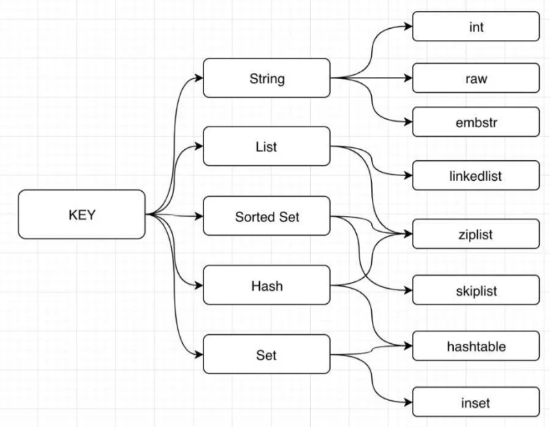

https://www.toutiao.com/i6780886836198769163/

## Redis内部编码

String，List，Hash，Set，Sorted Set只是对外的编码，实际上每种数据结构都有自己底层的**内部编码**实现，而且是多种实现，这样Redis可以在合适的场景选择更合适的内部编码。

每种数据结构都有2种以上的内部编码实现，例如String数据结构就包含了raw、int和embstr三种内部编码。同时，有些内部编码可以作为多种外部数据结构的内部实现，例如ziplist就是hash、list和zset共有的内部编码，而set的内部编码可能是hashtable或者intset




### String的3种内部编码

==**int类型**==：当一个key的value是整型时，Redis就将其编码为int类型（另外还有一个条件：把这个value当作字符串来看，它的长度不能超过20）

Redis默认会缓存10000个整型值（#define OBJSHAREDINTEGERS 10000），这就意味着，如果有10个不同的KEY，其value都是10000以内的值，事实上全部都是共享同一个对象

==**embstr和raw**==：长度界限是44，长度超过44以后，就是**raw编码**类型，不会有任何优化，是多长，就要消耗多少内存

==**embstr编码**==：创建字符串对象的空间分配，raw编码是两次，而embstr是一次。

因为embstr编码的字符串对象的所有数据都保存在一块==**连续的内存**==里面，所以这种编码的字符串对象比起raw编码的字符串对象能更好地利用缓存带来的优势。并且释放embstr编码的字符串对象只需要调用一次内存释放函数，而释放raw编码对象的字符串对象需要调用两次内存释放函数

### ziplist

List，Hash，Sorted Set数据结构，在特殊情况下的内部编码都是ziplist


### Set和Hash的关系

Set是一个特殊的**value为空**的Hash。Set类型操作的源码在tset.c中。

以新增一个元素为例（ intsetTypeAdd(robj*subject,sds value)），如果编码类型是**OBJENCODING_HT**，那么新增源码的源码如下，事实上就是对dict即Hash数据结构进行操作，并且dictSetVal时value是NULL：

```
dictEntry *de = dictAddRaw(ht,value,NULL);if (de) {    dictSetKey(ht,de,sdsdup(value));    dictSetVal(ht,de,NULL);    return 1;}
```

同样的，我们在thash.c中看到Hash类型新增元素时，当判断编码类型是**OBJENCODING_HT**时，也是调用dict的方法：dictAdd(o->ptr,f,v)，dictAdd最终也是调用dictSetVal()方法，只不过v即value不为NULL：

```
/* Add an element to the target hash table */int dictAdd(dict *d, void *key, void *val){    dictEntry *entry = dictAddRaw(d,key,NULL);
    if (!entry) return DICT_ERR;    dictSetVal(d, entry, val);    return DICT_OK;}
```

所以，**Redis中Set和Hash的关系就很清楚了，当编码是OBJENCODINGHT时，两者都是dict数据类型，只不过Set是value为NULL的特殊的dict**。

### Sorted Set

用了跳表的数据结构。

跳跃表（skiplist）是一种**有序数据**结构，它通过在每个节点中维持多个指向其它节点的指针，从而达到快速访问节点的目的。具有如下性质：

　　1、由很多层结构组成；

　　2、每一层都是一个有序的链表，排列顺序为由高层到底层，都至少包含两个链表节点，分别是前面的head节点和后面的nil节点；

　　3、最底层的链表包含了所有的元素；

　　4、如果一个元素出现在某一层的链表中，那么在该层之下的链表也全都会出现（上一层的元素是当前层的元素的子集）；

　　5、链表中的每个节点都包含两个指针，一个指向同一层的下一个链表节点，另一个指向下一层的同一个链表节点；