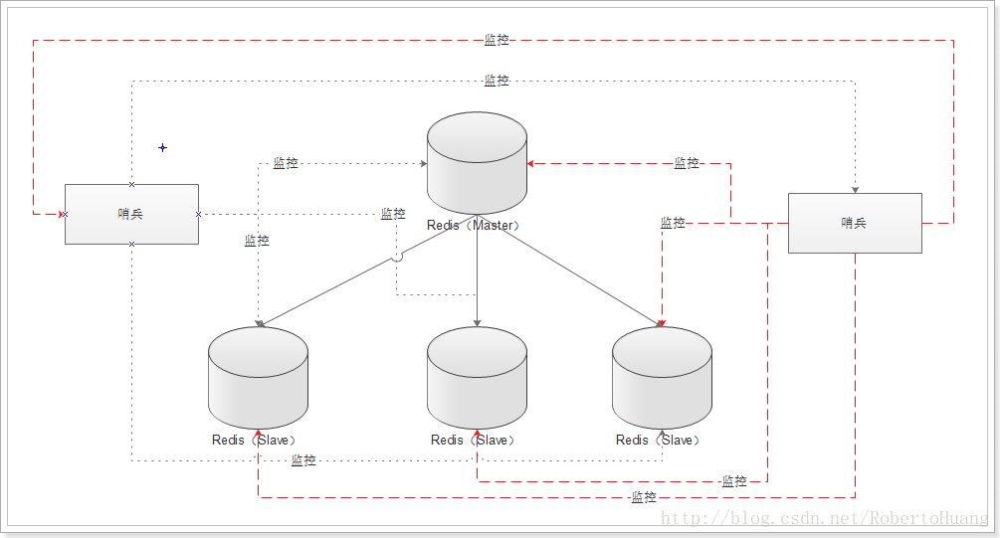
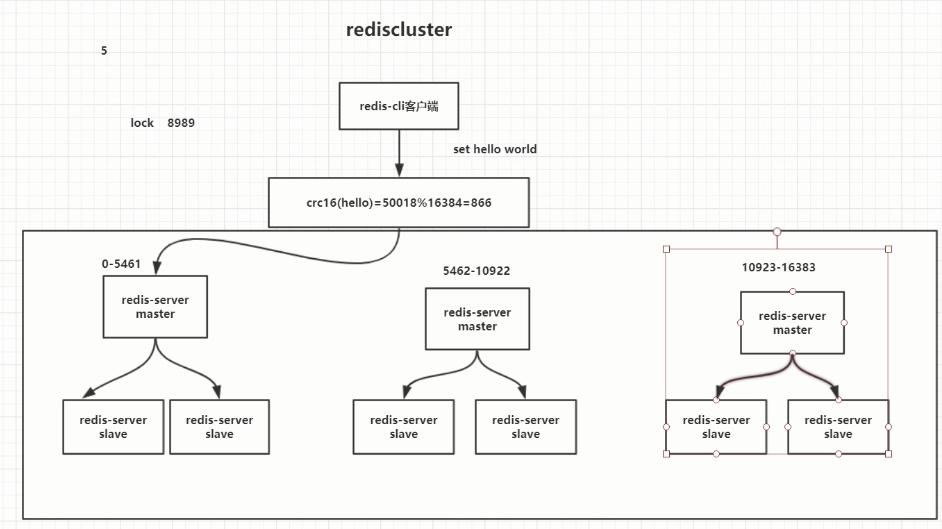

相关阅读：

- [史上最全Redis高可用技术解决方案大全](https://mp.weixin.qq.com/s?__biz=Mzg2OTA0Njk0OA==&mid=2247484850&idx=1&sn=3238360bfa8105cf758dcf7354af2814&chksm=cea24a79f9d5c36fb2399aafa91d7fb2699b5006d8d037fe8aaf2e5577ff20ae322868b04a87&token=1082669959&lang=zh_CN&scene=21#wechat_redirect)
- [Raft协议实战之Redis Sentinel的选举Leader源码解析](http://weizijun.cn/2015/04/30/Raft%E5%8D%8F%E8%AE%AE%E5%AE%9E%E6%88%98%E4%B9%8BRedis%20Sentinel%E7%9A%84%E9%80%89%E4%B8%BELeader%E6%BA%90%E7%A0%81%E8%A7%A3%E6%9E%90/)

## 集群

主从架构，一主多从，一般来说，很多项目其实就足够了，单主用来写入数据，单机几万QPS，多从用来查询数据，多个从实例可以提供每秒10万的QPS

一主多从，每个实例都容纳了完整的数据，比如redis主就10G的内存量，其实你就最对只能容纳10g的数据量。
如果你的缓存要容纳的数据量很大，达到了几十g，甚至几百g，或者是几t，那你就需要[Redis集群](https://zhuanlan.zhihu.com/p/64860002)，而且用redis集群之后，可以提供可能每秒几十万的读写并发

### 主从架构

单机的 redis，能够承载的 QPS 大概就在上万到几万不等

一主多从或多主多从，主负责写，并且将数据复制到其它的 slave 节点，从节点负责读。所有的**读请求全部走从节点**。这样也可以很轻松实现水平扩容，**支撑读高并发**

####主从复制机制

- redis 采用**异步方式**复制数据到 slave 节点，不过 redis2.8 开始，slave node 会周期性地确认自己每次复制的数据量；
- 一个主节点是可以配置多个从节点的；
- 从节点也可以连接其他的 从节点；
- 从节点 做复制的时候，不会 阻塞主节点的正常工作；
- 从节点 在做复制的时候，也不会 阻塞 对自己的查询操作，它会用旧的数据集来提供服务；但是复制完成的时候，需要删除旧数据集，加载新数据集，这个时候就会暂停对外服务了；
- 从节点主要用来进行横向扩容，做读写分离，扩容的 从节点可以提高读的吞吐量。

**注意**，如果采用了主从架构，那么建议必须**开启** **主节点的持久化**，不建议用 slave node 作为 master node 的数据热备，因为那样的话，如果你关掉 master 的持久化，可能在 master 宕机重启的时候数据是空的，然后可能一经过复制， slave node 的数据也丢了。

另外，master 的各种**备份方案**，也需要做。万一本地的所有文件丢失了，从备份中挑选一份 rdb 去恢复 master，这样才能**确保启动的时候，是有数据的**，即使采用了后续讲解的[高可用机制](https://github.com/doocs/advanced-java/blob/master/docs/high-concurrency/redis-sentinel.md)，slave node 可以自动接管 master node，但也可能 sentinel 还没检测到 master failure，master node 就自动重启了，还是可能导致上面所有的 slave node 数据被清空。


#### 复制模式

##### 全量复制

- master 执行 bgsave ，在本地生成一份 rdb 快照文件。
- master node 将 rdb 快照文件发送给 slave node，如果 rdb 复制时间超过 60秒（repl-timeout），那么 slave node 就会认为复制失败，可以适当调大这个参数(对于千兆网卡的机器，一般每秒传输 100MB，6G 文件，很可能超过 60s)
- master node 在生成 rdb 时，会将所有**新的写命令**缓存在内存中，在 slave node 保存了 rdb 之后，再将新的写命令复制给 slave node。
- 如果在复制期间，内存缓冲区持续消耗超过 64MB，或者一次性超过 256MB，那么停止复制，复制失败。

```
client-output-buffer-limit slave 256MB 64MB 60
```

- slave node 接收到 rdb 之后，清空自己的旧数据，然后重新加载 rdb 到自己的内存中，同时**基于旧的数据版本**对外提供服务。
- 如果 slave node 开启了 AOF，那么会立即执行 BGREWRITEAOF，重写 AOF。

##### 增量复制

- 如果全量复制过程中，master-slave 网络连接断掉，那么 slave 重新连接 master 时，会触发增量复制。
- master 直接从自己的 backlog 中获取部分丢失的数据，发送给 slave node，默认 backlog 就是 1MB。
- master 就是根据 slave 发送的 psync 中的 offset 来从 backlog 中获取数据的。


#### redis 主从复制的核心原理

当启动一个 slave node 的时候，它会发送一个 `PSYNC` 命令给 master node。

如果这是 slave node 初次连接到 master node，那么会触发一次 `full resynchronization` **全量复制**。此时 master 会启动一个后台进程，开始生成一份 `RDB` 快照文件，同时还会将从客户端 client 新收到的所有**写命令缓存在内存中**。`RDB` 文件生成完毕后， master 会将这个 `RDB` 发送给 slave，slave 会先**写入本地磁盘，然后再从本地磁盘加载到内存**中，接着 master 会将内存中缓存的写命令发送到 slave，slave 也会同步这些数据。slave node 如果跟 master node 有网络故障，断开了连接，会自动重连，连接之后 master node 仅会复制给 slave 部分缺少的数据。


#### 复制的完整流程

slave node 启动时，会在自己本地保存 master node 的信息，包括 master node 的`host`和`ip`，但是复制流程没开始。

slave node 内部有个**定时任务**，每秒检查是否有新的 master node 要连接和复制，如果发现，就跟 master node 建立 **socket** 网络连接。然后 slave node 发送 `ping` 命令给 master node。如果 master 设置了 requirepass，那么 slave node 必须发送 masterauth 的口令过去进行认证。master node **第一次执行全量复制**，将所有数据发给 slave node。而在后续，master node 持续将写命令，异步复制给 slave node。


#### 主从复制的断点续传

从 redis2.8 开始，就支持主从复制的断点续传，如果主从复制过程中，网络连接断掉了，那么可以接着上次复制的地方，继续复制下去，而不是从头开始复制一份。

master node 会在内存中维护一个 backlog，master 和 slave 都会保存一个 replica offset 还有一个 master run id，offset 就是保存在 backlog 中的。如果 master 和 slave 网络连接断掉了，slave 会让 master 从上次 replica offset 开始继续复制，如果没有找到对应的 offset，那么就会执行一次 `resynchronization`。


#### 无磁盘化复制

master 在内存中直接创建 `RDB`，然后发送给 slave，不会在自己本地落地磁盘了。只需要在配置文件中开启 `repl-diskless-sync yes` 即可。

```
repl-diskless-sync yes

# 等待 5s 后再开始复制，因为要等更多 slave 重新连接过来
repl-diskless-sync-delay 5
```


#### 问题点

一旦 **主节点宕机**，**从节点** 晋升成 **主节点**，同时需要修改 **应用方** 的 **主节点地址**，还需要命令所有 **从节点** 去 **复制** 新的主节点，整个过程需要 **人工干预**。

**主节点** 的 **写能力** 受到 **单机的限制**。

**主节点** 的 **存储能力** 受到 **单机的限制**。

**原生复制** 的弊端在早期的版本中也会比较突出，比如：`Redis` **复制中断** 后，**从节点** 会发起 `psync`。此时如果 **同步不成功**，则会进行 **全量同步**，**主库** 执行 **全量备份** 的同时，可能会造成毫秒或秒级的 **卡顿**。

同步故障
- 复制数据延迟(不一致)
- 读取过期数据(Slave 不能删除数据)
- 从节点故障
- 主节点故障，无法自动切换

配置不一致
- maxmemory 不一致:丢失数据
- 优化参数不一致:内存不一致.

避免全量复制
- 选择小主节点(分片)、低峰期间操作.
- 如果节点运行 id 不匹配(如主节点重启、运行 id 发送变化)，此时要执行全量复制，应该配合哨兵和集群解决.
- 主从复制挤压缓冲区不足产生的问题(网络中断，部分复制无法满足)，可增大复制缓冲区( rel_backlog_size 参数).

复制风暴


### 哨兵机制

https://juejin.cn/post/6844903663362637832



1. 哨兵需要至少3个实例，保证自己的健壮性
2. 哨兵 + Redis主从的部署架构，是不会保证数据零丢失的，只能保证redis集群的高可用性
3. 对于哨兵 + Redis主从这种复杂的部署架构，尽量在测试环境和生产环境，都进行充足的测试和演练

优点：

缺点：故障转移期间，redis不可用

####哨兵介绍：

主要功能：

- 集群监控：负责监控 redis master 和 slave 进程是否正常工作。
- 消息通知：如果某个 redis 实例有故障，那么哨兵负责发送消息作为报警通知给管理员。
- 故障转移：如果 master node 挂掉了，会自动转移到 slave node 上。
- 配置中心：如果故障转移发生了，通知 client 客户端新的 master 地址。

哨兵集群：哨兵本身就是分布式的

- 故障转移时，判断一个 master node 是否宕机了，需要大部分的哨兵都同意才行，涉及到了**分布式选举**的问题。
- 即使部分哨兵节点挂掉了，哨兵集群还是能正常工作的，因为如果一个作为高可用机制重要组成部分的故障转移系统本身是单点的，那就很坑爹了。


#### redis 哨兵主备切换的数据丢失问题

主备切换的过程，可能会导致数据丢失：

- 异步复制导致的数据丢失

因为 master->slave 的复制是异步的，所以可能有部分数据还没复制到 slave，master 就宕机了，此时这部分数据就丢失了。

- 脑裂导致的数据丢失

脑裂，也就是说，某个 master 所在机器突然**脱离了正常的网络**，跟其他 slave 机器不能连接，但是实际上 master 还运行着。此时哨兵可能就会**认为** master 宕机了，然后开启选举，将其他 slave 切换成了 master。这个时候，集群里就会有两个 master ，也就是所谓的**脑裂**。

此时虽然某个 slave 被切换成了 master，但是可能 client 还没来得及切换到新的 master，还继续向旧 master 写数据。因此旧 master 再次恢复的时候，会被作为一个 slave 挂到新的 master 上去，自己的数据会清空，重新从新的 master 复制数据。而新的 master 并没有后来 client 写入的数据，因此，这部分数据也就丢失了。


#### 数据丢失问题的解决方案

进行如下配置：

```
min-slaves-to-write 1
min-slaves-max-lag 10
```

表示，要求至少有 1 个 slave，数据复制和同步的延迟不能超过 10 秒。

如果说一旦所有的 slave，数据复制和同步的延迟都超过了 10 秒钟，那么这个时候，master 就不会再接收任何请求了。

- 减少异步复制数据的丢失

有了 `min-slaves-max-lag` 这个配置，就可以确保说，一旦 slave 复制数据和 ack 延时太长，就认为可能 master 宕机后损失的数据太多了，那么就拒绝写请求，这样可以把 master 宕机时由于部分数据未同步到 slave 导致的数据丢失降低的可控范围内。

- 减少脑裂的数据丢失

如果一个 master 出现了脑裂，跟其他 slave 丢了连接，那么上面两个配置可以确保说，如果不能继续给指定数量的 slave 发送数据，而且 slave 超过 10 秒没有给自己 ack 消息，那么就直接拒绝客户端的写请求。因此在脑裂场景下，最多就丢失 10 秒的数据。


#### 节点下线

- 主观下线
  - 即 Sentinel 节点对 Redis 节点失败的偏见，超出超时时间认为 Master 已经宕机。
  - Sentinel 集群的每一个 Sentinel 节点会定时对 Redis 集群的所有节点发心跳包检测节点是否正常。如果一个节点在 `down-after-milliseconds` 时间内没有回复 Sentinel 节点的心跳包，则该 Redis 节点被该 Sentinel 节点主观下线。
- 客观下线
  - 所有 Sentinel 节点对 Redis 节点失败要达成共识，即超过 quorum 个统一。
  - 当节点被一个 Sentinel 节点记为主观下线时，并不意味着该节点肯定故障了，还需要 Sentinel 集群的其他 Sentinel 节点共同判断为主观下线才行。
  - 该 Sentinel 节点会询问其它 Sentinel 节点，如果 Sentinel 集群中超过 quorum 数量的 Sentinel 节点认为该 Redis 节点主观下线，则该 Redis 客观下线。


#### slave->master 选举算法

如果一个 master 被认为 odown 了，而且 majority 数量的哨兵都允许主备切换，那么某个哨兵就会执行主备切换操作，此时首先要选举一个 slave 来，会考虑 slave 的一些信息：

- 跟 master 断开连接的时长
- slave 优先级
- 复制 offset
- run id

如果一个 slave 跟 master 断开连接的时间已经超过了 `down-after-milliseconds` 的 10 倍，外加 master 宕机的时长，那么 slave 就被认为不适合选举为 master。

```
(down-after-milliseconds * 10) + milliseconds_since_master_is_in_SDOWN_state
```

接下来会对 slave 进行排序：

- 按照 slave 优先级进行排序，slave priority 越低，优先级就越高。
- 如果 slave priority 相同，那么看 replica offset，哪个 slave 复制了越多的数据，offset 越靠后，优先级就越高。
- 如果上面两个条件都相同，那么选择一个 run id 比较小的那个 slave。


#### 哨兵Leader选举

- 选举出一个 Sentinel 作为 Leader：集群中至少有三个 Sentinel 节点，但只有其中一个节点可完成故障转移.通过以下命令可以进行失败判定或领导者选举。
- 选举流程
  1. 每个主观下线的 Sentinel 节点向其他 Sentinel 节点发送命令，要求设置它为领导者.
  2. 收到命令的 Sentinel 节点如果没有同意通过其他 Sentinel 节点发送的命令，则同意该请求，否则拒绝。
  3. 如果该 Sentinel 节点发现自己的票数已经超过 Sentinel 集合半数且超过 quorum，则它成为领导者。
  4. 如果此过程有多个 Sentinel 节点成为领导者，则等待一段时间再重新进行选举。

#### 故障转移

- 转移流程
  1. Sentinel 选出一个合适的 Slave 作为新的 Master(slaveof no one 命令)。
  2. 向其余 Slave 发出通知，让它们成为新 Master 的 Slave( parallel-syncs 参数)。
  3. 等待旧 Master 复活，并使之称为新 Master 的 Slave。
  4. 向客户端通知 Master 变化。
- 从 Slave 中选择新 Master 节点的规则(slave 升级成 master 之后)
  1. 选择 slave-priority 最高的节点。
  2. 选择复制偏移量最大的节点(同步数据最多)。
  3. 选择 runId 最小的节点。

> Sentinel 集群运行过程中故障转移完成，所有 Sentinel 又会恢复平等。Leader 仅仅是故障转移操作出现的角色。

#### 读写分离

#### 定时任务

- 每 1s 每个 Sentinel 对其他 Sentinel 和 Redis 执行 ping，进行心跳检测。
- 每 2s 每个 Sentinel 通过 Master 的 Channel 交换信息(pub - sub)。
- 每 10s 每个 Sentinel 对 Master 和 Slave 执行 info，目的是发现 Slave 节点、确定主从关系。


### 分布式集群(Cluster)



功能类似哨兵，没有哨兵节点

#### 通讯

##### 集中式

> 将集群元数据(节点信息、故障等等)几种存储在某个节点上。

- 优势
  1. 元数据的更新读取具有很强的时效性，元数据修改立即更新
- 劣势
  1. 数据集中存储

##### Gossip


- [Gossip 协议](https://www.jianshu.com/p/8279d6fd65bb)

#### 寻址分片

##### hash取模

- hash(key)%机器数量
- 问题
  1. 机器宕机，造成数据丢失，数据读取失败
  2. 伸缩性

##### 一致性hash

- 
- 问题
  1. 一致性哈希算法在节点太少时，容易因为节点分布不均匀而造成缓存热点的问题。
     - 解决方案
       - 可以通过引入虚拟节点机制解决：即对每一个节点计算多个 hash，每个计算结果位置都放置一个虚拟节点。这样就实现了数据的均匀分布，负载均衡。

##### hash槽

- CRC16(key)%16384
- 


### 集群不可用

有 A，B，C 三个节点的集群,在没有复制模型的情况下,如果节点 B 失败了，那么整个集群就会以为缺少 5501-11000 这个范围的槽而不可用

### 集群高可用

主备切换，用哨兵模式

##  生产环境redis集群部署

### redis cluster

10台机器，5台机器部署了redis主节点，另外5台机器部署了redis的从节点
每个主节点挂了一个从节点，5个节点对外提供读写服务，每个节点的读写高峰QPS可能可以达到每秒5万，5台机器最多是25万个QPS.

### 机器配置

32G内存+8核CPU+1T磁盘，但是分配给redis进程的是10g内存，一般线上生产环境，redis的内存尽量不要超过10g，超过10g可能会有问题。

5台机器对外提供读写，一共有50g内存。

因为每个主实例都挂了一个从实例，所以是高可用的，任何一个主实例宕机，都会自动故障迁移，redis从实例会自动变成主实例继续提供读写服务

### 你往内存里写的是什么数据？每条数据的大小是多少？

商品数据，每条数据是10kb。100条数据是1mb，10万条数据是1g。常驻内存的是200万条商品数据，占用内存是20g，仅仅不到总内存的50%。

目前高峰期每秒就是3500左右的请求量

### 面试

这套东西基本构成了缓存这块你必须知道的基础性的知识，如果你不知道，那么说明你有点懒惰了，平时没好好积累。

因为这些问题确实不难，如果往深了问，可以问的很细，结合项目扣的很细
比如你们公司线上系统高峰QPS 3000？
那请求主要访问哪些接口？
redis抗了多少请求？
mysql抗了多少请求？
你到底是怎么实现高并发的？
咱们聊聊redis的内核吧，看看你对底层了解的多么？
如果要缓存几百GB的数据会有什么坑该这么弄？
如果缓存出现热点现象该这么处理？
某个value特别大把网卡给打死了怎么办？
等等等等，可以深挖的东西其实有很多。。。。。

但是如果你掌握好了这套东西的回答，那么你在面试的时候，如果面试官没有全都问到，你可以自己主动合盘脱出。
比如你可以说，我们线上的缓存，做了啥啥机制，防止雪崩、防止穿透、保证双写时的数据一致性、保证并发竞争时的数据一致性，我们线上咋部署的，啥架构，怎么玩儿的。
这套东西你可以自己说出来，展示一下你对缓存这块的掌握。

## 使用场景

### 热点数据

存取数据优先从 Redis 操作，如果不存在再从文件（例如 MySQL）中操作，从文件操作完后将数据存储到 Redis 中并返回。同时有个定时任务后台定时扫描 Redis 的 key，根据业务规则进行淘汰，防止某些只访问一两次的数据一直存在 Redis 中。
>例如使用 Zset 数据结构，存储 Key 的访问次数/最后访问时间作为 Score，最后做排序，来淘汰那些最少访问的 Key。  

如果企业级应用，可以参考：[阿里云的 Redis 混合存储版][1]

### 会话维持 Session

会话维持 Session 场景，即使用 Redis 作为分布式场景下的登录中心存储应用。每次不同的服务在登录的时候，都会去统一的 Redis 去验证 Session 是否正确。但是在微服务场景，一般会考虑 Redis + JWT 做 Oauth2 模块。


spring session + redis 实现session共享

>其中 Redis 存储 JWT 的相关信息主要是留出口子，方便以后做统一的防刷接口，或者做登录设备限制等。

### 分布式锁 SETNX

命令格式：`SETNX key value`：当且仅当 key 不存在，将 key 的值设为 value【随机生成的UUID】，返回1。若给定的 key 已经存在，则 SETNX 不做任何动作，返回0。

1. 超时时间设置：获取锁的同时，启动守护线程，使用 expire 进行定时更新超时时间。如果该业务机器宕机，守护线程也挂掉，这样也会自动过期。如果该业务不是宕机，而是真的需要这么久的操作时间，那么增加超时时间在业务上也是可以接受的，但是肯定有个最大的阈值。
2. 释放锁的时候，通过 UUID 判断是不是该锁，若是该锁，则执行 delete 进行锁释放。
3. 但是为了增加高可用，需要使用多台 Redis，就增加了复杂性，就可以参考 Redlock：[Redlock分布式锁](Redlock分布式锁.md#怎么在单节点上实现分布式锁)


#### 如果业务中途出异常？

用try catch，在finaly里面释放锁，删除key


#### 如果在执行过程中，进程被kill

就不会走finaly 清除key，

可以设置个过器时间，比如10秒，最多会阻塞10秒而已。


#### 如果执行过程超过10秒？

在执行过程中，锁过期失效了，这时可能会有其他线程进来请求，会加一个新的锁。

然后第一个线程执行完，走删除锁操作的时候，就会清除第二个线程加的锁

解决：获取锁后，开启一个线程，里面做一个定时器timer，给当前key延长过期时间

比如key设置30s过期，但是线程可能要执行35秒，就用timer延长key过期时间，线程结束，定时任务也结束


#### 如果宕机在设置过期时间之前执行？

让setnx设值和设置过期时间进行原子操作，同时成功

redis原生API可以操作


#### redisson框架

 


### 对象缓存

mset user：1：name zhuge user：1：blance：188

mget user：1：name user：1：blance

### 表缓存

Redis 缓存表的场景有黑名单、禁言表等。访问频率较高，即读高。根据业务需求，可以使用后台定时任务定时刷新 Redis 的缓存表数据。

### 消息队列 list

主要使用了 List 数据结构。lpush+brpop，（brpop阻塞等待消费消息）  
List 支持在头部和尾部操作，因此可以实现简单的消息队列。

1. 发消息：在 List 尾部塞入数据。
2. 消费消息：在 List 头部拿出数据。

同时可以使用多个 List，来实现多个队列，根据不同的业务消息，塞入不同的 List，来增加吞吐量。

### 微博公众号信息流

用list实现，关注者发消息，存储到消息队列，key为发布者id，value为消息id，lpush msg:发布者id 10080

获取消息，用lrange，key为发布者id，指定获取区间。lrange msg:发布者id 0 5

### 点赞收藏

用set集合，sadd key value；srem key value；sismember key value；smembers key；scard key

点赞：sadd like:[消息id] {用户id}

取消点赞：srem like:[消息id] {用户id}

检查用户是否点过咱：sismembers like:[消息id] {用户id}

获取点赞用户列表：smembers like:[消息id] 

获取点赞用户数：scard like:[消息id]

### 抽奖

用set数据结构实现

参与抽奖用户加入集合：sadd key [userid]

查看所有用户：smembers key

抽奖：srandmember key [count]；或者抽完后从集合删除：spop key [count]


### 计数器 string

比如文章的阅读量

主要使用了 INCR、DECR、INCRBY、DECRBY 方法。

INCR key：给 key 的 value 值增加一 
DECR key：给 key 的 value 值减去一

### 购物车

用户id为key；商品id为field；商品数量为value

操作：添加商品 --> hset cart:1001 10080 1

​	增加商品 --> hincby cart:1001 10080 1

商品总数 --> hlen cart:1001

删除商品 --> hdel cart:1001 10080

获取所有商品 --> hgetall cart:1001


## 缓存设计

### 更新策略

- LRU、LFU、FIFO 算法自动清除：一致性最差，维护成本低。
- 超时自动清除(key expire)：一致性较差，维护成本低。
- 主动更新：代码层面控制生命周期，一致性最好，维护成本高。

在 Redis 根据在 redis.conf 的参数 `maxmemory` 来做更新淘汰策略：
1. noeviction: 不删除策略, 达到最大内存限制时, 如果需要更多内存, 直接返回错误信息。大多数写命令都会导致占用更多的内存(有极少数会例外, 如 DEL 命令)。
2. allkeys-lru: 所有 key 通用; 优先删除最近最少使用(less recently used ,LRU) 的 key。
3. volatile-lru: 只限于设置了 expire 的部分; 优先删除最近最少使用(less recently used ,LRU) 的 key。
4. allkeys-random: 所有key通用; 随机删除一部分 key。
5. volatile-random: 只限于设置了 expire 的部分; 随机删除一部分 key。
6. volatile-ttl: 只限于设置了 expire 的部分; 优先删除剩余时间(time to live,TTL) 短的key。

### 更新一致性

- 读请求：先读缓存，缓存没有的话，就读数据库，然后取出数据后放入缓存，同时返回响应。
- 写请求：先删除缓存，然后再更新数据库(避免大量地写、却又不经常读的数据导致缓存频繁更新)。

### 缓存粒度

- 通用性：全量属性更好。
- 占用空间：部分属性更好。
- 代码维护成本。

### 缓存穿透

> 当大量的请求无命中缓存、直接请求到后端数据库(业务代码的 bug、或恶意攻击)，同时**后端数据库也没有查询到**相应的记录、无法添加缓存。  
> 这种状态会一直维持，流量一直打到存储层上，无法利用缓存、还会给存储层带来巨大压力。

#### 解决方案

1. 请求无法命中缓存、同时数据库记录为空时在缓存添加该 key 的空对象(设置过期时间)，缺点是可能会在缓存中添加大量的空值键(比如遭到恶意攻击或爬虫)，而且缓存层和存储层数据短期内不一致；
2. 使用布隆过滤器在缓存层前拦截非法请求、自动为空值添加黑名单(同时可能要为误判的记录添加白名单).但需要考虑布隆过滤器的维护(离线生成/ 实时生成)。

### 缓存雪崩

> 缓存崩溃时请求会直接落到数据库上，很可能由于无法承受大量的并发请求而崩溃，此时如果只重启数据库，或因为缓存重启后没有数据，新的流量进来很快又会把数据库击倒。

#### 出现后应对

- 事前：Redis 高可用，主从 + 哨兵，Redis Cluster，避免全盘崩溃。
- 事中：本地 ehcache 缓存 + hystrix 限流 & 降级，避免数据库承受太多压力。
- 事后：Redis 持久化，一旦重启，自动从磁盘上加载数据，快速恢复缓存数据。

#### 请求过程

1. 用户请求先访问本地缓存，无命中后再访问 Redis，如果本地缓存和 Redis 都没有再查数据库，并把数据添加到本地缓存和 Redis；
2. 由于设置了限流，一段时间范围内超出的请求走降级处理(返回默认值，或给出友情提示)。

[1]: https://promotion.aliyun.com/ntms/act/redishybridstorage.html?spm=5176.54432.1380373.5.41921cf20pcZrZ&aly_as=ArH4VaEb
