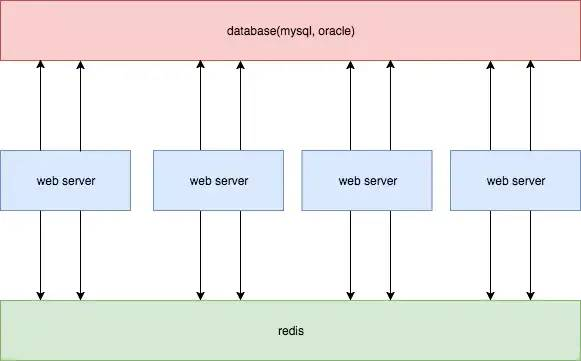
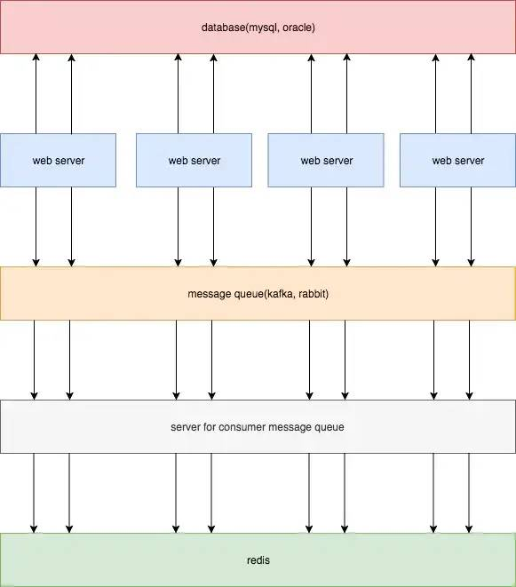
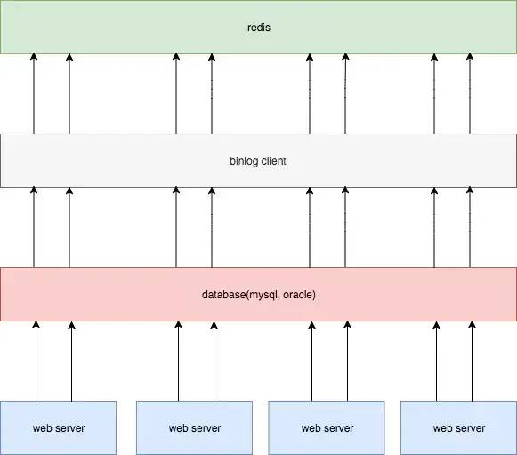

数据库缓存最终一致性方案

## 一、基于过期时间

通过 key 的过期时间，mysql 更新时，redis 不更新。这种方式实现简单，但不一致的时间会很长。如果读请求非常频繁，且过期时间比较长，则会产生很多长期的脏数据。

优点：

- 开发成本低，易于实现；
- 管理成本低，出问题的概率会比较小。

不足

- 完全依赖过期时间，时间太短容易缓存频繁失效，太长容易有长时间更新延迟（不一致）

## 二、同时更新

更新 mysql 时，同时更新 redis

优点

- 相对方案一，更新延迟更小。

不足

- 如果更新 mysql 成功，更新 redis 却失败，就退化到了方案一；
- 在高并发场景，业务 server 需要和 mysql,redis 同时进行连接。这样是损耗双倍的连接资源，容易造成连接数过多的问题。

## 三、同步写，消息队列

同步写 redis 进行优化，增加消息队列，将 redis 更新操作交给 kafka，由消息队列保证可靠性，再搭建一个消费服务，来异步更新 redis

优点

- 消息队列可以用一个句柄，很多消息队列客户端还支持本地缓存发送，有效解决了方案二连接数过多的问题；
- 使用消息队列，实现了逻辑上的解耦；
- 消息队列本身具有可靠性，通过手动提交等手段，可以至少一次消费到 redis。

不足

- 依旧解决不了时序性问题，如果多台业务服务器分别处理针对同一行数据的两条请求，举个栗子，a = 1；a = 5;，如果 mysql 中是第一条先执行，而进入 kafka 的顺序是第二条先执行，那么数据就会产生不一致。
- 引入了消息队列，同时要增加服务消费消息，成本较高。

##四、binlog更新redis

通过订阅 binlog 来更新 redis，把我们搭建的消费服务，作为 mysql 的一个 slave，订阅 binlog，解析出更新内容，再更新到 redis。

优点

- 在 mysql 压力不大情况下，延迟较低；
- 和业务完全解耦；
- 解决了时序性问题。

缺点

- 要单独搭建一个同步服务，并且引入 binlog 同步机制，成本较大。

