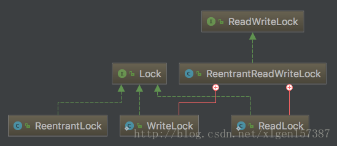

## 简介

基于JDK实现的可重入锁，是一种**递归无阻塞的**同步机制。可以等同于synchronized使用，但是更灵活强大，可以减少死锁发生

也是排他锁，同一时间只能有一个线程在执行ReentrantLock.lock()之后的任务

使用的是AQS中的一个同步状态state表示当前共享资源是否被其他线程锁占用。如果为0则表示未被占用，其他值表示该锁被重入的次数

## 获取锁

```java
ReentranLock lock = new ReentrantLock();
lock.lock();
```

lock方法：用内部类Sync调用lock（）方法。继承AQS，有两个子类：公平锁FairSync和非公平锁NonfairSync

## 释放锁

内部类Sync调用release（int arg）方法

## 其他方法

```java
getHoldCount() //查询当前线程保持此锁定的个数，也就是调用lock()的次数； 
getQueueLength() //返回正等待获取此锁定的线程估计数目；
isFair() //判断是不是公平锁； 
```

## 公平锁与非公平锁

公平锁表示线程获取锁的顺序是按照线程加锁的顺序来分配；非公平是一种抢占机制，是随机获得锁

构造函数允许设置，true表示是公平锁，反之为非公平锁

```java
public ReentrantLock(boolean fair) {    
	sync = fair ? new FairSync() : new NonfairSync();} 
```

## ReentrantLock与synchronized区别

- 1、reentrantLock多了时间锁等候，可中断锁等候，锁投票

- 2、reentrantLock提供Condition，对线程等待、唤醒更灵活，更适合在多个条件变量和高度竞争锁的地方，一个 ReentrantLock 可以同时绑定多个 Condition 对象

- 3、reentrantLock提供轮询的锁请求，尝试获取锁，如果成功则继续，否则等到下次运行处理

  ​	synchronized一旦进入锁请求，要么成功，要么阻塞，容易死锁

- 4、reentrantLock支持更灵活的同步代码块，锁是否一定要在finally处理

  ​	synchronized只能在同一个代码块中获取和释放

- 5、reentrantLock支持中断处理，synchronized不支持

  ​	等待可中断：当持有锁的线程长期不释放锁的时候，正在等待的线程可以选择放弃等待，改为处理其他事情。

- 6、synchronized 是 JVM 实现的，而 ReentrantLock 是 JDK 实现的。

- 7、公平锁是指多个线程在等待同一个锁时，必须按照申请锁的时间顺序来依次获得锁。

  ​	synchronized 中的锁是非公平的，ReentrantLock 默认情况下也是非公平的，但是也可以是公平的。


## ReentrantReadWriteLock 实现并发

<https://blog.csdn.net/xlgen157387/article/details/78375986>



ReentrantReadWriteLock有两个内部类：ReadLock和WriteLock  实现了Lock 接口

读写锁维护一对锁，读锁和写锁，写锁是独占锁，读锁是共享锁，通过读写分离提高性能

可同时多个读线程同时访问，写线程访问时，所有读写线程阻塞

### 特性：

公平性：支持公平性和非公平性。

重入性：支持重入。读写锁最多支持65535个递归写入锁和65535个递归读取锁。

锁降级：遵循获取写锁、获取读锁在释放写锁的次序，写锁能够降级成为读锁

### 写锁：

```java
 lock.writeLock().lock(); 
```

支持可重入的排他锁，读锁完全释放写锁才能被当前线程获取，所有其他读写锁均会被阻塞

### 读锁：

·	可重入的共享锁，能被多个线程同时持有。

```java
lock.readLock().lock(); 
```


### 总结

1、读锁的重入是允许多个申请读操作的线程的，而写锁同时只允许单个线程占有，该线程的**写操作可以重入**。

2、如果一个线程占有了写锁，在不释放写锁的情况下，它还能占有读锁，即写锁降级为读锁。

3、对于同时占有读锁和写锁的线程，如果完全释放了写锁，那么它就完全转换成了读锁，以后的写操作无法重入，在写锁未完全释放时写操作是可以重入的。

4、公平模式下无论读锁还是写锁的申请都必须按照AQS锁等待队列先进先出的顺序。非公平模式下读操作插队的条件是锁等待队列head节点后的下一个节点是SHARED型节点，写锁则无条件插队。

5、读锁不允许newConditon获取Condition接口，而写锁的newCondition接口实现方法同ReentrantLock。


特性

- **读读共享；** 
- 写写互斥； 
- 读写互斥； 
- **写读互斥；**

```java
public class ReentrantReadWriteLockDemo {
    private ReentrantReadWriteLock lock = new ReentrantReadWriteLock();
    public static void main(String[] args) throws InterruptedException {
        ReentrantReadWriteLockDemo demo = new ReentrantReadWriteLockDemo();
        new Thread(() -> demo.read(), "ThreadA").start();
        Thread.sleep(1000);
        new Thread(() -> demo.write(), "ThreadB").start();
    }

    private void read() {
        try {
            try {
                lock.readLock().lock();
                System.out.println("获得读锁" + Thread.currentThread().getName()
                        + " 时间:" + System.currentTimeMillis());
                Thread.sleep(3000);
            } finally {
                lock.readLock().unlock();
            }
        } catch (InterruptedException e) {
            e.printStackTrace();
        }
    }
    private void write() {
        try {
            try {
                lock.writeLock().lock();
                System.out.println("获得写锁" + Thread.currentThread().getName()
                        + " 时间:" + System.currentTimeMillis());
                Thread.sleep(3000);
            } finally {
                lock.writeLock().unlock();
            }
        } catch (InterruptedException e) {
            e.printStackTrace();
        }
    }
}
```


## ReentrantReadWriteLock原理分析

LockSupport

ReentrantReadWriteLock还是ReentrantLock，用于阻塞或唤醒一个线程


