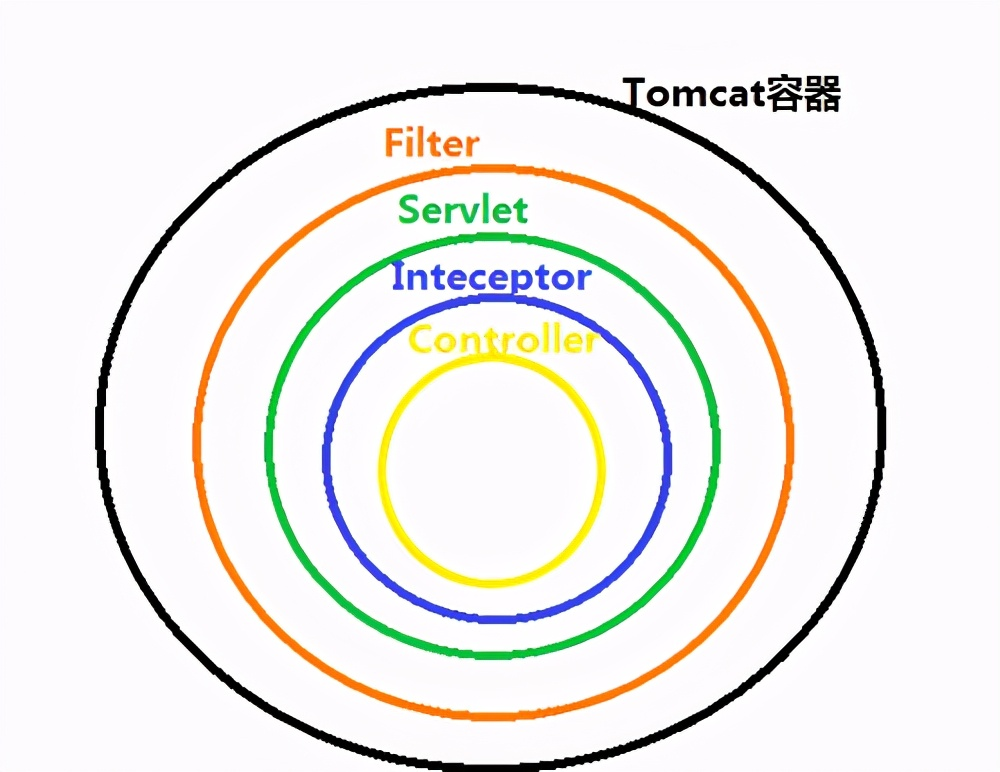
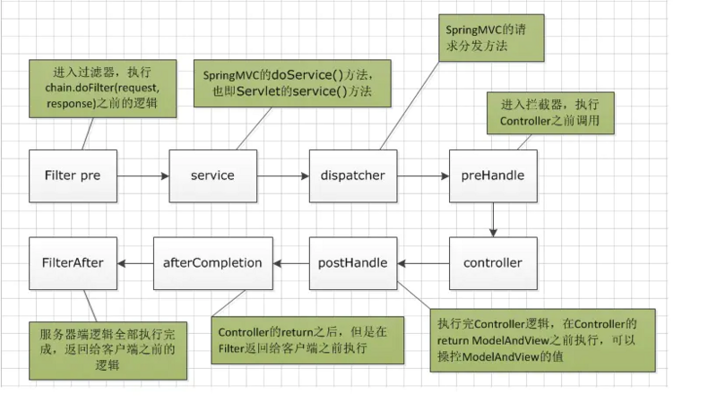

> 本文整理自网络，原文出处暂不知，对原文做了较大的改动，在此说明！

##springmvc原理

### 先来看一下什么是 MVC 模式

MVC 是一种设计模式.

**MVC 的原理图如下：**


### SpringMVC 简单介绍

SpringMVC 框架是以请求为驱动，围绕 Servlet 设计，将请求发给控制器，然后通过模型对象，分派器来展示请求结果视图。其中核心类是 DispatcherServlet，它是一个 Servlet，顶层是实现的Servlet接口。

### SpringMVC 使用

需要在 web.xml 中配置 DispatcherServlet 。并且需要配置 Spring 监听器ContextLoaderListener

```xml

<listener>
	<listener-class>org.springframework.web.context.ContextLoaderListener
	</listener-class>
</listener>
<servlet>
	<servlet-name>springmvc</servlet-name>
	<servlet-class>org.springframework.web.servlet.DispatcherServlet
	</servlet-class>
	<!-- 如果不设置init-param标签，则必须在/WEB-INF/下创建xxx-servlet.xml文件，其中xxx是servlet-name中配置的名称。 -->
	<init-param>
		<param-name>contextConfigLocation</param-name>
		<param-value>classpath:spring/springmvc-servlet.xml</param-value>
	</init-param>
	<load-on-startup>1</load-on-startup>
</servlet>
<servlet-mapping>
	<servlet-name>springmvc</servlet-name>
	<url-pattern>/</url-pattern>
</servlet-mapping>

```

### SpringMVC 工作原理（重要）

**简单来说：**

客户端发送请求-> 前端控制器 DispatcherServlet 接受客户端请求 -> 找到处理器映射 HandlerMapping 解析请求对应的 Handler-> HandlerAdapter 会根据 Handler 来调用真正的处理器开处理请求，并处理相应的业务逻辑 -> 处理器返回一个模型视图 ModelAndView -> 视图解析器进行解析 -> 返回一个视图对象->前端控制器 DispatcherServlet 渲染数据（Moder）->将得到视图对象返回给用户


**如下图所示：**


上图的一个笔误的小问题：Spring MVC 的入口函数也就是前端控制器 DispatcherServlet 的作用是接收请求，响应结果。

**流程说明（重要）：**

（1）客户端（浏览器）发送请求，直接请求到 DispatcherServlet。

（2）DispatcherServlet 根据请求信息调用 HandlerMapping，解析请求对应的 Handler。

（3）解析到对应的 Handler（也就是我们平常说的 Controller 控制器）后，开始由 HandlerAdapter 适配器处理。

（4）HandlerAdapter 会根据 Handler 来调用真正的处理器开处理请求，并处理相应的业务逻辑。

（5）处理器处理完业务后，会返回一个 ModelAndView 对象，Model 是返回的数据对象，View 是个逻辑上的 View。

（6）ViewResolver 会根据逻辑 View 查找实际的 View。

（7）DispaterServlet 把返回的 Model 传给 View（视图渲染）。

（8）把 View 返回给请求者（浏览器）


### SpringMVC 重要组件说明


**1、前端控制器DispatcherServlet（不需要工程师开发）,由框架提供（重要）**

作用：**Spring MVC 的入口函数。接收请求，响应结果，相当于转发器，中央处理器。有了 DispatcherServlet 减少了其它组件之间的耦合度。用户请求到达前端控制器，它就相当于mvc模式中的c，DispatcherServlet是整个流程控制的中心，由它调用其它组件处理用户的请求，DispatcherServlet的存在降低了组件之间的耦合性。**

**2、处理器映射器HandlerMapping(不需要工程师开发),由框架提供**

作用：根据请求的url查找Handler。HandlerMapping负责根据用户请求找到Handler即处理器（Controller），SpringMVC提供了不同的映射器实现不同的映射方式，例如：配置文件方式，实现接口方式，注解方式等。

**3、处理器适配器HandlerAdapter**

作用：按照特定规则（HandlerAdapter要求的规则）去执行Handler
通过HandlerAdapter对处理器进行执行，这是适配器模式的应用，通过扩展适配器可以对更多类型的处理器进行执行。

**4、处理器Handler(需要工程师开发)**

注意：编写Handler时按照HandlerAdapter的要求去做，这样适配器才可以去正确执行Handler
Handler 是继DispatcherServlet前端控制器的后端控制器，在DispatcherServlet的控制下Handler对具体的用户请求进行处理。
由于Handler涉及到具体的用户业务请求，所以一般情况需要工程师根据业务需求开发Handler。

**5、视图解析器View resolver(不需要工程师开发),由框架提供**

作用：进行视图解析，根据逻辑视图名解析成真正的视图（view）
View Resolver负责将处理结果生成View视图，View Resolver首先根据逻辑视图名解析成物理视图名即具体的页面地址，再生成View视图对象，最后对View进行渲染将处理结果通过页面展示给用户。 springmvc框架提供了很多的View视图类型，包括：jstlView、freemarkerView、pdfView等。
一般情况下需要通过页面标签或页面模版技术将模型数据通过页面展示给用户，需要由工程师根据业务需求开发具体的页面。

**6、视图View(需要工程师开发)**

View是一个接口，实现类支持不同的View类型（jsp、freemarker、pdf...）

**注意：处理器Handler（也就是我们平常说的Controller控制器）以及视图层view都是需要我们自己手动开发的。其他的一些组件比如：前端控制器DispatcherServlet、处理器映射器HandlerMapping、处理器适配器HandlerAdapter等等都是框架提供给我们的，不需要自己手动开发。**

### DispatcherServlet详细解析

首先看下源码：

```java
package org.springframework.web.servlet;
 
@SuppressWarnings("serial")
public class DispatcherServlet extends FrameworkServlet {
 
	public static final String MULTIPART_RESOLVER_BEAN_NAME = "multipartResolver";
	public static final String LOCALE_RESOLVER_BEAN_NAME = "localeResolver";
	public static final String THEME_RESOLVER_BEAN_NAME = "themeResolver";
	public static final String HANDLER_MAPPING_BEAN_NAME = "handlerMapping";
	public static final String HANDLER_ADAPTER_BEAN_NAME = "handlerAdapter";
	public static final String HANDLER_EXCEPTION_RESOLVER_BEAN_NAME = "handlerExceptionResolver";
	public static final String REQUEST_TO_VIEW_NAME_TRANSLATOR_BEAN_NAME = "viewNameTranslator";
	public static final String VIEW_RESOLVER_BEAN_NAME = "viewResolver";
	public static final String FLASH_MAP_MANAGER_BEAN_NAME = "flashMapManager";
	public static final String WEB_APPLICATION_CONTEXT_ATTRIBUTE = DispatcherServlet.class.getName() + ".CONTEXT";
	public static final String LOCALE_RESOLVER_ATTRIBUTE = DispatcherServlet.class.getName() + ".LOCALE_RESOLVER";
	public static final String THEME_RESOLVER_ATTRIBUTE = DispatcherServlet.class.getName() + ".THEME_RESOLVER";
	public static final String THEME_SOURCE_ATTRIBUTE = DispatcherServlet.class.getName() + ".THEME_SOURCE";
	public static final String INPUT_FLASH_MAP_ATTRIBUTE = DispatcherServlet.class.getName() + ".INPUT_FLASH_MAP";
	public static final String OUTPUT_FLASH_MAP_ATTRIBUTE = DispatcherServlet.class.getName() + ".OUTPUT_FLASH_MAP";
	public static final String FLASH_MAP_MANAGER_ATTRIBUTE = DispatcherServlet.class.getName() + ".FLASH_MAP_MANAGER";
	public static final String EXCEPTION_ATTRIBUTE = DispatcherServlet.class.getName() + ".EXCEPTION";
	public static final String PAGE_NOT_FOUND_LOG_CATEGORY = "org.springframework.web.servlet.PageNotFound";
	private static final String DEFAULT_STRATEGIES_PATH = "DispatcherServlet.properties";
	protected static final Log pageNotFoundLogger = LogFactory.getLog(PAGE_NOT_FOUND_LOG_CATEGORY);
	private static final Properties defaultStrategies;
	static {
		try {
			ClassPathResource resource = new ClassPathResource(DEFAULT_STRATEGIES_PATH, DispatcherServlet.class);
			defaultStrategies = PropertiesLoaderUtils.loadProperties(resource);
		}
		catch (IOException ex) {
			throw new IllegalStateException("Could not load 'DispatcherServlet.properties': " + ex.getMessage());
		}
	}
 
	/** Detect all HandlerMappings or just expect "handlerMapping" bean? */
	private boolean detectAllHandlerMappings = true;
 
	/** Detect all HandlerAdapters or just expect "handlerAdapter" bean? */
	private boolean detectAllHandlerAdapters = true;
 
	/** Detect all HandlerExceptionResolvers or just expect "handlerExceptionResolver" bean? */
	private boolean detectAllHandlerExceptionResolvers = true;
 
	/** Detect all ViewResolvers or just expect "viewResolver" bean? */
	private boolean detectAllViewResolvers = true;
 
	/** Throw a NoHandlerFoundException if no Handler was found to process this request? **/
	private boolean throwExceptionIfNoHandlerFound = false;
 
	/** Perform cleanup of request attributes after include request? */
	private boolean cleanupAfterInclude = true;
 
	/** MultipartResolver used by this servlet */
	private MultipartResolver multipartResolver;
 
	/** LocaleResolver used by this servlet */
	private LocaleResolver localeResolver;
 
	/** ThemeResolver used by this servlet */
	private ThemeResolver themeResolver;
 
	/** List of HandlerMappings used by this servlet */
	private List<HandlerMapping> handlerMappings;
 
	/** List of HandlerAdapters used by this servlet */
	private List<HandlerAdapter> handlerAdapters;
 
	/** List of HandlerExceptionResolvers used by this servlet */
	private List<HandlerExceptionResolver> handlerExceptionResolvers;
 
	/** RequestToViewNameTranslator used by this servlet */
	private RequestToViewNameTranslator viewNameTranslator;
 
	private FlashMapManager flashMapManager;
 
	/** List of ViewResolvers used by this servlet */
	private List<ViewResolver> viewResolvers;
 
	public DispatcherServlet() {
		super();
	}
 
	public DispatcherServlet(WebApplicationContext webApplicationContext) {
		super(webApplicationContext);
	}
	@Override
	protected void onRefresh(ApplicationContext context) {
		initStrategies(context);
	}
 
	protected void initStrategies(ApplicationContext context) {
		initMultipartResolver(context);
		initLocaleResolver(context);
		initThemeResolver(context);
		initHandlerMappings(context);
		initHandlerAdapters(context);
		initHandlerExceptionResolvers(context);
		initRequestToViewNameTranslator(context);
		initViewResolvers(context);
		initFlashMapManager(context);
	}
}

```

DispatcherServlet类中的属性beans：

- HandlerMapping：用于handlers映射请求和一系列的对于拦截器的前处理和后处理，大部分用@Controller注解。
- HandlerAdapter：帮助DispatcherServlet处理映射请求处理程序的适配器，而不用考虑实际调用的是 哪个处理程序。- - - 
- ViewResolver：根据实际配置解析实际的View类型。
- ThemeResolver：解决Web应用程序可以使用的主题，例如提供个性化布局。
- MultipartResolver：解析多部分请求，以支持从HTML表单上传文件。- 
- FlashMapManager：存储并检索可用于将一个请求属性传递到另一个请求的input和output的FlashMap，通常用于重定向。

在Web MVC框架中，每个DispatcherServlet都拥自己的WebApplicationContext，它继承了ApplicationContext。WebApplicationContext包含了其上下文和Servlet实例之间共享的所有的基础框架beans。

**HandlerMapping**


HandlerMapping接口处理请求的映射HandlerMapping接口的实现类：

- SimpleUrlHandlerMapping类通过配置文件把URL映射到Controller类。
- DefaultAnnotationHandlerMapping类通过注解把URL映射到Controller类。

**HandlerAdapter**


HandlerAdapter接口-处理请求映射

AnnotationMethodHandlerAdapter：通过注解，把请求URL映射到Controller类的方法上。

**HandlerExceptionResolver**


HandlerExceptionResolver接口-异常处理接口

- SimpleMappingExceptionResolver通过配置文件进行异常处理。
- AnnotationMethodHandlerExceptionResolver：通过注解进行异常处理。

**ViewResolver**


ViewResolver接口解析View视图。

UrlBasedViewResolver类 通过配置文件，把一个视图名交给到一个View来处理。

## 常用组件

### ArgumentResolver

ArgumentResovler是springmvc为提供的一个处理**controller请求参数**的扩展点

api接口需要拿到一个userId，但是这个userId又不能直接通过http参数拿，可能是传一个token，然后，根据token从服务器取出登录用户的userId

当然一种方案是在interceptor里面解析token拿到userId，然后存入ThreadLocal中；这种就需要我们所有需要用到userId的controller都写一段从ThreadLocal中get的代码；

这里介绍另一种，可能在代码上更简洁。直接在相应的controller方法的参数中写一个userId的入参，但是这个入参不是客户端传的，是在我们的一个ArgumentResovler内部解析传入的，解析也就是token拿到userId的过程。当然我们需要使用注解标注userId参数。
https://blog.csdn.net/u010900754/article/details/97614139


## 面试Spring MVC

### 1 说说自己对于 Spring MVC 了解?

谈到这个问题，我们不得不提提之前 Model1 和 Model2 这两个没有 Spring MVC 的时代。

- **Model1 时代** : 很多学 Java 后端比较晚的朋友可能并没有接触过  Model1 模式下的 JavaWeb 应用开发。在 Model1 模式下，整个 Web 应用几乎全部用 JSP 页面组成，只用少量的 JavaBean 来处理数据库连接、访问等操作。这个模式下 JSP 即是控制层又是表现层。显而易见，这种模式存在很多问题。比如①将控制逻辑和表现逻辑混杂在一起，导致代码重用率极低；②前端和后端相互依赖，难以进行测试并且开发效率极低；
- **Model2 时代** ：学过 Servlet 并做过相关 Demo 的朋友应该了解“Java Bean(Model)+ JSP（View,）+Servlet（Controller）  ”这种开发模式,这就是早期的 JavaWeb MVC 开发模式。Model:系统涉及的数据，也就是 dao 和 bean。View：展示模型中的数据，只是用来展示。Controller：处理用户请求都发送给 ，返回数据给 JSP 并展示给用户。

Model2 模式下还存在很多问题，Model2的抽象和封装程度还远远不够，使用Model2进行开发时不可避免地会重复造轮子，这就大大降低了程序的可维护性和复用性。于是很多JavaWeb开发相关的 MVC 框架应运而生比如Struts2，但是 Struts2 比较笨重。随着 Spring 轻量级开发框架的流行，Spring 生态圈出现了 Spring MVC 框架， Spring MVC 是当前最优秀的 MVC 框架。相比于 Struts2 ， Spring MVC 使用更加简单和方便，开发效率更高，并且 Spring MVC 运行速度更快。

MVC 是一种设计模式,Spring MVC 是一款很优秀的 MVC 框架。Spring MVC 可以帮助我们进行更简洁的Web层的开发，并且它天生与 Spring 框架集成。Spring MVC 下我们一般把后端项目分为 Service层（处理业务）、Dao层（数据库操作）、Entity层（实体类）、Controller层(控制层，返回数据给前台页面)。

**Spring MVC 的简单原理图如下：**


### 2 SpringMVC 工作原理了解吗?

**原理如下图所示：**


上图的一个笔误的小问题：Spring MVC 的入口函数也就是前端控制器 `DispatcherServlet` 的作用是接收请求，响应结果。

**流程说明（重要）：**

1. 客户端（浏览器）发送请求，直接请求到 `DispatcherServlet`。
2. `DispatcherServlet` 根据请求信息调用 `HandlerMapping`，解析请求对应的 `Handler`。
3. 解析到对应的 `Handler`（也就是我们平常说的 `Controller` 控制器）后，开始由 `HandlerAdapter` 适配器处理。
4. `HandlerAdapter` 会根据 `Handler `来调用真正的处理器开处理请求，并处理相应的业务逻辑。
5. 处理器处理完业务后，会返回一个 `ModelAndView` 对象，`Model` 是返回的数据对象，`View` 是个逻辑上的 `View`。
6. `ViewResolver` 会根据逻辑 `View` 查找实际的 `View`。
7. `DispaterServlet` 把返回的 `Model` 传给 `View`（视图渲染）。
8. 把 `View` 返回给请求者（浏览器）

### 3 拦截器、过滤器和监听器

#### 1 拦截器：

​	springMVC中拦截器用于对处理器预处理和后处理，是AOP的具体应用

​	自定义拦截器，实现HandlerInterceptor接口，然后在配置文件中配置，<mvc:interceptor 标签配置mapping和拦截器bean

​	多个拦截器执行顺序：

​		按配置顺序执行，第一个放行才会执行第二个的preHandle（）方法；不放行就直接响应浏览器

​		如果第二个不放行，就执行第一个拦截器的afterCompletion（）方法，然后响应浏览器

​		如果都响应，执行完controller方法后，拦截链从后往前执行postHandler（）方法

​		postHandler 方法执行完，再从后往前执行afterCompletion方法


**应用：**

​	用户是否登录，跳转登录页

​	request.getRequestDispatcher("/WEB-INF/jsp/login.jsp").forward(request,response）；

**自定义拦截器**：

​	继承 HandlerInterceptorAdapter类也可以通过实现HandlerInterceptor这个接口

```java
public class LogCostInterceptor implements HandlerInterceptor { long start = System.currentTimeMillis();
    @Override public boolean preHandle(HttpServletRequest httpServletRequest, HttpServletResponse httpServletResponse, Object o) throws Exception {
        start = System.currentTimeMillis(); return true;
    }
    @Override public void postHandle(HttpServletRequest httpServletRequest, HttpServletResponse httpServletResponse, Object o, ModelAndView modelAndView) throws Exception {
        System.out.println("Interceptor cost="+(System.currentTimeMillis()-start));
    }
 	//视图渲染完成后执行
    @Override public void afterCompletion(HttpServletRequest httpServletRequest, HttpServletResponse httpServletResponse, Object o, Exception e) throws Exception {
    }
}
```

```java
@Configuration 
public class InterceptorConfig extends WebMvcConfigurerAdapter {
 
    @Override public void addInterceptors(InterceptorRegistry registry) {
        registry.addInterceptor(new LogCostInterceptor()).addPathPatterns("/**"); 
        super.addInterceptors(registry);
    }
}
```

#### 过滤器

自定义过滤器实现 Filter 接口

**1、**使用spring boot提供的**FilterRegistrationBean注册Filter**

**2、**使用**原生servlet注解定义Filter**
两种方式的本质都是一样的，**都是去FilterRegistrationBean注册自定义Filter**

```java
@Configuration
public class FilterConfig {

    @Bean
    public FilterRegistrationBean registrationBean() {
       ** FilterRegistrationBean filterRegistrationBean = new FilterRegistrationBean(new** **MyFilter());**
        filterRegistrationBean.addUrlPatterns("/*");
        return filterRegistrationBean;
    }
}
```


#### 区别：






- 过滤器只能在请求的前后使用，可以获取request请求却拿不到控制器信息；而拦截器可以控制器和其中的方法

- 触发时机不同：过滤器是在请求进入tomcat容器后，到达servlet之前预处理。

- 拦截器是springAOP的具体应用，可以获取IOC容器中的bean，注入一股service就可以调用业务逻辑；过滤器是基于servlet规范，不需要依赖spring，不能获取IOC容器的bean？？？

- 过滤器的执行由**Servlet容器回调完成**，而**拦截器**通常通**过动态代理（反射）**的方式来执行


#### 应用

**拦截器应用场景**：

拦截器本质上是面向切面编程（AOP），符合横切关注点的功能都可以放在拦截器中来实现，主要的应用场景包括：

- 登录验证，判断用户是否登录。
- 权限验证，判断用户是否有权限访问资源，如校验token
- 日志记录，记录请求操作日志（用户ip，访问时间等），以便统计请求访问量。
- 处理cookie、本地化、国际化、主题等。
- 性能监控，监控请求处理时长等。
- 通用行为：读取cookie得到用户信息并将用户对象放入请求，从而方便后续流程使用，还有如提取Locale、Theme信息等，只要是多个处理器都需要的即可使用拦截器实现）

**过滤器应用场景**：

1）过滤敏感词汇（防止sql注入）
2）设置字符编码
3）URL级别的权限访问控制
4）压缩响应信息

监听器：依赖web容器，随容器启动而启动，只初始化一次


### 4 post乱码

web.xml添加characterEncodingFilter过滤器

设置过滤器的值，init-param中指定encoding编码

然后启动过滤器forceEncoding为true


springboot解决方式，配置类继承 ==WebMvcConfigurerAdapter==

```java
@Configurationpublic 
class CustomMVCConfiguration extends WebMvcConfigurerAdapter {

	@Bean
	public HttpMessageConverter<String> responseBodyConverter() {
		StringHttpMessageConverter converter = new StringHttpMessageConverter(Charset.forName("UTF-8")); 
		return converter;
	} 
	@Override
	public void configureMessageConverters(List<HttpMessageConverter<?>> converters) { 
		super.configureMessageConverters(converters);
		converters.add(responseBodyConverter());
	} 
	@Override
	public void configureContentNegotiation(ContentNegotiationConfigurer configurer) {
		configurer.favorPathExtension(false);
	}
}
```


### 5 SpringMvc 控制器

控制器的单例模式，多线程访问有线程安全问题，解决：controller里面不要写字段，只有映射方法

没有字段，方法间如何共享数据？ @SessionAttributes注解

控制器用@Controller注解标识

请求映射用@RequestMapping作用到方法上，写上RequestMethod的值可以指定get、post拦截方式

如果要得到request或session，只需要在方法形参中声明

### 6 方法返回值

可以返回ModelAndView，String

转发和重定向：在返回值前面添加forword或redirect

返回“success” 就是默认请求转发。也可写成 return "forward:/WEB-INF/pages/success.jsp"


### 7 ajax返回对象：json数据

加上@ResponseBody注解，将controller返回的对象转换成json，响应给客户端

### 8 常用注解

@RequestParam 

​	把请求的参数赋值给指定名称的形参，@RequestParam("name")String username

@RequestBody 

​	用于获取请求体内容，key-value字符串形式

@PathVariable 

​	绑定url中占位符，比如"/usePathVariable/{id}"，绑定id占位符：@PathVariable("id")

@CookieValue 

​	用于绑定cookie的值到形参，`(@CookieValue(value="JSESSIONID",required=false)
String cookieValue){`


@ModelAttribute：

​	修饰方法，会在控制器的方法之前先执行。方法有无返回值都可以

​	修饰参数上，获取指定的数据给参数赋值。


@SessionAttributes

​	用于控制器的多个方法之间参数共享。value:用于指定存入的属性名称；type:用于指定存入的数据类型。


### 9 如何让浏览器支持put，delete请求

由于浏览器 form 表单只支持 GET 与 POST 请求

首先在web.xnl配置 HiddentHttpMethodFilter 过滤器

其次表单用post请求，表单里添加 _method 字段，值为put，delete等

最后过滤器会读取 _method  的值，映射到对应方法


### 10 springMVC异常

 dao、service、controller层出现的异常会向上抛出，最后由前端控制器交给异常处理器处理

首先自定义异常类，继承Exception

其次自定义异常处理器，实现HandlerExceptionResolver接口，重写异常处理方法

最后配置异常处理器，bean标签或者@Bean注解，配置到spring容器


