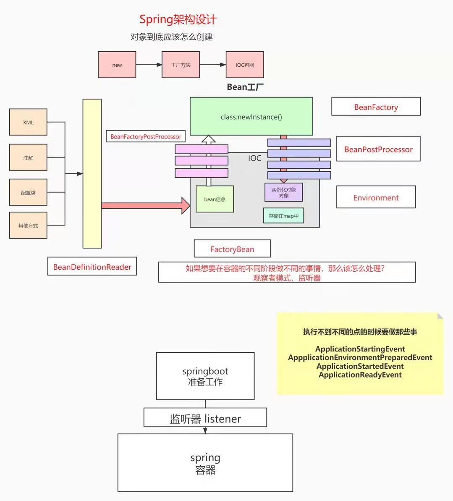
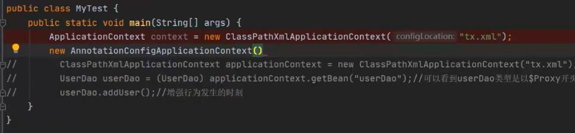
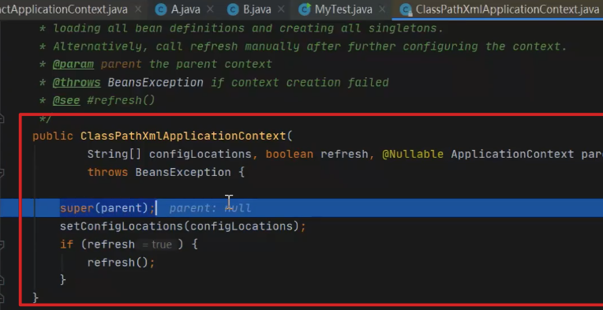
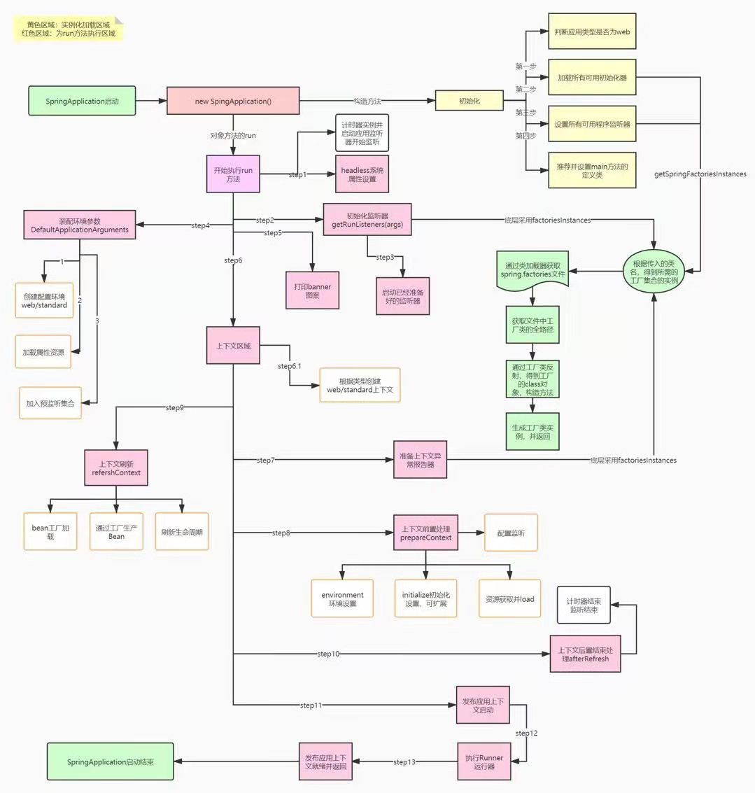
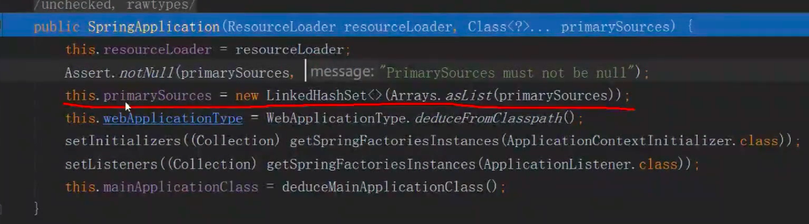
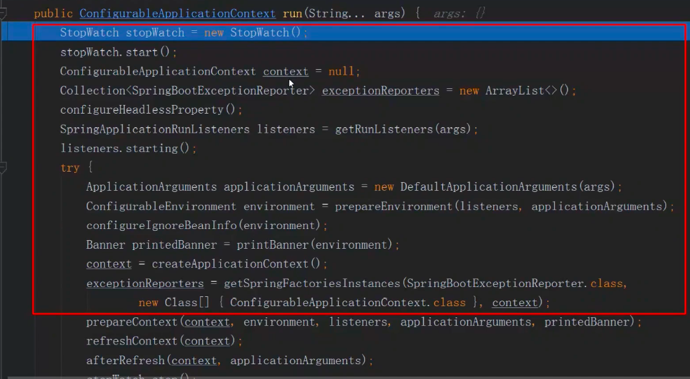
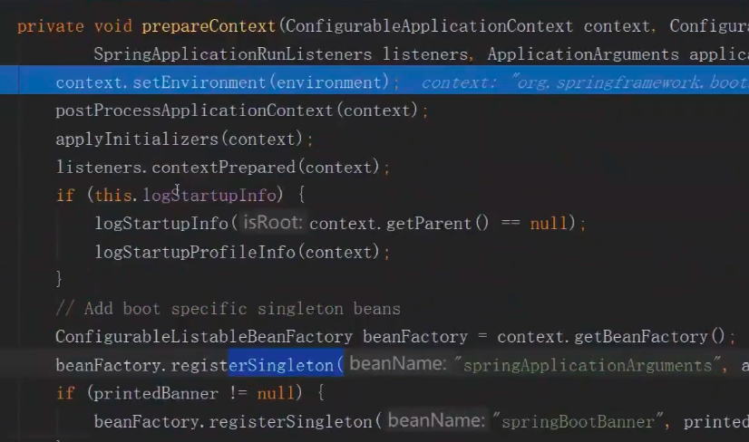
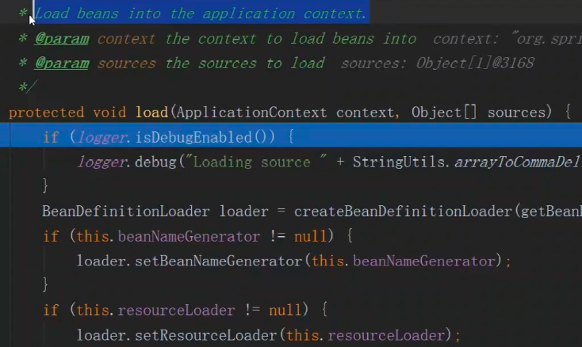

## 一、bean实例化

### 1、代码debug

创建spring应用，debug，F7一步步来

setConfigLocations()：加载外部配置文件

关键方法refresh（）：

## springboot

springbootApplication debug

springApplication构造方法：

通过堆栈信息匹配main方法，推断主类的class

执行run()方法：

1、准备工作

- 设置启动时间；
- 创建上下文对象；
- 创建异常报告器；
- 获取监听器并启动；
- 设置环境参数对象ApplicationArguments；

2、prepareContext方法：准备上下文

给上下文设置具体属性值：

- 环境对象；
- 初始化参数；
- 发布监听事件
- 创建对象工厂

load方法：

加载bean到上下文。

3、refreshContex方法：刷新容器

调用spring的refresh方法

