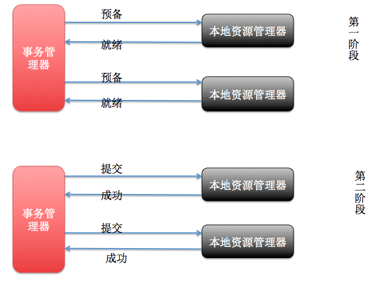

## 一　分布式系统的经典基础理论

[分布式系统的经典基础理论](https://blog.csdn.net/qq_34337272/article/details/80444032)

 本文主要是简单的介绍了三个常见的概念： **分布式系统设计理念** 、 **CAP定理** 、 **BASE理论** ，关于分布式系统的还有很多很多东西。
  

## 二　分布式事务
分布式事务就是指事务的参与者、支持事务的服务器、资源服务器以及事务管理器分别位于不同的分布式系统的不同节点之上。以上是百度百科的解释，简单的说，就是一次大的操作由不同的小操作组成，这些小的操作分布在不同的服务器上，且属于不同的应用，分布式事务需要保证这些小操作要么全部成功，要么全部失败。本质上来说，分布式事务就是为了保证不同数据库的数据一致性。
* [深入理解分布式事务](http://www.codeceo.com/article/distributed-transaction.html)

解决：

###基于XA的两阶段提交：本地资源管理器（数据库）+ 事务管理器

XA 就是 X/Open DTP 定义的交易中间件与数据库之间的接口规范(即接口函数)，交易中间件用它来通知数据库事务的开始、结束以及提交、回滚等。 XA 接口函数由数据库厂商提供。

**准备阶段：**

事务协调者(事务管理器)给每个参与者(资源管理器)发送 Prepare 消息，每个参与者要么直接返回 失败(如权限验证失败)，要么在本地执行事务，写本地的 redo 和 undo 日志，但不提交，到达一 种“万事俱备，只欠东风”的状态。 

**提交阶段 ：**

如果协调者收到了参与者的失败消息或者超时，直接给每个参与者发送回滚(Rollback)消息;否则， 发送提交(Commit)消息;参与者根据协调者的指令执行提交或者回滚操作，释放所有事务处理过 程中使用的锁资源。(注意:必须在最后阶段释放锁资源) 

缺点：

1、 同步阻塞问题：执行过程中，所有参与节点都是事务阻塞型的。  

2、 单点故障：由于协调者的重要性，一旦协调者发生故障。参与者会一直阻塞下去。 

3、数据不一致(脑裂问题) ：在二阶段提交的阶段二中，当协调者向参与者发送 commit 请求之后，发生了局部网络异 常或者在发送 commit 请求过程中协调者发生了故障，导致只有一部分参与者接受到了 commit 请求。于是整个分布式系统便出现了数据部一致性的现象(脑裂现象)。 

4、数据状态不确定（二阶段无法解决）：协调者再发出 commit 消息之后宕机，而唯一接收到这条消息的参与者同时也宕机了。那 么即使协调者通过选举协议产生了新的协调者，这条事务的状态也是不确定的，没人知道 事务是否被已经提交。 

###消息事务+最终一致性：基于消息中间件的两阶段提交

1、A系统向消息中间件发送一条预备消息
2、消息中间件保存预备消息并返回成功
3、A执行本地事务
4、A发送提交消息给消息中间件	

### TCC编程

整个业务逻辑分为三块：Try、Confirm和Cancel三个操作

- Try 阶段主要是对业务系统做检测及资源预留
- Confirm 阶段主要是对业务系统做确认提交，Try阶段执行成功并开始执行 Confirm阶段时，默认 Confirm阶段是不会出错的。即：只要Try成功，Confirm一定成功。
- Cancel 阶段主要是在业务执行错误，需要回滚的状态下执行的业务取消，预留资源释放。

缺点：产生多次DB操作，这将损耗一定的性能，并使得整个TCC事务时间拉长。

###本地消息表（异步确保）

本地消息表这种实现方式应该是业界使用最多的，其核心思想是将分布式事务拆分成本地事务进行处理

消息生产方，需要额外建一个消息表，并记录消息发送状态。消息表和业务数据要在一个事务里提交，也就是说他们要在一个数据库里面。然后消息会经过MQ发送到消息的消费方。如果消息发送失败，会进行重试发送。

消息消费方，需要处理这个消息，并完成自己的业务逻辑。此时如果本地事务处理成功，表明已经处理成功了，如果处理失败，那么就会重试执行。如果是业务上面的失败，可以给生产方发送一个业务补偿消息，通知生产方进行回滚等操作。

生产方和消费方定时扫描本地消息表，把还没处理完成的消息或者失败的消息再发送一遍。如果有靠谱的自动对账补账逻辑，这种方案还是非常实用的。

这种方案遵循BASE理论，采用的是最终一致性，笔者认为是这几种方案里面比较适合实际业务场景的，即不会出现像2PC那样复杂的实现(当调用链很长的时候，2PC的可用性是非常低的)，也不会像TCC那样可能出现确认或者回滚不了的情况。

**优点：** 一种非常经典的实现，避免了分布式事务，实现了最终一致性。在 .NET中 有现成的解决方案。

**缺点：** 消息表会耦合到业务系统中，如果没有封装好的解决方案，会有很多杂活需要处理。

###幂等性

即使没有MQ，重试也是无处不在的。所以幂等问题不是因为用到MQ后引入的，而是老问题。

幂等怎么做？

如果是单条insert操作，我们一般会依赖唯一键。如果一个事务里包含一个单条insert，那也可以依赖这条insert做幂等，当insert抛异常就回滚事务。

如果是update操作，那么状态机控制和版本控制异常重要。这里要多加小心。

再复杂点的，可以考虑引入一个log表。该log对操作id（消息id？）进行唯一键控制。然后整个操作用事务控制。当插入log失败时整个事务回滚就好了。

有人会说先查log表或者利用redis等缓存，加锁。我想说的是这个基本上都不work。除非在事务里进行查寻。所以建议，所幸让代码简单点，直接插入，依赖数据库唯一键冲突回滚掉就好了。

用唯一键挡重入是目前为止个人觉得最有安全感的方式。当然对数据库会有一些额外性能损耗。问题就变成了有多大的并发，其中又有多大是需要重试的？

* [分布式事务？No, 最终一致性](https://zhuanlan.zhihu.com/p/25933039)

* [聊聊分布式事务，再说说解决方案](https://www.cnblogs.com/savorboard/p/distributed-system-transaction-consistency.html)

## 三　分布式系统一致性
[分布式服务化系统一致性的“最佳实干”](https://www.jianshu.com/p/1156151e20c8)

### 一致性hash：

一致性哈希算法(Consistent Hashing Algorithm)是一种分布式算法，常用于负载均衡

## 四　一致性协议/算法
早在1898年就诞生了著名的 **Paxos经典算法** （**Zookeeper就采用了Paxos算法的近亲兄弟Zab算法**），但由于Paxos算法非常难以理解、实现、排错。所以不断有人尝试简化这一算法，直到2013年才有了重大突破：斯坦福的Diego Ongaro、John Ousterhout以易懂性为目标设计了新的一致性算法—— **Raft算法** ，并发布了对应的论文《In Search of an Understandable Consensus Algorithm》，到现在有十多种语言实现的Raft算法框架，较为出名的有以Go语言实现的Etcd，它的功能类似于Zookeeper，但采用了更为主流的Rest接口。
* [图解 Paxos 一致性协议](https://mp.weixin.qq.com/s?__biz=MzI0NDI0MTgyOA==&mid=2652037784&idx=1&sn=d8c4f31a9cfb49ee91d05bb374e5cdd5&chksm=f2868653c5f10f45fc4a64d15a5f4163c3e66c00ed2ad334fa93edb46671f42db6752001f6c0#rd)
*  [图解分布式协议-RAFT](http://ifeve.com/raft/)
*  [Zookeeper ZAB 协议分析](https://dbaplus.cn/news-141-1875-1.html)

## 五　分布式存储

**分布式存储系统将数据分散存储在多台独立的设备上**。传统的网络存储系统采用集中的存储服务器存放所有数据，存储服务器成为系统性能的瓶颈，也是可靠性和安全性的焦点，不能满足大规模存储应用的需要。分布式网络存储系统采用可扩展的系统结构，利用多台存储服务器分担存储负荷，利用位置服务器定位存储信息，它不但提高了系统的可靠性、可用性和存取效率，还易于扩展。 

 * [分布式存储系统概要](http://witchiman.top/2017/05/05/distributed-system/)

## 六　分布式计算

**所谓分布式计算是一门计算机科学，它研究如何把一个需要非常巨大的计算能力才能解决的问题分成许多小的部分，然后把这些部分分配给许多计算机进行处理，最后把这些计算结果综合起来得到最终的结果。**
分布式网络存储技术是将数据分散的存储于多台独立的机器设备上。分布式网络存储系统采用可扩展的系统结构，利用多台存储服务器分担存储负荷，利用位置服务器定位存储信息，不但解决了传统集中式存储系统中单存储服务器的瓶颈问题，还提高了系统的可靠性、可用性和扩展性。

* [关于分布式计算的一些概念](https://blog.csdn.net/qq_34337272/article/details/80549020)

