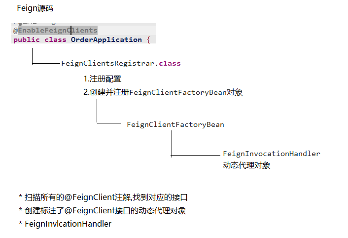

##RPC与RESTful


RPC 远程调用图解：


| 比较项   | RESTful    | RPC         |
| -------- | ---------- | ----------- |
| 通讯协议 | HTTP       | 一般使用TCP |
| 性能     | 略低       | 较高        |
| 灵活度   | 高         | 低          |
| 应用     | 微服务架构 | SOA架构     |


## CAP理论


Consistency(一致性):数据一致更新，所有数据的变化都是同步的
Availability(可用性):在集群中一部分节点故障后，集群整体是否还能响应客户端的读写请求
Partition tolerance(分区容忍性):某个节点的故障，并不影响整个系统的运行

| 选 择 | 说明                                                         |
| ----- | ------------------------------------------------------------ |
| CA    | `放弃分区容错性，加强一致性和可用性，其实就是传统的关系型数据库的选择 ` |
| AP    | 放弃一致性(这里说的一致性是强一致性)，追求分区容错性和可用性，这是很多分布式 系统设计时的选择，例如很多NoSQL系统就是如此 |
| CP    | `放弃可用性，追求一致性和分区容错性，基本不会选择，网络问题会直接让整个系统不可 用 ` |


##eureka


- Eureka Client是一个Java客户端，用于简化与Eureka Server的交互;
- Eureka Server提供服务发现的能力，各个微服务启动时，会通过Eureka Client向Eureka Server
  进行注册自己的信息(例如网络信息)，Eureka Server会存储该服务的信息;
- 微服务启动后，会周期性地向Eureka Server发送心跳(默认周期为30秒)以续约自己的信息。如
  果Eureka Server在一定时间内没有接收到某个微服务节点的心跳，Eureka Server将会注销该微服
  务节点(默认90秒);
- 每个Eureka Server同时也是Eureka Client，多个Eureka Server之间通过复制的方式完成服务注
  册表的同步;
- Eureka Client会缓存Eureka Server中的信息。即使所有的Eureka Server节点都宕掉，服务消费
  者依然可以使用缓存中的信息找到服务提供者。

###eureka注册中心

引入依赖 spring-cloud-starter-netflix-eureka-server
配置EurekaServer
通过 @EnableEurekaServer 激活Eureka Server端配置

###eureka服务注册流程

pom文件中添加eureka client的相关坐标

配置文件中添加Eureka Server的主机地址 eureka.client.serviceUrl.defaultZone 

启动类添加服务注册注解 @EnableDiscoveryClient 或 @EnableEurekaClient 

###eureka续约流程


###Eureka中的自我保护 

微服务第一次注册成功之后，每**30秒**会发送一次**心跳**将服务的实例信息注册到注册中心。通知 Eureka Server 该实例仍然存在。如果超过**90秒**没有发送更新，则服务器将从注册信息中将此服务**移除**。 

Eureka Server在运行期间，会统计心跳失败的比例在15分钟之内是否低于85%，如果出现低于的情况 (在单机调试的时候很容易满足，实际在生产环境上通常是由于网络不稳定导致)，Eureka Server会 将当前的实例注册信息保护起来，同时提示这个警告。保护模式主要用于一组客户端和Eureka Server 之间存在网络分区场景下的保护。一旦进入保护模式，Eureka Server将会尝试保护其服务注册表中的 信息，不再删除服务注册表中的数据(也就是**不会注销任何微服务**)

### eureka启动流程


### eureka server启动流程


### eureka client自动装载

通过@springbootapplication里面的@EnableAutoconfigration找到starter的factories文件，定位里的一些autoConfigration**自动配置类**，


### eureka元数据

Eureka的元数据有两种:标准元数据和自定义元数据。 

标准元数据:主机名、IP地址、端口号、状态页和健康检查等信息，这些信息都会被发布在服务注 册表中，用于服务之间的调用。 自定义元数据:可以使用eureka.instance.metadata-map配置，符合KEY/VALUE的存储格式。这 些元数据可以在远程客户端中访问。 


##Eureka中的常见问题 

###服务注册慢
 默认情况下，服务注册到Eureka Server的过程较慢。SpringCloud官方文档中给出了详细的原因 

服务的注册涉及到心跳，默认心跳间隔为30s。在实例、服务器、客户端都在本地缓存中具 有相同的元数据之前，服务不可用于客户端发现(所以可能需要3次心跳)。可以通过配置 

eureka.instance.leaseRenewalIntervalInSeconds (心跳频率)加快客户端连接到其他服务的过 程。在生产中，最好坚持使用默认值，因为在服务器内部有一些计算，他们对续约做出假设。 

###服务节点剔除问题
 默认情况下，由于Eureka Server剔除失效服务间隔时间为90s且存在自我保护的机制。所以不能有效而 迅速的剔除失效节点，这对开发或测试会造成困扰。

解决方案如下: **Eureka Server: 配置关闭自我保护，设置剔除无效节点的时间间隔 ；Eureka Client:配置开启健康检查，并设置续约时间**


##RestTemplate服务调用

Spring框架提供的RestTemplate类可用于在应用中调用rest服务

RestTemplate默认依赖JDK提供http连接的能力(HttpURLConnection)，如果有需要的话也可以通过 setRequestFactory方法替换为例如 Apache HttpComponents、Netty或OkHttp等其它HTTP library。 

HTTP协议的方法:HEAD、GET、POST、PUT、DELETE和OPTIONS。对应的， RestTemplate类具有headForHeaders()、getForObject()、postForObject()、put()和delete()等方法。 


##Ribbon

1、服务调用

基于Ribbon实现服务调用， 是通过拉取到的所有服务列表组成(服务名-请求路径的)映射关系。借助
RestTemplate 最终进行调用

```
创建RestTemplate时候，声明@LoadBalance注解

使用RestTemplate调用微服务，以服务名称替换IP地址
```

2、负载均衡

客户端负载均衡工具

负载均衡策略：轮询，随机，重试，权重策略（会计算每个服务的权重，越高的被调用的可能性越大），

最佳策略（遍历所有的服务实例，过滤掉故障实例，并返回请求数最小的实例返回） 

可用过滤策略（过滤掉故障和请求数超过阈值的服务实例，再从剩下的实力中轮询调用）


##ribbon源码


关键组件：

- ServerList:可以响应客户端的特定服务的服务器列表。
- ServerListFilter:可以动态获得的具有所需特征的候选服务器列表的过滤器。
- ServerListUpdater:用于执行动态服务器列表更新。
- Rule:负载均衡策略，用于确定从服务器列表返回哪个服务器。
- Ping:客户端用于快速检查服务器当时是否处于活动状态。
- LoadBalancer:负载均衡器，负责负载均衡调度的管理


##feign

服务消费者引入 spring-cloud-starter-openfeign 依赖
通过 @FeignClient 声明一个调用远程微服务接口
启动类上通过 @EnableFeignClients 激活Feign


**请求压缩：**

Spring Cloud Feign 支持对请求和响应进行GZIP压缩，以减少通信过程中的性能损耗。通过下面的参数


### 源码



动态代理对象调用接口


## 微服务高并发

请求积压问题


解决：线程池服务隔离隔离


##Hystrix断路器

### 服务雪崩

客户端访问A服务，而A服务需要调用B服务，B服务需要调用C服务，由于网络原因或者自身的原因，如果B服务或者C服务不能及时响应，A服务将处于阻塞状态，直到B服务C服务响应。此时若有大量的请求涌入，容器的线程资源会被消耗完毕，导致服务瘫痪。服务与服务之间的依赖性，故障会传播，造成连锁反应，会对整个微服务系统造成灾难性的严重后果，这就是服务故障的“雪崩”效应


服务隔离：模块独立，无强依赖

熔断降级：当下游服务因访问压力过大而响应变慢或失败，上游服务为了保护系统整体的可用性，可以暂时切断对下游服务的调用

降级：是当某个服务熔断之后，服务器将不再被调用，此时客户端可以自己准备一个本地的fallback回调，返回一个缺省值

限流：可以认为服务降级的一种，限流就是限制系统的输入和输出流量已达到保护系统的目的

###实现：

**ribbon：**

1. 添加Hystrix的相关依赖
2. 启动类 添加 @EnableCircuitBreaker 注解开启对熔断器的支持
3. 定义降级方法，并在@HystrixCommand 中配置


**支持Feign**

1、引入依赖（Feign已经继承Hystrix）

2、在Feign配置中开启Hystrix

3、配置FeignClient接口实现类，里面有熔断触发降级逻辑

4、修改feignClient接口，添加降级方法支持，@FeignClient注解中添加降级方法


###短路


###熔断器隔离策略

**线程池隔离策略**:使用一个线程池来存储当前的请求，线程池对请求作处理，设置任务返回处理超
时时间，堆积的请求堆积入线程池队列。这种方式需要为每个依赖的服务申请线程池，有一定的资
源消耗，好处是可以应对突发流量(流量洪峰来临时，处理不完可将数据存储到线程池队里慢慢处
理)
**信号量隔离策略**:使用一个原子计数器(或信号量)来记录当前有多少个线程在运行，请求来先判
断计数器的数值，若超过设置的最大线程个数则丢弃改类型的新请求，若不超过则执行计数操作请
求来计数器+1，请求返回计数器-1。这种方式是严格的控制线程且立即返回模式，无法应对突发
流量(流量洪峰来临时，处理的线程超过数量，其他的请求会直接返回，不继续去请求依赖的服
务)


##Spring Cloud Alibaba 

###Spring Cloud Alibaba简介 

Spring Cloud Alibaba 是由阿里推出的， 致力于提供微服务开发的一站式解决方案。 2018年7月正式开源， 进入 Spring Cloud 孵化器;2019年7月, 从Spring Cloud迁出, 独立维护。 阿里巴巴推出 Spring Cloud Alibaba，很大程度上市希望通过抢占开发者生态，来帮助推广自家的 云产品。
 依赖于阿里巴巴强大的技术影响力， 逐渐成为主流互联网公司， 微服务解决方案的重要选择之 一。 

###Spring Cloud Alibaba主要功能: 

- 服务限流降级

- 服务注册与发现
- 分布式配置管理
-  消息驱动能力

- 分布式事务

- 分布式任务调度

- 阿里云对象存储、短信服务等

###Spring Cloud Alibaba主要组件: 

**Sentinel**:把流量作为切入点，从流量控制、熔断降级、系统负载保护等多个维度保护服务 的稳定性。 

**Nacos**:一个更易于构建云原生应用的动态服务发现、配置管理和服务管理平台。 

**RocketMQ**:一款开源的分布式消息系统，基于高可用分布式集群技术，提供低延时的、高 可靠的消息发布与订阅服务。 

**Dubbo**:Apache Dubbo? 是一款高性能 Java RPC 框架。 

**Seata**:阿里巴巴开源产品，一个易于使用的高性能微服务分布式事务解决方案。

 **Alibaba Cloud ACM**:一款在分布式架构环境中对应用配置进行集中管理和推送的应用配置 中心产品。

 **Alibaba Cloud OSS**: 阿里云对象存储服务(Object Storage Service，简称 OSS)，是阿里云 提供的海量、安全、低成本、高可靠的云存储服务。您可以在任何应用、任何时间、任何地 点存储和访问任意类型的数据。

 **Alibaba Cloud SchedulerX**: 阿里中间件团队开发的一款分布式任务调度产品，提供秒级、精 准、高可靠、高可用的定时(基于 Cron 表达式)任务调度服务。

 **Alibaba Cloud SMS**: 覆盖全球的短信服务，友好、高效、智能的互联化通讯能力，帮助企业 迅速搭建客户触达通道。 


###Spring Cloud vs Spring Cloud Alibaba 

Spring Cloud Alibaba与Spring Cloud并非两种对立的技术, Spring Cloud Alibaba是基于Spring Cloud 基础上做了改进与扩展, 增加了许多功能, 提供了完善的微服务解决方案。 

| 对比           | Spring Cloud Alibaba | Spring Cloud       |
| -------------- | -------------------- | ------------------ |
| 注册中心       | Nacos                | Eureka/Consul      |
| 熔断降级       | Sentinel             | Hystrix            |
| 服务通讯       | Rest/Rpc(Dubbo)      | Rest(Ribbon/Feign) |
| 服务网关       | Spring Cloud Gateway | Zuul               |
| 分布式事务     | Seata                | -                  |
| 消息队列       | RocketMQ             | -                  |
| 对象存储       | OSS                  | -                  |
| 分布式任务调度 | SchedulerX           | -                  |
| 日志分析       | SLS                  | -                  |
| 推送服务       | SMS短信/VMS语音      | -                  |


##面试要点

### 微服务概述


微服务架构设计，优势，存在问题，服务雪崩，穿透，并发，可用性等


深度：，CAP机制，BASE理论，TCC两阶段，补偿


### 设计模式

聚合模式


代理模式


分支模式


异步模式


### 熔断降级原理


###springcloud和springcloud alibaba区别


**springcloud alibaba的改进**


###springcloud核心组件

打的全点，


### springcloud和dubbo区别

rest，RPC


