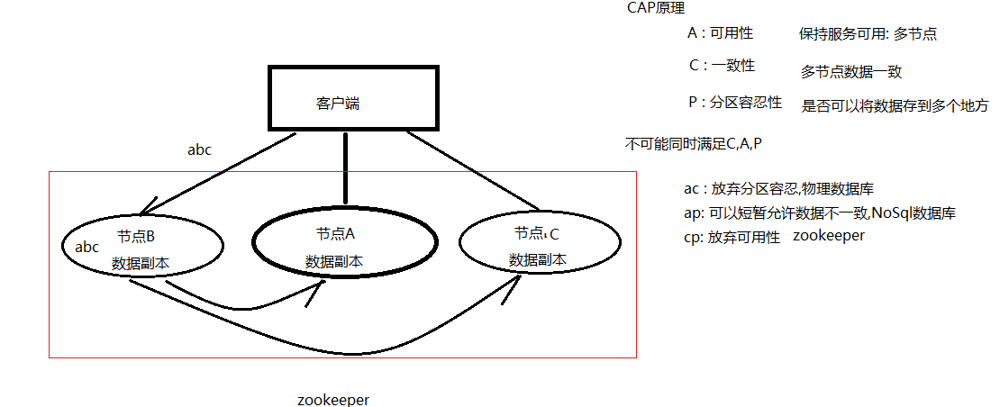
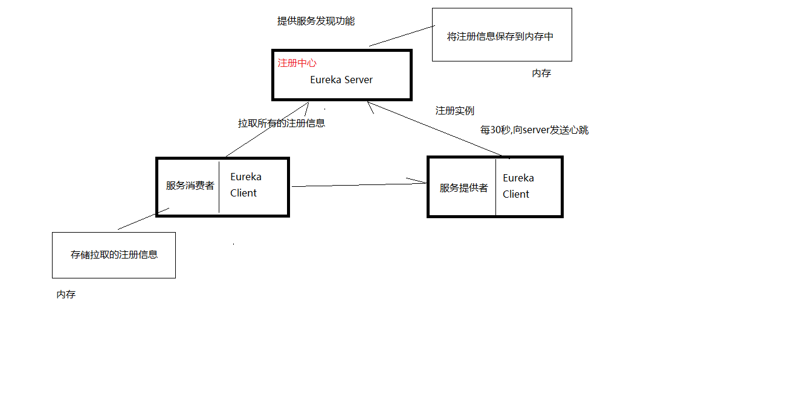
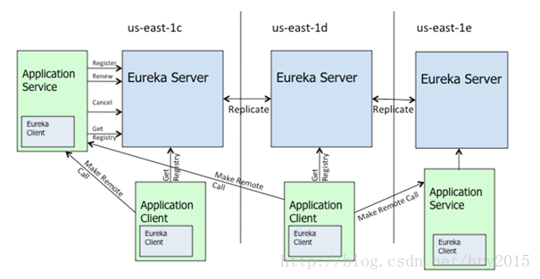
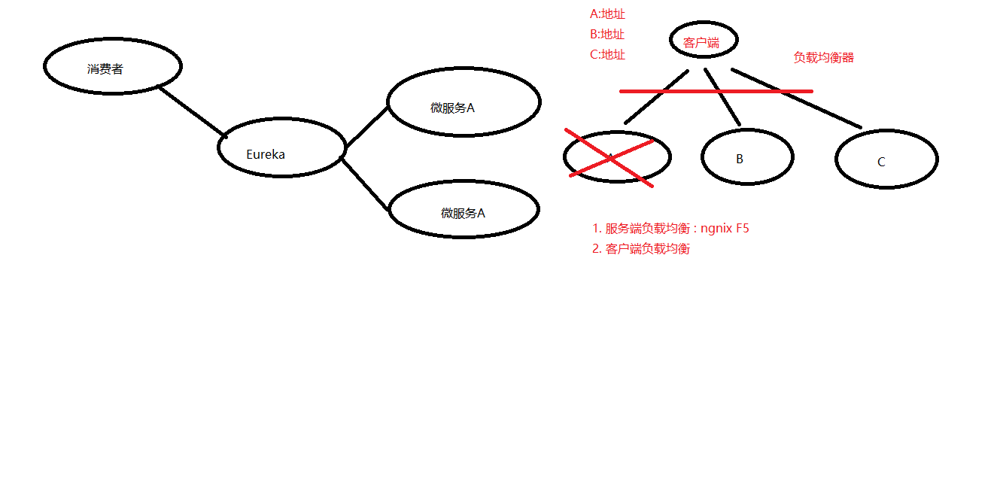
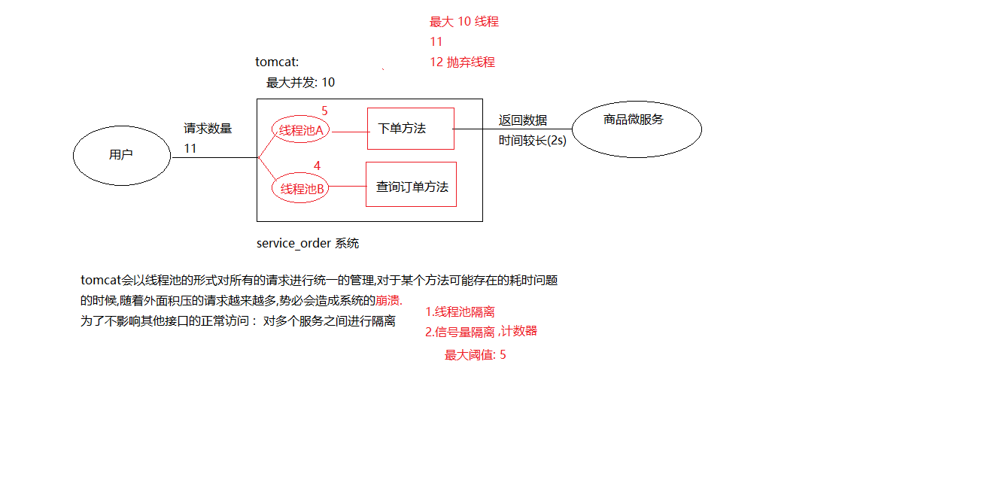

##RPC与RESTful


RPC 远程调用图解：


| 比较项   | RESTful    | RPC         |
| -------- | ---------- | ----------- |
| 通讯协议 | HTTP       | 一般使用TCP |
| 性能     | 略低       | 较高        |
| 灵活度   | 高         | 低          |
| 应用     | 微服务架构 | SOA架构     |


## CAP理论



Consistency(一致性):数据一致更新，所有数据的变化都是同步的
Availability(可用性):在集群中一部分节点故障后，集群整体是否还能响应客户端的读写请求
Partition tolerance(分区容忍性):某个节点的故障，并不影响整个系统的运行

| 选 择 | 说明                                                         |
| ----- | ------------------------------------------------------------ |
| CA    | `放弃分区容错性，加强一致性和可用性，其实就是传统的关系型数据库的选择 ` |
| AP    | 放弃一致性(这里说的一致性是强一致性)，追求分区容错性和可用性，这是很多分布式 系统设计时的选择，例如很多NoSQL系统就是如此 |
| CP    | `放弃可用性，追求一致性和分区容错性，基本不会选择，网络问题会直接让整个系统不可 用 ` |

## ZK和eureka区别：CAP理论

zk：cp设计（强一致性），分布式协调系统，当节点crash后，需要进行leader选举，期间ZK服务不可用。

eureka：ap（高可用），服务注册发现系统，eureka各节点平等，几个挂掉不会影响正常节点工作，客户端向eureka注册时发现连接失败，会自动切换其他节点（**保证可用性**）；获取的服务列表可能不是最新的（**不保证强一致**）

当eureka发现85%服务没有心跳，就会认为是自己网络问题，就不会从服务列表删除这些服务，同时客户端也会缓存服务信息，


##eureka



- Eureka Client是一个Java客户端，用于简化与Eureka Server的交互;
- Eureka Server提供服务发现的能力，各个微服务启动时，会通过Eureka Client向Eureka Server
  进行注册自己的信息(例如网络信息)，Eureka Server会存储该服务的信息;
- 微服务启动后，会周期性地向Eureka Server发送心跳(默认周期为30秒)以续约自己的信息。如
  果Eureka Server在一定时间内没有接收到某个微服务节点的心跳，Eureka Server将会注销该微服
  务节点(默认90秒);
- 每个Eureka Server同时也是Eureka Client，多个Eureka Server之间通过复制的方式完成服务注
  册表的同步;
- Eureka Client会缓存Eureka Server中的信息。即使所有的Eureka Server节点都宕掉，服务消费
  者依然可以使用缓存中的信息找到服务提供者。

###eureka注册中心

引入依赖 spring-cloud-starter-netflix-eureka-server
配置EurekaServer
通过 @EnableEurekaServer 激活Eureka Server端配置

###eureka服务注册流程

pom文件中添加eureka client的相关坐标

配置文件中添加Eureka Server的主机地址 eureka.client.serviceUrl.defaultZone 

启动类添加服务注册注解 @EnableDiscoveryClient 或 @EnableEurekaClient 

当 Eureka Client（服务提供者）向 Eureka Server 注册时，它提供自身的元数据 ，比如 IP 地址、端口，运行状况指示符 URL，主页等；

###eureka续约流程

Eureka Client 会每隔30秒（默认情况下）发送一次心跳来续约；通过续约来告知 Eureka Server 该 Eureka Client 仍然存在，没有出现问题；正常情况下，如果 Eureka Server 在90秒没有收到 Eureka Client 的续约，它会将实例从其注册表中删除；

### eureka服务发现

eureka server内部采用多级缓存来同步服务注册表，readonly缓存，readwrite缓存，定时线程

当一个服务的信息注册到服务注册表中，会立即同步到readwrite缓存中，定时线程负责同步到readonly缓存

消费者定时，比如30s，从readonly缓存拉取注册表信息

###Eureka中的自我保护 

微服务第一次注册成功之后，每**30秒**会发送一次**心跳**将服务的实例信息注册到注册中心。通知 Eureka Server 该实例仍然存在。如果超过**90秒**没有发送更新，则服务器将从注册信息中将此服务**移除**。 

Eureka Server在运行期间，会统计心跳失败的比例在15分钟之内是否低于==85%==，如果出现低于的情况 (在单机调试的时候很容易满足，实际在生产环境上通常是由于网络不稳定导致)，Eureka Server会 将当前的实例注册信息保护起来，同时提示这个警告。保护模式主要用于一组客户端和Eureka Server 之间存在网络分区场景下的保护。一旦进入保护模式，Eureka Server将会尝试保护其服务注册表中的 信息，不再删除服务注册表中的数据(也就是**不会注销任何微服务**)

（eureka.server.enableSelfPreservation）来关闭服务保护模式，商业项目中不推荐关闭服务保护，因为网络不可靠很容易造成网络波动、延迟、断线的可能，如果关闭了，可能导致大量的服务反复注册、删除、再注册，导致效率降低；

### eureka启动流程


### eureka server启动流程


### eureka client自动装载

通过@springbootapplication里面的@EnableAutoconfigration找到starter的factories文件，定位里的一些autoConfigration**自动配置类**，


### eureka元数据

Eureka的元数据有两种:标准元数据和自定义元数据。 

标准元数据:主机名、IP地址、端口号、状态页和健康检查等信息，这些信息都会被发布在服务注 册表中，用于服务之间的调用。 自定义元数据:可以使用eureka.instance.metadata-map配置，符合KEY/VALUE的存储格式。这 些元数据可以在远程客户端中访问。 

### 服务下线

 在全局配置文件中配置（endpoints.shutdown.enabled），通过 HTTP POST 请求的方式（http://ip:port/shutdown），通知 Eureka Client 优雅停服，这个请求一旦发送到 Eureka Client，那么 Eureka Client 会发送一个 shutdown 请求到 Eureka Server，Eureka Server 接收到这个 shutdown 请求后，会在服务列表中标记这个服务的状态为 down，同时 Eureka Client 应用自动关闭；

### eureka高可用

​        Eureka Server 互相注册，Eureka Client 配置所有的 Eureka Server 连接，逗号隔开；


##Eureka中的常见问题 

###服务注册慢
 默认情况下，服务注册到Eureka Server的过程较慢。SpringCloud官方文档中给出了详细的原因 

服务的注册涉及到心跳，默认心跳间隔为30s。在实例、服务器、客户端都在本地缓存中具 有相同的元数据之前，服务不可用于客户端发现(所以可能需要3次心跳)。可以通过配置 

eureka.instance.leaseRenewalIntervalInSeconds (心跳频率)加快客户端连接到其他服务的过 程。在生产中，最好坚持使用默认值，因为在服务器内部有一些计算，他们对续约做出假设。 

###服务节点剔除问题
 默认情况下，由于Eureka Server剔除失效服务间隔时间为90s且存在自我保护的机制。所以不能有效而 迅速的剔除失效节点，这对开发或测试会造成困扰。

解决方案如下: **Eureka Server: 配置关闭自我保护，设置剔除无效节点的时间间隔 ；Eureka Client:配置开启健康检查，并设置续约时间**


## Eureka集群



**新的Eureka Server节点加入集群后的影响：**

新增节点从集群里其它节点获取所有的实例注册信息。如果获取同步失败，它会在一定时间（此值由决定eureka.server.peer-eureka-nodes-update-interval-ms决定）内拒绝服务

**已有Eureka Server和Service Consumer如何发现新的Eureka Server**

1.在运行过程中，Eureka Server之间会定时同步实例的注册信息

2.Eureka Server节点定时更新节点信息，相互发现


##RestTemplate服务调用

Spring框架提供的RestTemplate类可用于在应用中调用rest服务

RestTemplate默认依赖JDK提供http连接的能力(HttpURLConnection)，如果有需要的话也可以通过 setRequestFactory方法替换为例如 Apache HttpComponents、Netty或OkHttp等其它HTTP library。 

HTTP协议的方法:HEAD、GET、POST、PUT、DELETE和OPTIONS。对应的， RestTemplate类具有headForHeaders()、getForObject()、postForObject()、put()和delete()等方法。 


##Ribbon

1、服务调用

服务发现：LoadBalancerClient

（RibbonLoadBalancerClient 是实现类）在初始化的时候（execute 方法），会通过 ILoadBalance（BaseLoadBalancer 是实现类）向 Eureka 注册中心获取服务注册列表；借助RestTemplate 最终进行调用

```
创建RestTemplate时候，声明@LoadBalance注解
使用RestTemplate调用微服务，以服务名称替换IP地址
```

2、负载均衡

客户端负载均衡工具，通过 LoadBalancerInterceptor 进行拦截请求，并根据具体的 IRule 实现来进行负载均衡，默认轮询算法，并且可以更换默认的负载均衡算法，只需要在配置文件中做出修改

负载均衡策略：

- 轮询，
- 随机，
- 重试，
- 权重策略（会计算每个服务的权重，越高的被调用的可能性越大），
- 最佳策略（遍历所有的服务实例，过滤掉故障实例，并返回请求数最小的实例返回） 

- 可用过滤策略（过滤掉故障和请求数超过阈值的服务实例，再从剩下的实力中轮询调用）




3、ribbon与feign区别

Nginx是客户端所有请求统一交给Nginx，由Nginx进行实现负载均衡请求转发，属于==服务器端负载均衡==。既请求由Nginx服务器端进行转发。客户端负载均衡Ribbon，Ribbon是从Eureka注册中心服务器端上获取服务注册信息列表，缓存到本地，然后在本地实现轮询负载均衡策略。既在==客户端实现负载均衡==。

##ribbon源码


关键组件：

- ServerList:可以响应客户端的特定服务的服务器列表。
- ServerListFilter:可以动态获得的具有所需特征的候选服务器列表的过滤器。
- ServerListUpdater:用于执行动态服务器列表更新。
- Rule:负载均衡策略，用于确定从服务器列表返回哪个服务器。
- Ping:客户端用于快速检查服务器当时是否处于活动状态。
- LoadBalancer:负载均衡器，负责负载均衡调度的管理


##feign

服务消费者引入 spring-cloud-starter-openfeign 依赖
通过 @FeignClient 声明一个调用远程微服务接口
启动类上通过 @EnableFeignClients 激活Feign


**Feign 原理**

1. 启动时，程序会进行包扫描，扫描所有包下所有 @FeignClient 注解的类，创建远程接口的本地JDK Proxy==代理==实例。然后将这些本地Proxy代理实例，注入到Spring IOC容器中，当远程接口的方法被调用，由Proxy代理实例去完成真正的远程访问，并且返回结果
2. RequestTemplate 中包含请求的所有信息，如请求参数，请求 URL 等；
3. RequestTemplate 生产 Request，然后将 Request 交给 Client 处理，这个 Client 默认是 JDK HTTPUrlConnection，也可以是 OKhttp、Apache HTTPClient 等；
4. 最后 Client 封装成 LoadBaLanceClient，结合 Ribbon 负载均衡地发起调用；


### 源码


动态代理对象调用接口

### 优化

**Feign 日志级别**

​        优化：生产日志级别设置：BASIC；

- NONE（默认值）：不记录任何日志；
- BASIC：仅记录请求方法、URL、响应状态代码以及执行时间；
- HEADERS：记录请求和响应的 header；
- FULL：记录请求和响应的 header、body 和元数据；

**GET 多参数请求构造**

​        Feign 默认不支持 GET 方法直接绑定 POJO 的，目前解决方式如下：

- 方法一：通过 Feign 的 RequestInterceptor 中的 apply 方法，统一拦截转换处理 Feign 中的 GET 方法多参数；
- 方法二：Feign 接口方法入参使用 @SpringQueryMap User user；
- 方法三：Feign 接口方法入参使用 
- @RequestParam("id") Long id, @RequestParam("username") String username；

**Feign 开启 GZIP 压缩**


意：由于开启 GZIP 压缩之后，Feign 之间的调用数据通过二进制协议进行传输，返回值需要修改为 ResponseEntity<byte[]> 才可以正常显示，否则会导致服务之间的调用乱码；


## zuul

Zuul包含了对请求的==路由和过滤==两个最主要的功能，是各种服务的统一入口，同时还会用来提供监控、授权、安全、调度等等

路由功能：负责将外部请求转发到具体的微服务实例上，是实现外部访问统一入口的基础。

过滤器功能：则负责对请求的处理过程进行干预，是实现请求校验、服务聚合等功能的基础。

**Zuul和Eureka进行整合**：将Zuul自身注册为Eureka服务治理下的应用，同时从Eureka中获得其他微服务的消息,也即以后的访问微服务都是通过Zuul跳转后获得。

注意：Zuul服务最终还是会==注册进Eureka==，提供代理+路由+过滤三大功能。

### 核心原理

Zuul的核心是一系列的filters，其作用可以类比Servlet框架的Filter，或者AOP。

过滤器之间没有直接进行通信,而是通过Request Context（上下文）进行数据传递。

**过滤器的种类**：

- PRE（前置）：这种过滤器在请求被路由之前调用。我们可利用这种过滤器实现鉴权、限流、参数校验调整等。
- ROUTING（路由）：这种过滤器将请求路由到微服务。这种过滤器用于构建发送给微服务的请求，并使用Apache HttpClient或Netfilx Ribbon请求微服务。
- POST（后置）：这种过滤器在路由到微服务以后执行。这种过滤器可用来为响应添加标准的HTTP Header、收集统计信息和指标、将响应从微服务发送给客户端、日志等。
- ERROR（错误）：在其他阶段发生错误时执行该过滤器。


## 微服务高并发

请求积压问题



解决：线程池服务隔离隔离


##Hystrix断路器

Hystrix处理流程：https://blog.csdn.net/hry2015/article/details/78533758?spm=1001.2014.3001.5501

### 服务雪崩

客户端访问A服务，而A服务需要调用B服务，B服务需要调用C服务，由于网络原因或者自身的原因，如果B服务或者C服务不能及时响应，A服务将处于阻塞状态，直到B服务C服务响应。此时若有大量的请求涌入，容器的线程资源会被消耗完毕，导致服务瘫痪。服务与服务之间的依赖性，故障会传播，造成连锁反应，会对整个微服务系统造成灾难性的严重后果，这就是服务故障的“雪崩”效应

### 服务隔离：

模块独立，无强依赖

### 服务熔断：

当下游服务因访问压力过大而响应变慢或失败，上游服务为了保护系统整体的可用性，可以暂时切断对下游服务的调用

### 服务降级：

是当某个服务熔断之后，服务器将不再被调用，此时客户端可以自己准备一个本地的fallback回调，返回一个缺省值

### 限流：

可以认为服务降级的一种，限流就是限制系统的输入和输出流量已达到保护系统的目的

###实现：

**ribbon：**

1. 添加Hystrix的相关依赖
2. 启动类 添加 @EnableCircuitBreaker 注解开启对熔断器的支持
3. 定义降级方法，并在@HystrixCommand 中配置


**支持Feign**

1、引入依赖（Feign已经继承Hystrix）

2、在Feign配置中开启Hystrix

3、配置FeignClient接口实现类，里面有熔断触发降级逻辑

4、修改feignClient接口，添加降级方法支持，@FeignClient注解中添加降级方法


###短路


### **Hystrix的设计原则**

- 资源隔离（线程池隔离和信号量隔离）机制：限制调用分布式服务的资源使用，某一个调用的服务出现问题不会影响其它服务调用。
- 限流机制：限流机制主要是提前对各个类型的请求设置最高的QPS阈值，若高于设置的阈值则对该请求直接返回，不再调用后续资源。
- 熔断机制：当失败率达到阀值自动触发降级（如因网络故障、超时造成的失败率真高），熔断器触发的快速失败会进行快速恢复。
- 降级机制：超时降级、资源不足时（线程或信号量）降级、运行异常降级等，降级后可以配合降级接口返回托底数据。
- 缓存支持：提供了请求缓存、请求合并实现。
- 通过近实时的统计/监控/报警功能，来提高故障发现的速度。
- 通过近实时的属性和配置热修改功能，来提高故障处理和恢复的速度。

###熔断器隔离策略

**线程池隔离策略**:

信号量隔离只是起了个限制作用，它的保护能力有限：如果下游服务有问题，长时间不返回结果。本身信号量隔离对这个单个请求是起不到任何作用的。它只能限制这样的请求太多了就拒绝，不让整个服务挂。

使用一个线程池来存储当前的请求，线程池对请求作处理，设置任务返回处理超
时时间，堆积的请求堆积入线程池队列。这种方式需要为每个依赖的服务申请线程池，有一定的资
源消耗，好处是可以应对突发流量(流量洪峰来临时，处理不完可将数据存储到线程池队里慢慢处
理)
**信号量隔离策略**:

使用一个==原子计数器==(或信号量)来记录当前有多少个线程在运行，请求来先判
断计数器的数值，若超过设置的最大线程个数则丢弃改类型的新请求，若不超过则执行计数操作请
求来计数器+1，请求返回计数器-1。这种方式是严格的控制线程且立即返回模式，无法应对突发
流量(流量洪峰来临时，处理的线程超过数量，其他的请求会直接返回，不继续去请求依赖的服
务)


