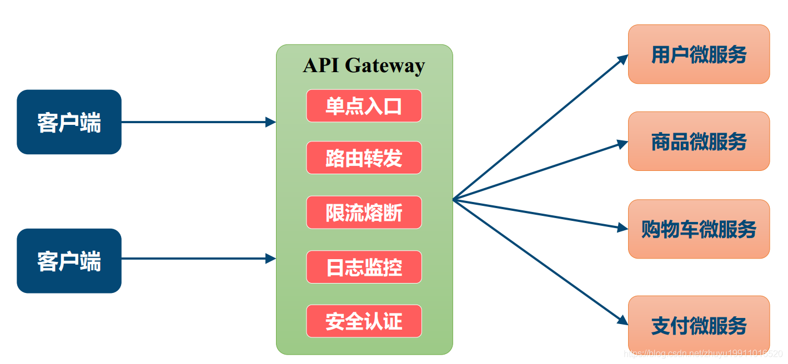

# 网关作用

请求过滤。用作外界连接系统的入口。在网关处理比如权限验证，监控，缓存，请求路由

**一般情况下，网关会提供请求转发、安全认证（身份/权限认证）、流量控制、负载均衡、容灾、日志、监控这些功能**

# 为何需要网关

请求路由：转发请求到对应的接口

统一鉴权：

统一监控：监控入参出参，链路时间等

流量控制，熔断降级：

# 统一API网关设计

## 异步化请求

统一网关层，用少量的机器接入更多的服务，用异步来提高吞吐量

- Tomcat/Jetty+NIO+servlet3

这种策略使用的比较普遍，京东，有赞，Zuul，都选取的是这个策略，这种策略比较适合HTTP。在Servlet3中可以开启异步。

- Netty+NIO

Netty为高并发而生，目前唯品会的网关使用这个策略，在唯品会的技术文章中在相同的情况下Netty是每秒30w+的吞吐量，Tomcat是13w+,可以看出是有一定的差距的，但是Netty需要自己处理HTTP协议，这一块比较麻烦。

对于网关是HTTP请求场景比较多的情况可以采用Servlet，毕竟有更加成熟的处理HTTP协议。如果更加重视吞吐量那么可以采用Netty。

全链路异步：

​	

## 链式处理

- preFilters：前置过滤器，用来处理一些公共的业务，比如统一鉴权，统一限流，熔断降级，缓存处理等，并且提供业务方扩展。
- routingFilters: 用来处理一些泛化调用，主要是做协议的转换，请求的路由工作。
- postFilters: 后置过滤器，主要用来做结果的处理，日志打点，记录时间等等。
- errorFilters: 错误过滤器，用来处理调用异常的情况。

## 业务隔离

#### 2.3.1 信号量隔离

信号量隔离只是限制了==总的并发数==，服务还是主线程进行同步调用。这个隔离如果远程调用超时依然会影响主线程，从而会影响其他业务。因此，如果只是想限制某个服务的总并发调用量或者调用的服务不涉及远程调用的话，可以使用轻量级的信号量来实现。有赞的网关由于没有自定义filter所以选取的是信号量隔离。

#### 2.3.2 线程池隔离

最简单的就是不同业务之间通过不同的线程池进行隔离，就算业务接口出现了问题由于线程池已经进行了隔离那么也不会影响其他业务。在京东的网关实现之中就是采用的线程池隔离，比较重要的业务比如商品或者订单 都是单独的通过线程池去处理。但是由于是统一网关平台，如果业务线众多，大家都觉得自己的业务比较重要需要单独的线程池隔离，如果使用的是Java语言开发的话那么，在Java中线程是比较重的资源比较受限，如果需要隔离的线程池过多不是很适用。如果使用一些其他语言比如Golang进行开发网关的话，线程是比较轻的资源，所以比较适合使用线程池隔离。

#### 2.3.3 集群隔离

如果有某些业务就需要使用隔离但是统一网关又没有线程池隔离那么应该怎么办呢？那么可以使用集群隔离，如果你的某些业务真的很重要那么可以为这一系列业务单独申请一个集群或者多个集群，通过机器之间进行隔离。

## 请求限流

流量控制可以采用很多开源的实现，比如阿里最近开源的Sentinel和比较成熟的Hystrix。

一般限流分为集群限流和单机限流:

- 利用统一存储保存当前流量的情况，一般可以采用Redis，这个一般会有一些性能损耗。
- 单机限流:限流每台机器我们可以直接利用Guava的令牌桶去做，由于没有远程调用性能消耗较小。

# getway

配置和使用：https://blog.csdn.net/qq_38380025/article/details/102968559?ops_request_misc=%257B%2522request%255Fid%2522%253A%2522163425830516780265470227%2522%252C%2522scm%2522%253A%252220140713.130102334.pc%255Fall.%2522%257D&request_id=163425830516780265470227&biz_id=0&utm_medium=distribute.pc_search_result.none-task-blog-2~all~first_rank_ecpm_v1~hot_rank-11-102968559.first_rank_v2_pc_rank_v29&utm_term=getway%E5%8E%9F%E7%90%86&spm=1018.2226.3001.4187

# 参考

getway鉴权：https://segmentfault.com/a/1190000040574542

Spring Cloud Gateway + Oauth2 实现统一认证和鉴权 https://mp.weixin.qq.com/s/npyZsa4p30PLULxjskxKSA