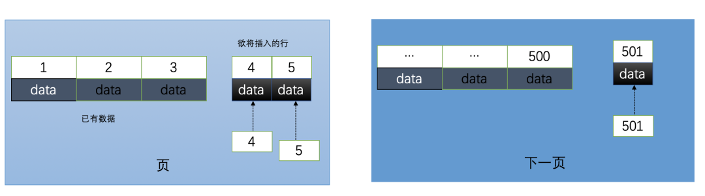
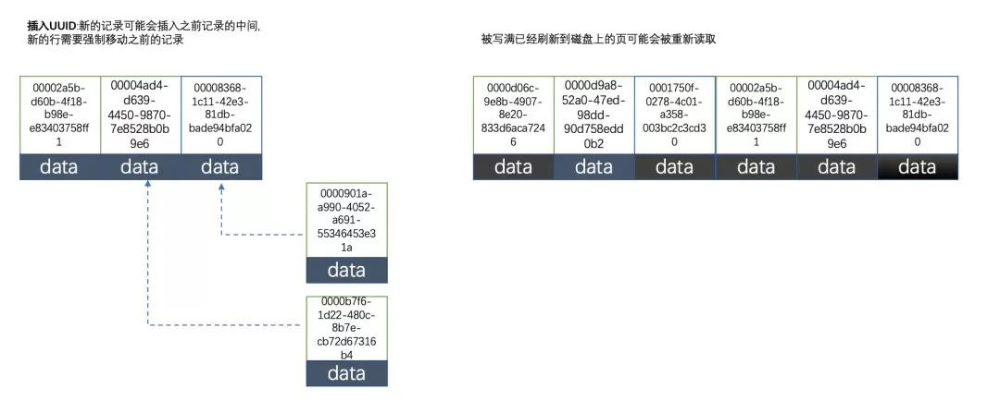
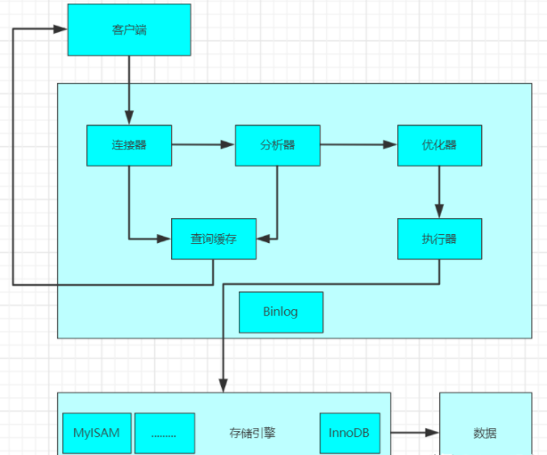

- [SQL Tutorial](https://www.w3schools.com/sql/default.asp) （SQL语句学习,英文）、[SQL Tutorial](https://www.w3school.com.cn/sql/index.asp)（SQL语句学习,中文）、[SQL语句在线练习](https://www.w3schools.com/sql/exercise.asp) （非常不错）
- [Github-MySQL入门教程（MySQL tutorial book）](https://github.com/jaywcjlove/mysql-tutorial) （从零开始学习MySQL，主要是面向MySQL数据库管理系统初学者）
- [官方教程](https://dev.mysql.com/doc/refman/5.7/)
- [MySQL 教程（菜鸟教程）](http://www.runoob.com/MySQL/MySQL-tutorial.html)

- [中国5级行政区域mysql库](https://github.com/kakuilan/china_area_mysql)


### 什么是MySQL?

MySQL 是一种关系型数据库，在Java企业级开发中非常常用，因为 MySQL 是开源免费的，并且方便扩展。阿里巴巴数据库系统也大量用到了 MySQL，因此它的稳定性是有保障的。MySQL是开放源代码的，因此任何人都可以在 GPL(General Public License) 的许可下下载并根据个性化的需要对其进行修改。MySQL的默认端口号是**3306**。

### MySQL 基本架构概览

下图是 MySQL  的一个简要架构图，从下图你可以很清晰的看到用户的 SQL 语句在 MySQL 内部是如何执行的。

先简单介绍一下下图涉及的一些组件的基本作用帮助大家理解这幅图，在 1.2 节中会详细介绍到这些组件的作用。

- **连接器：** 身份认证和权限相关(登录 MySQL 的时候)。
- **查询缓存:**  执行查询语句的时候，会先查询缓存（MySQL 8.0 版本后移除，因为这个功能不太实用）。
- **分析器:**  没有命中缓存的话，SQL 语句就会经过分析器，分析器说白了就是要先看你的 SQL 语句要干嘛，再检查你的 SQL 语句语法是否正确。
- **优化器：**  按照 MySQL 认为最优的方案去执行。
- **执行器:** 执行语句，然后从存储引擎返回数据。


####简单来说 MySQL  主要分为 Server 层和存储引擎层：

- **Server 层**：主要包括连接器、查询缓存、分析器、优化器、执行器等，所有跨存储引擎的功能都在这一层实现，比如存储过程、触发器、视图，函数等，还有一个通用的日志模块 binglog 日志模块。
- **存储引擎**： 主要负责数据的存储和读取，采用可以替换的插件式架构，支持 InnoDB、MyISAM、Memory 等多个存储引擎，其中 InnoDB 引擎有自有的日志模块 redolog 模块。**现在最常用的存储引擎是 InnoDB，它从 MySQL 5.5.5 版本开始就被当做默认存储引擎了。**

### Server 层基本组件介绍

#### 1) 连接器

连接器主要和身份认证和权限相关的功能相关，就好比一个级别很高的门卫一样。

主要负责用户登录数据库，进行用户的身份认证，包括校验账户密码，权限等操作，如果用户账户密码已通过，连接器会到权限表中查询该用户的所有权限，之后在这个连接里的权限逻辑判断都是会依赖此时读取到的权限数据，也就是说，后续只要这个连接不断开，即时管理员修改了该用户的权限，该用户也是不受影响的。

#### 2) 查询缓存(MySQL 8.0 版本后移除)

查询缓存主要用来缓存我们所执行的 SELECT 语句以及该语句的结果集。

连接建立后，执行查询语句的时候，会先查询缓存，MySQL 会先校验这个 sql 是否执行过，以 Key-Value 的形式缓存在内存中，Key 是查询预计，Value 是结果集。如果缓存 key 被命中，就会直接返回给客户端，如果没有命中，就会执行后续的操作，完成后也会把结果缓存起来，方便下一次调用。当然在真正执行缓存查询的时候还是会校验用户的权限，是否有该表的查询条件。

MySQL 查询不建议使用缓存，因为查询缓存失效在实际业务场景中可能会非常频繁，假如你对一个表更新的话，这个表上的所有的查询缓存都会被清空。对于不经常更新的数据来说，使用缓存还是可以的。

所以，一般在大多数情况下我们都是不推荐去使用查询缓存的。

MySQL 8.0 版本后删除了缓存的功能，官方也是认为该功能在实际的应用场景比较少，所以干脆直接删掉了。

#### 3) 分析器

MySQL 没有命中缓存，那么就会进入分析器，分析器主要是用来分析 SQL 语句是来干嘛的，分析器也会分为几步：

**第一步，词法分析**，一条 SQL 语句有多个字符串组成，首先要提取关键字，比如 select，提出查询的表，提出字段名，提出查询条件等等。做完这些操作后，就会进入第二步。

**第二步，语法分析**，主要就是判断你输入的 sql 是否正确，是否符合 MySQL 的语法。

完成这 2 步之后，MySQL 就准备开始执行了，但是如何执行，怎么执行是最好的结果呢？这个时候就需要优化器上场了。

#### 4) 优化器 

优化器的作用就是它认为的最优的执行方案去执行（有时候可能也不是最优，这篇文章涉及对这部分知识的深入讲解），比如多个索引的时候该如何选择索引，多表查询的时候如何选择关联顺序等。

可以说，经过了优化器之后可以说这个语句具体该如何执行就已经定下来。

#### 5) 执行器

当选择了执行方案后，MySQL 就准备开始执行了，首先执行前会校验该用户有没有权限，如果没有权限，就会返回错误信息，如果有权限，就会去调用引擎的接口，返回接口执行的结果。


### 存储引擎

#### MyISAM和InnoDB区别

MyISAM是MySQL的默认数据库引擎（5.5版之前）。虽然性能极佳，而且提供了大量的特性，包括全文索引、压缩、空间函数等，但MyISAM不支持事务和行级锁，而且最大的缺陷就是崩溃后无法安全恢复。不过，5.5版本之后，MySQL引入了InnoDB（事务性数据库引擎），MySQL 5.5版本后默认的存储引擎为InnoDB。

大多数时候我们使用的都是 InnoDB 存储引擎，但是在某些情况下使用 MyISAM 也是合适的比如读密集的情况下。（如果你不介意 MyISAM 崩溃恢复问题的话）。

**两者的对比：**

1. **是否支持行级锁** : MyISAM 只有表级锁(table-level locking)，而InnoDB 支持行级锁(row-level locking)和表级锁,默认为行级锁。
2. **是否支持事务和崩溃后的安全恢复： MyISAM** 强调的是性能，每次查询具有原子性,其执行速度比InnoDB类型更快，但是不提供事务支持。但是**InnoDB** 提供事务**支持事务**，外部键等高级数据库功能。 具有事务(commit)、回滚(rollback)和崩溃修复能力(crash recovery capabilities)的事务安全(transaction-safe (ACID compliant))型表。
3. **是否支持外键：** MyISAM不支持，而InnoDB支持。
4. **是否支持MVCC** ：仅 InnoDB 支持。应对高并发事务, MVCC比单纯的加锁更高效;MVCC只在 `READ COMMITTED` 和 `REPEATABLE READ` 两个隔离级别下工作;MVCC可以使用 乐观(optimistic)锁 和 悲观(pessimistic)锁来实现;各数据库中MVCC实现并不统一。推荐阅读：[MySQL-InnoDB-MVCC多版本并发控制](https://segmentfault.com/a/1190000012650596)
5. **索引**：InnoDB是聚族索引， MyISAM是非聚族索引；InnoDB的B+树主键索引的叶子节点就是数据文件，辅助索引的叶子节点是主键的值；而MyISAM的B+树主键索引和辅助索引的叶子节点都是数据文件的地址指针

《MySQL高性能》上面有一句话这样写到:

> 不要轻易相信“MyISAM比InnoDB快”之类的经验之谈，这个结论往往不是绝对的。在很多我们已知场景中，InnoDB的速度都可以让MyISAM望尘莫及，尤其是用到了聚簇索引，或者需要访问的数据都可以放入内存的应用。

一般情况下我们选择 InnoDB 都是没有问题的，但是某些情况下你并不在乎可扩展能力和并发能力，也不需要事务支持，也不在乎崩溃后的安全恢复问题的话，选择MyISAM也是一个不错的选择。但是一般情况下，我们都是需要考虑到这些问题的。

####InnoDB

InnoDB 底层存储结构为 B+树， B 树的每个节点对应 innodb 的一个 page，page 大小是固定的， 一般设为 16k。其中非叶子节点只有键值，叶子节点包含完成数据。 

适用场景：

- 经常更新的表，适合处理多重并发的更新请求。
- 支持事务。
- 可以从灾难中恢复(通过 bin-log 日志等)。
- 外键约束。只有他支持外键。
- 支持自动增加列属性 auto_increment。	


#### 为何myisam比iniodb块

Myisam文件结构如下：

- role.frm：表结构文件
- role.MYD：数据文件（MyISAM Data）
- role.MYI：索引文件（MyISAM Index）

InnoDB文件结构如下：

- user.frm：表结构文件
- user.ibd：索引和数据文件（InnoDB Data）


==SELECT==的时候，InNODB要维护的东西比MYISAM引擎多很多:

1）数据块，INNODB要缓存，MYISAM只缓存==索引块==，  这中间还有换进换出的减少；

2）innodb寻址要映射到块，再到行，MYISAM记录的直接是文件的OFFSET，定位比INNODB要快

3）INNODB还需要维护MVCC一致；虽然你的场景没有，但他还是需要去检查和维护
MVCC (Multi-Version Concurrency Control)多版本并发控制 

```
InnoDB：通过为每一行记录添加两个额外的隐藏的值来实现MVCC，这两个值一个记录这行数据何时被创建，另外一个记录这行数据何时过期（或者被删除）。但是InnoDB并不存储这些事件发生时的实际时间，相反它只存储这些事件发生时的系统版本号。这是一个随着事务的创建而不断增长的数字。每个事务在事务开始时会记录它自己的系统版本号。每个查询必须去检查每行数据的版本号与事务的版本号是否相同。让我们来看看当隔离级别是REPEATABLEREAD时这种策略是如何应用到特定的操作的：
SELECT InnoDB必须每行数据来保证它符合两个条件：
1、InnoDB必须找到一个行的版本，它至少要和事务的版本一样老(也即它的版本号不大于事务的版本号)。这保证了不管是事务开始之前，或者事务创建时，或者修改了这行数据的时候，这行数据是存在的。
2、这行数据的删除版本必须是未定义的或者比事务版本要大。这可以保证在事务开始之前这行数据没有被删除
```


### 字符集及校对规则

字符集指的是一种从二进制编码到某类字符符号的映射。校对规则则是指某种字符集下的排序规则。MySQL中每一种字符集都会对应一系列的校对规则。

MySQL采用的是类似继承的方式指定字符集的默认值，每个数据库以及每张数据表都有自己的默认值，他们逐层继承。比如：某个库中所有表的默认字符集将是该数据库所指定的字符集（这些表在没有指定字符集的情况下，才会采用默认字符集） PS：整理自《Java工程师修炼之道》

详细参考：   [MySQL字符集及校对规则的理解](https://www.cnblogs.com/geaozhang/p/6724393.html#MySQLyuzifuji)

### 日志

#### binlog

`binlog` 用于记录数据库执行的==写入性操作==(不包括查询)信息，以二进制的形式保存在磁盘中。`binlog` 是 `mysql`的逻辑日志，并且由 `Server` 层进行记录，使用任何存储引擎的 `mysql` 数据库都会记录 `binlog` 日志。

- **逻辑日志**：可以简单理解为记录的就是sql语句 。
- **物理日志**：`mysql` 数据最终是保存在数据页中的，物理日志记录的就是数据页变更 。

`binlog` 是通过追加的方式进行写入的，可以通过 `max_binlog_size` 参数设置每个 `binlog`文件的大小，当文件大小达到给定值之后，会生成新的文件来保存日志。

`1、应用：`

1. **主从复制** ：在 `Master` 端开启 `binlog` ，然后将 `binlog` 发送到各个 `Slave` 端， `Slave` 端重放 `binlog` 从而达到主从数据一致。
2. **数据恢复** ：通过使用 `mysqlbinlog` 工具来恢复数据。

`2、刷盘时机`

对于 `InnoDB` 存储引擎而言，只有在==事务提交时==才会记录 `biglog` ，此时记录还在内存中，那么 `biglog`
是什么时候刷到磁盘中的呢？`mysql` 通过 ==sync_binlog 参数==控制 `biglog` 的刷盘时机，取值范围是 `0-N`

- 0：不去强制要求，由系统自行判断何时写入磁盘；
- 1：每次 `commit` 的时候都要将 `binlog` 写入磁盘；
- N：每N个事务，才会将 `binlog` 写入磁盘。

从上面可以看出， `sync_binlog` 最安全的是设置是 `1` ，这也是 `MySQL 5.7.7`之后版本的默认值。但是设置一个大一些的值可以提升数据库性能，因此实际情况下也可以将值适当调大，牺牲一定的一致性来获取更好的性能。

`3、日志格式`

`binlog` 日志有三种格式，分别为 ==STATMENT 、 ROW 和 MIXED== 。

> 在 `MySQL 5.7.7` 之前，默认的格式是 `STATEMENT` ， `MySQL 5.7.7` 之后，默认值是 `ROW`。日志格式通过 `binlog-format` 指定。

- `STATMENT`：基于`SQL` 语句的复制( `statement-based replication, SBR` )，每一条会修改数据的sql语句会记录到 `binlog` 中  。

- - 优点：不需要记录每一行的变化，减少了 binlog 日志量，节约了  IO  , 从而提高了性能；
  - 缺点：在某些情况下会导致主从数据不一致，比如执行sysdate() 、  slepp()  等 。

- `ROW`：基于行的复制(`row-based replication, RBR` )，不记录每条sql语句的上下文信息，仅需记录哪条数据被修改了 。

- - 优点：不会出现某些特定情况下的存储过程、或function、或trigger的调用和触发无法被正确复制的问题 ；
  - 缺点：会产生大量的日志，尤其是` alter table ` 的时候会让日志暴涨

- `MIXED`：基于`STATMENT` 和 `ROW` 两种模式的混合复制( `mixed-based replication, MBR` )，一般的复制使用 `STATEMENT` 模式保存 `binlog` ，对于 `STATEMENT` 模式无法复制的操作使用 `ROW` 模式保存 `binlog`

####redo log

redolog用来保证事务的持久性。Redo Log记录的是**新数据**的备份。

如果每次修改都将修改的数据页刷新到磁盘，会严重影响性能。

1. 因为 `Innodb` 是以 `页` 为单位进行磁盘交互的，而一个事务很可能只修改一个数据页里面的几个字节，这个时候将完整的数据页刷到磁盘的话，太浪费资源了！
2. 一个事务可能涉及修改多个数据页，并且这些数据页在物理上并不连续，使用随机IO写入性能太差！

所以redolog，只记录事务对数据页做了哪些修改

`1、概念`

`redo log` 包括两部分：一个是内存中的==日志缓冲==( `redo log buffer` )，另一个是磁盘上的==日志文件==( `redo log file` )。

`mysql` 每执行一条 `DML` 语句，先将记录写入 `redo log buffer`，后续某个时间点再一次性将多个操作记录写到 `redo log file` 。这种==**先写日志，再写磁盘== 的技术就是 `MySQL`里经常说到的 `WAL(Write-Ahead Logging)` 技术。

`2、写入时机`

通过 `innodb_flush_log_at_trx_commit` 参数配置`redo log buffer` 写入 `redo log file` 的时机

0：==每秒写入== `os buffer` 并调用 `fsync()` 写入到 `redo log file` 中。故障会丢失1秒钟的数据。

1：==每次提交事务==都实时刷，IO性能差

2：==每次提交写入buffer缓存，每秒同步写入redologfile==

#### redo和bin区别

|          | redo log                                                     | binlog                                                       |
| -------- | ------------------------------------------------------------ | ------------------------------------------------------------ |
| 文件大小 | `redo log` 的大小是固定的。                                  | `binlog` 可通过配置参数 `max_binlog_size` 设置每个`binlog` 文件的大小。 |
| 实现方式 | `redo log` 是 `InnoDB` 引擎层实现的，并不是所有引擎都有。    | `binlog` 是 `Server` 层实现的，所有引擎都可以使用 `binlog` 日志 |
| 记录方式 | redo log 采用循环写的方式记录，当写到结尾时，会回到开头循环写日志。 | binlog通过追加的方式记录，当文件大小大于给定值后，后续的日志会记录到新的文件上 |
| 适用场景 | `redo log` 适用于崩溃恢复(crash-safe)                        | `binlog` 适用于主从复制和数据恢复                            |

由 `binlog` 和 `redo log` 的区别可知：`binlog` 日志只用于归档，只依靠 `binlog` 是没有 `crash-safe` 能力的。但只有 `redo log` 也不行，因为 `redo log` 是 `InnoDB`
特有的，且日志上的记录落盘后会被覆盖掉。因此需要 `binlog` 和 `redo log`
二者同时记录，才能保证当数据库发生宕机重启时，数据不会丢失。

#### undolog

事务的原子性，通过undolog实现。槽作任何数据之前，首先将数据==**备份到Undo Log**==。然后进行数据的修改

`undo log` 主要记录了数据的逻辑变化，比如一条 `INSERT` 语句，对应一条 `DELETE` 的 `undo log` ，对于每个 `UPDATE` 语句，对应一条相反的 `UPDATE` 的 `undo log` ，这样在发生错误时，就能回滚到事务之前的数据状态

用Undo Log实现原子性和持久化的事务的简化过程：

 假设有A、B两个数据，值分别为1,2。
 A. 事务开始.
 B. 记录A=1到undo log.
 C. 修改A=3.
 D. 记录B=2到undo log.
 E. 修改B=4.
 F. 将undo log写到磁盘（undo持久化）。
 G. 将数据写到磁盘（数据持久化）。
 H. 事务提交

- 如何保证持久性？

  事务提交前，会把修改数据到磁盘前，也就是说只要事务提交了，数据肯定持久化了。

- 如何保证原子性？

  - 每次对数据库修改，都会把修改前数据记录在undo log，那么需要回滚时，可以读取undo log，恢复数据。

  - 若系统在G和H之间崩溃

    此时事务并未提交，需要回滚。而undo log已经被持久化，可以根据undo log来恢复数据

  - 若系统在G之前崩溃

    此时数据并未持久化到硬盘，依然保持在事务之前的状态

**缺陷：**每个事务提交前将数据和Undo Log写入磁盘，这样会导致**大量的磁盘IO**，因此性能很低。

如果能够将数据缓存一段时间，就能减少IO提高性能。但是这样就会丧失事务的持久性。因此引入了另外一种机制来实现持久化，即**Redo Log**.

### 索引

[重新理解mysql索引](https://blog.objectspace.cn/2019/12/10/清空认知，然后重新理解MySQL索引结构/)

MySQL索引使用的数据结构主要有**BTree索引** 和 **哈希索引** 。对于哈希索引来说，底层的数据结构就是哈希表，因此在绝大多数需求为**单条记录查询**的时候，可以选择哈希索引，查询性能最快；其余大部分场景，建议选择BTree索引。

####一张表可以建16个索引

mysql 可支持16个索引，最大索引长度256字节。


####B+树索引

MySQL的BTree索引使用的是B树中的**B+Tree**，但对于主要的两种存储引擎的实现方式是不同的。

**MyISAM:** 

- B+Tree**叶节点的data域存放的是数据记录的地址**。在索引检索的时候，首先按照B+Tree搜索算法搜索索引，如果指定的Key存在，则取出其 **data 域的值**，然后以 data 域的值为地址**读取相应的数据记录**。这被称为“**非聚簇索引**”。

  **InnoDB:** 

- 其**数据文件本身就是索引文件**。其表数据文件本身就是按B+Tree组织的一个索引结构，树的叶节点**data域保存了完整的数据记录**。这个索引的**key是数据表的主键**，因此InnoDB表数据文件本身就是主索引。这被称为“**聚簇索引**（或聚集索引）”。

- 而其余的索引都作为辅助索引，辅助索引的data域存储相应记录主键的值而不是地址，这也是和MyISAM不同的地方。**在根据主索引搜索时，直接找到key所在的节点即可取出数据；在根据辅助索引查找时，则需要先取出主键的值，再走一遍主索引。** **因此，在设计表的时候，不建议使用过长的字段作为主键，也不建议使用非单调的字段作为主键，这样会造成主索引频繁分裂。** PS：整理自《Java工程师修炼之道》

#### 为什么用B+树

[为什么用B+树](https://mp.weixin.qq.com/s/-1FJq7jhxzZT2CGjggsuXg)

#### 最左前缀原则

MySQL中的索引可以以一定顺序引用多列，这种索引叫作==联合索引==。如User表的name和city加联合索引就是(name,city)，而最左前缀原则指的是，如果查询的时候查询条件精确匹配索引的左边连续一列或几列，则此列就可以被用到。如下：

```
select * from user where name=xx and city=xx ; ／／可以命中索引
select * from user where name=xx ; // 可以命中索引
select * from user where city=xx ; // 无法命中索引            
```

这里需要注意的是，查询的时候如果两个条件都用上了，但是顺序不同，如 `city= xx and name ＝xx`，那么现在的查询引擎会自动优化为匹配联合索引的顺序，这样是能够命中索引的。

由于最左前缀原则，在创建联合索引时，索引字段的顺序需要考虑字段值去重之后的个数，较多的放前面。ORDER BY子句也遵循此规则。

#### 注意避免冗余索引

冗余索引指的是索引的功能相同，能够命中 就肯定能命中 ，那么 就是冗余索引如（name,city ）和（name ）这两个索引就是冗余索引，能够命中后者的查询肯定是能够命中前者的 在大多数情况下，都应该尽量扩展已有的索引而不是创建新索引。

MySQL 5.7 版本后，可以通过查询 sys 库的 `schema_redundant_indexes` 表来查看冗余索引

#### 为表字段添加索引

1.添加PRIMARY KEY（主键索引）

```mysql
ALTER TABLE `table_name` ADD PRIMARY KEY ( `column` ) 
```

2.添加UNIQUE(唯一索引)

```mysql
ALTER TABLE `table_name` ADD UNIQUE ( `column` ) 
```

3.添加INDEX(普通索引)

```mysql
ALTER TABLE `table_name` ADD INDEX index_name ( `column` )
```

4.添加FULLTEXT(全文索引)

```mysql
ALTER TABLE `table_name` ADD FULLTEXT ( `column`) 
```

5.添加多列索引

```mysql
ALTER TABLE `table_name` ADD INDEX index_name ( `column1`, `column2`, `column3` )
```

#### 索引如何提升查找速度

mysql数据存储结构是页，

- **各个数据页可以组成一个双向链表**
- 每个数据页中的记录又可以组成一个**单向链表**
  - 每个数据页都会为存储在它里边儿的记录生成一个**页目录**，在通过主键查找某条记录的时候可以在页目录中使用**二分法快速定位到对应的槽**，然后再遍历该槽对应分组中的记录即可快速找到指定的记录
  - 以其他列(非主键)作为搜索条件：只能从最小记录开始依次遍历单链表中的每条记录。


所以说，如果我们写select * from user where indexname = 'xxx'这样没有进行任何优化的sql语句，默认会这样做：

1. **定位到记录所在的页：需要遍历双向链表，找到所在的页**
2. **从所在的页内中查找相应的记录：由于不是根据主键查询，只能遍历所在页的单链表了**

**使用索引查询**

没有用索引我们是需要遍历双向链表来定位对应的页，现在通过 **“目录”** 就可以很快地定位到对应的页上了


#### 什么时候建索引

主键自动建索引

频繁查询字段要建索引

关联查询的字段，外键关系要建索引

统计或分组的字段，要建索引

组合索引比单键索引性价比更高

#### 索引没有命中

1、如果条件中有==**or**== ，即使其中有条件带索引也不会使用(这也是为什么尽量少用or的原因）

**注意：要想使用or，又想让索引生效，只能将or条件中的每个列都加上索引**

如果出现OR的一个条件没有索引时，建议使用 **==union== ，拼接多个查询语句**


2、**like**查询是以**%**开头，索引不会命中


3、如果列类型是**字符串**，那一定要在条件中将数据使用**引号引用起来**,否则不使用索引


### 查询缓存的使用

> 执行查询语句的时候，会先查询缓存。不过，MySQL 8.0 版本后移除，因为这个功能不太实用

my.cnf加入以下配置，重启MySQL开启查询缓存
```properties
query_cache_type=1
query_cache_size=600000
```

MySQL执行以下命令也可以开启查询缓存

```properties
set global  query_cache_type=1;
set global  query_cache_size=600000;
```
如上，**开启查询缓存后在同样的查询条件以及数据情况下，会直接在缓存中返回结果**。这里的查询条件包括查询本身、当前要查询的数据库、客户端协议版本号等一些可能影响结果的信息。因此任何两个查询在任何字符上的不同都会导致缓存不命中。此外，如果查询中包含任何用户自定义函数、存储函数、用户变量、临时表、MySQL库中的系统表，其查询结果也不会被缓存。

缓存建立之后，MySQL的查询缓存系统会跟踪查询中涉及的每张表，如果这些表（数据或结构）发生变化，那么和这张表相关的所有缓存数据都将失效。

**缓存虽然能够提升数据库的查询性能，但是缓存同时也带来了额外的开销，每次查询后都要做一次缓存操作，失效后还要销毁。** 因此，开启缓存查询要谨慎，尤其对于写密集的应用来说更是如此。如果开启，要注意合理控制缓存空间大小，一般来说其大小设置为几十MB比较合适。此外，**还可以通过sql_cache和sql_no_cache来控制某个查询语句是否需要缓存：**

```sql
select sql_no_cache count(*) from usr;
```

### 存储过程

==一组SQL语句集==，编译完成存在数据库里，是一种==可编程的函数==，优点：灵活，速度快

CREATE PROCEDURE  过程名([[IN|OUT|INOUT] 参数名 数据类型[,[IN|OUT|INOUT] 参数名 数据类型…]]) [特性 ...] 过程体


###触发器的作用：

触发器是一种特殊的存储过程，主要是通过事件来触发而被执行的

可以强化约束，来维护数据的完整性和一致性，可以跟踪数据内的操作从而不允许未经许可的更新和变化，

可以级联运算。

如：某表上的触发器上包含对另一个表的数据操作，而该操作会导致该表触发器被触发


###视图与游标

视图：是一种==虚拟的表==，具有和物理表相同的功能

游标：是对查询出来的==结果集==作为一个单元来进行有效的处理，游标可以定在该单元中的特定行，从结果集的当前行检索一行或多行，==可以对结果集当前行进行修改==。

游标一般不使用，一般用于需要逐条处理数据的时候


### 事务?

事务是逻辑上的一组操作，要么都执行，要么都不执行。

例如转账操作，甲余额减少，乙的余额增加，这两个操作要么都成功，要么都失败

#### 事物的四大特性(ACID)

1. **原子性（Atomicity）：** 事务是最小的执行单位，不允许分割。事务的原子性确保动作要么全部完成，要么完全不起作用；
2. **一致性（Consistency）：** 执行事务前后，数据保持一致，多个事务对同一个数据读取的结果是相同的；
3. **隔离性（Isolation）：** 并发访问数据库时，一个用户的事务不被其他事务所干扰，各并发事务之间数据库是独立的；
4. **持久性（Durability）：** 一个事务被提交之后。它对数据库中数据的改变是持久的，即使数据库发生故障也不应该对其有任何影响。

#### 并发事务的问题?

并发操作同一数据，会出现如下问题：

- **脏读（Dirty read）:** 当一个事务正在访问数据并且对数据进行了修改，**而这种修改还没有提交到数据库中**，这时另外一个事务也访问了这个数据，然后使用了这个数据。因为这个数据是还没有提交的数据，那么另外一个事务读到的这个数据是“脏数据”，依据“脏数据”所做的操作可能是不正确的。
- **丢失修改（Lost to modify）:** 指在一个事务读取一个数据时，另外一个事务也访问了该数据，那么在第一个事务中修改了这个数据后，第二个事务也修改了这个数据。这样**第一个事务内的修改结果就被丢失**，因此称为丢失修改。	例如：事务1读取某表中的数据A=20，事务2也读取A=20，事务1修改A=A-1，事务2也修改A=A-1，最终结果A=19，事务1的修改被丢失。
- **不可重复读（Unrepeatableread）:** 指在一个事务内多次读同一数据。在这个事务还没有结束时，另一个事务也访问该数据。那么，在第一个事务中的两次读数据之间，由于第二个事务的修改导致第一个事务**两次读取的数据可能不太一样**。这就发生了在一个事务内两次读到的数据是不一样的情况，因此称为不可重复读。
- **幻读（Phantom read）:** 幻读与不可重复读类似。它发生在一个事务（T1）读取了几行数据，接着另一个并发事务（T2）插入了一些数据时。在随后的查询中，第一个事务（T1）就会发现**多了一些原本不存在的记录**，就好像发生了幻觉一样，所以称为幻读。

**不可重复读和幻读区别：**

​	**不可重复读的重点是修改，幻读的重点在于新增或者删除**

> 不可重复读的重点是修改，幻读的重点在于新增或者删除。
>
> 例1（同样的条件, 你读取过的数据, 再次读取出来发现值不一样了 ）：事务1中的A先生读取自己的工资为     1000的操作还没完成，事务2中的B先生就修改了A的工资为2000，导        致A再读自己的工资时工资变为  2000；这就是不可重复读。
>
>  例2（同样的条件, 第1次和第2次读出来的记录数不一样 ）：假某工资单表中工资大于3000的有4人，事务1读取了所有工资大于3000的人，共查到4条记录，这时事务2 又插入了一条工资大于3000的记录，事务1再次读取时查到的记录就变为了5条，这样就导致了幻读。

#### 事务隔离级别

**SQL 标准定义了四个隔离级别：**

- **READ-UNCOMMITTED(读取未提交)：** 最低的隔离级别，允许读取尚未提交的数据变更，**可能会导致脏读、幻读或不可重复读**。
- **READ-COMMITTED(读取已提交)：** 允许读取并发事务已经提交的数据，**可以阻止脏读，但是幻读或不可重复读仍有可能发生**。
- **REPEATABLE-READ(可重复读)：**  对同一字段的多次读取结果都是一致的，除非数据是被本身事务自己所修改，**可以阻止脏读和不可重复读，但幻读仍有可能发生**。
- **SERIALIZABLE(可串行化)：** 最高的隔离级别，完全服从ACID的隔离级别。所有的事务依次逐个执行，这样事务之间就完全不可能产生干扰，也就是说，**该级别可以防止脏读、不可重复读以及幻读**。

------

|     隔离级别     | 脏读 | 不可重复读 | 幻影读 |
| :--------------: | :--: | :--------: | :----: |
| READ-UNCOMMITTED |  √   |     √      |   √    |
|  READ-COMMITTED  |  ×   |     √      |   √    |
| REPEATABLE-READ  |  ×   |     ×      |   √    |
|   SERIALIZABLE   |  ×   |     ×      |   ×    |

MySQL InnoDB 存储引擎的默认支持的隔离级别是 **REPEATABLE-READ（可重读）**。我们可以通过`SELECT @@tx_isolation;`命令来查看

```sql
mysql> SELECT @@tx_isolation;
+-----------------+
| @@tx_isolation  |
+-----------------+
| REPEATABLE-READ |
+-----------------+
```

这里需要注意的是：与 SQL 标准不同的地方在于 InnoDB 存储引擎在 **REPEATABLE-READ（可重读）** 
事务隔离级别下使用的是**Next-Key Lock** 锁算法，因此可以避免幻读的产生，这与其他数据库系统(如 SQL Server)
是不同的。所以说InnoDB 存储引擎的默认支持的隔离级别是 **REPEATABLE-READ（可重读）** 已经可以完全保证事务的隔离性要求，即达到了
 SQL标准的 **SERIALIZABLE(可串行化)** 隔离级别。因为隔离级别越低，事务请求的锁越少，所以大部分数据库系统的隔离级别都是 **READ-COMMITTED(读取提交内容)** ，但是你要知道的是InnoDB 存储引擎默认使用 **REPEAaTABLE-READ（可重读）** 并不会有任何性能损失。

InnoDB 存储引擎在 **分布式事务** 的情况下一般会用到 **SERIALIZABLE(可串行化)** 隔离级别。

#### 参考

- 《MySQL技术内幕：InnoDB存储引擎》
- <https://dev.mysql.com/doc/refman/5.7/en/>
- [Mysql 锁：灵魂七拷问](https://tech.youzan.com/seven-questions-about-the-lock-of-mysql/)
- [Innodb 中的事务隔离级别和锁的关系](https://tech.meituan.com/2014/08/20/innodb-lock.html)

### 锁机制与InnoDB锁算法

**MyISAM和InnoDB存储引擎使用的锁：**

- MyISAM采用表级锁(table-level locking)。
- InnoDB支持行级锁(row-level locking)和表级锁,默认为行级锁

**表级锁和行级锁对比：**

- **表级锁：** MySQL中锁定 **粒度最大** 的一种锁，对当前操作的整张表加锁，实现简单，资源消耗也比较少，加锁快，不会出现死锁。其锁定粒度最大，触发锁冲突的概率最高，并发度最低，MyISAM和 InnoDB引擎都支持表级锁。
- **行级锁：** MySQL中锁定 **粒度最小** 的一种锁，只针对当前操作的行进行加锁。 行级锁能大大减少数据库操作的冲突。其加锁粒度最小，并发度高，但加锁的开销也最大，加锁慢，会出现死锁。 

**共享锁和排他锁对比**

- 共享锁（S锁）：如果事务T对数据A加上共享锁后，则其他事务只能对A再加共享锁，不 能加排他锁。获取共享锁的事务只能读数据，不能修改数据。
- 排他锁（X锁）：如果事务T对数据A加上排他锁后，则其他事务不能再对A加任任何类型的封锁。获取排他锁的事务既能读数据，又能修改数据。

详细内容可以参考：[https://blog.csdn.net/qq_34337272/article/details/80611486](https://blog.csdn.net/qq_34337272/article/details/80611486)

**InnoDB存储引擎的锁的算法有三种：**

- Record lock：单个行记录上的锁
- Gap lock：间隙锁，锁定一个范围，不包括记录本身
- Next-key lock：record+gap 锁定一个范围，包含记录本身

**相关知识点：**

1. innodb对于行的查询使用next-key lock
2. Next-locking keying为了解决Phantom Problem幻读问题
3. 当查询的索引含有唯一属性时，将next-key lock降级为record key
4. Gap锁设计的目的是为了阻止多个事务将记录插入到同一范围内，而这会导致幻读问题的产生
5. 有两种方式显式关闭gap锁：（除了外键约束和唯一性检查外，其余情况仅使用record lock） A. 将事务隔离级别设置为RC B. 将参数innodb_locks_unsafe_for_binlog设置为1

### 大表优化

当MySQL单表记录数过大时，数据库的CRUD性能会明显下降，一些常见的优化措施如下：

#### 1. 限定数据的范围

务必禁止不带任何限制数据范围条件的查询语句。比如：我们当用户在查询订单历史的时候，我们可以控制在一个月的范围内；

#### 2. 读/写分离

经典的数据库拆分方案，主库负责写，从库负责读；

#### 3. 垂直分区

 **根据数据库里面数据表的相关性进行拆分。** 例如，用户表中既有用户的登录信息又有用户的基本信息，可以将用户表拆分成两个单独的表，甚至放到单独的库做分库。

 **简单来说垂直拆分是指数据表列的拆分，把一张列比较多的表拆分为多张表。** 如下图所示，这样来说大家应该就更容易理解了。

- **垂直拆分的优点：** 可以使得列数据变小，在查询时减少读取的Block数，减少I/O次数。此外，垂直分区可以简化表的结构，易于维护。
- **垂直拆分的缺点：** 主键会出现冗余，需要管理冗余列，并会引起Join操作，可以通过在应用层进行Join来解决。此外，垂直分区会让事务变得更加复杂；

#### 4. 水平分区

**保持数据表结构不变，通过某种策略存储数据分片。这样每一片数据分散到不同的表或者库中，达到了分布式的目的。 水平拆分可以支撑非常大的数据量。** 

 水平拆分是指数据表行的拆分，表的行数超过200万行时，就会变慢，这时可以把一张的表的数据拆成多张表来存放。举个例子：我们可以将用户信息表拆分成多个用户信息表，这样就可以避免单一表数据量过大对性能造成影响。

水平拆分可以支持非常大的数据量。需要注意的一点是：分表仅仅是解决了单一表数据过大的问题，但由于表的数据还是在同一台机器上，其实对于提升MySQL并发能力没有什么意义，所以 **水平拆分最好分库** 。

水平拆分能够 **支持非常大的数据量存储，应用端改造也少**，但 **分片事务难以解决**  ，跨节点Join性能较差，逻辑复杂。《Java工程师修炼之道》的作者推荐 **尽量不要对数据进行分片，因为拆分会带来逻辑、部署、运维的各种复杂度** ，一般的数据表在优化得当的情况下支撑千万以下的数据量是没有太大问题的。如果实在要分片，尽量选择客户端分片架构，这样可以减少一次和中间件的网络I/O。

**数据库分片的两种常见方案：**

- **客户端代理：**  **分片逻辑在应用端，封装在jar包中，通过修改或者封装JDBC层来实现。** 当当网的 **Sharding-JDBC** 、阿里的TDDL是两种比较常用的实现。
- **中间件代理：** **在应用和数据中间加了一个代理层。分片逻辑统一维护在中间件服务中。** 我们现在谈的 **Mycat** 、360的Atlas、网易的DDB等等都是这种架构的实现。

详细内容可以参考： MySQL大表优化方案: [https://segmentfault.com/a/1190000006158186](https://segmentfault.com/a/1190000006158186)

### 分库分表

https://mp.weixin.qq.com/s/D9_nTfQJqr6ziJzPkl3l7A


### 数据库连接池?

池话设计应该不是一个新名词。我们常见的如java线程池、jdbc连接池、redis连接池等就是这类设计的代表实现。这种设计会初始预设资源，解决的问题就是抵消每次获取资源的消耗，如创建线程的开销，获取远程连接的开销等。就好比你去食堂打饭，打饭的大妈会先把饭盛好几份放那里，你来了就直接拿着饭盒加菜即可，不用再临时又盛饭又打菜，效率就高了。除了初始化资源，池化设计还包括如下这些特征：池子的初始值、池子的活跃值、池子的最大值等，这些特征可以直接映射到java线程池和数据库连接池的成员属性中。——这篇文章对[池化设计思想](https://mp.weixin.qq.com/s?__biz=Mzg2OTA0Njk0OA==&mid=2247485679&idx=1&sn=57dbca8c9ad49e1f3968ecff04a4f735&chksm=cea24724f9d5ce3212292fac291234a760c99c0960b5430d714269efe33554730b5f71208582&token=1141994790&lang=zh_CN#rd)介绍的还不错，直接复制过来，避免重复造轮子了。

数据库连接本质就是一个 socket 的连接。数据库服务端还要维护一些缓存和用户权限信息之类的 所以占用了一些内存。我们可以把数据库连接池是看做是维护的数据库连接的缓存，以便将来需要对数据库的请求时可以重用这些连接。为每个用户打开和维护数据库连接，尤其是对动态数据库驱动的网站应用程序的请求，既昂贵又浪费资源。**在连接池中，创建连接后，将其放置在池中，并再次使用它，因此不必建立新的连接。如果使用了所有连接，则会建立一个新连接并将其添加到池中。**连接池还减少了用户必须等待建立与数据库的连接的时间。

### 数据库ID

#### 1.使用自增id的内部结构

自增的主键的值是顺序的,所以Innodb把每一条记录都存储在一条记录的后面。当达到页面的最大填充因子时候(innodb默认的最大填充因子是页大小的15/16,会留出1/16的空间留作以后的修改)：

①下一条记录就会写入新的页中，一旦数据按照这种顺序的方式加载，主键页就会近乎于顺序的记录填满，提升了页面的最大填充率，不会有页的浪费

②新插入的行一定会在原有的最大数据行下一行,mysql定位和寻址很快，不会为计算新行的位置而做出额外的消耗

③减少了页分裂和碎片的产生

#### 2.使用uuid的索引内部结构

因为uuid相对顺序的自增id来说是毫无规律可言的,新行的值不一定要比之前的主键的值要大,所以innodb无法做到总是把新行插入到索引的最后,而是需要为新行寻找新的合适的位置从而来分配新的空间。

这个过程需要做很多额外的操作，数据的毫无顺序会导致数据分布散乱，将会导致以下的问题：

①写入的目标页很可能已经刷新到磁盘上并且从缓存上移除，或者还没有被加载到缓存中，innodb在插入之前不得不先找到并从磁盘读取目标页到内存中，这将导致大量的随机IO

②因为写入是乱序的,innodb不得不频繁的做页分裂操作,以便为新的行分配空间,页分裂导致移动大量的数据，一次插入最少需要修改三个页以上

③由于频繁的页分裂，页会变得稀疏并被不规则的填充，最终会导致数据会有碎片

在把随机值（uuid和雪花id）载入到聚簇索引(innodb默认的索引类型)以后,有时候会需要做一次OPTIMEIZE TABLE来重建表并优化页的填充，这将又需要一定的时间消耗。

结论：使用innodb应该尽可能的按主键的自增顺序插入，并且尽可能使用单调的增加的聚簇键的值来插入新行。

#### 3.使用自增id的缺点

那么使用自增的id就完全没有坏处了吗？并不是，自增id也会存在以下几点问题：

①别人一旦爬取你的数据库,就可以根据数据库的自增id获取到你的业务增长信息，很容易分析出你的经营情况

②对于高并发的负载，innodb在按主键进行插入的时候会造成明显的锁争用，主键的上界会成为争抢的热点，因为所有的插入都发生在这里，并发插入会导致间隙锁竞争

③Auto_Increment锁机制会造成自增锁的抢夺,有一定的性能损失

###### 附：Auto_increment的锁争抢问题，如果要改善需要调优innodb_autoinc_lock_mode的配置

### 分库分表之后,id 主键如何处理？

因为要是分成多个表之后，每个表都是从 1 开始累加，这样是不对的，我们需要一个全局唯一的 id 来支持。

生成全局 id （==分布式id==）有下面这几种方式：

- **UUID**：不适合作为主键，因为太长了，并且无序不可读，查询效率低。比较适合用于生成唯一的名字的标示比如文件的名字。
- **数据库自增 id** : 两台数据库分别设置不同步长，生成不重复ID的策略来实现高可用。这种方式生成的 id 有序，但是需要独立部署数据库实例，成本高，还会有性能瓶颈。
- **利用 redis 生成 id :** 性能比较好，灵活方便，不依赖于数据库。但是，引入了新的组件造成系统更加复杂，可用性降低，编码更加复杂，增加了系统成本。
- **Twitter的snowflake算法** ：Github 地址：https://github.com/twitter-archive/snowflake。
- **美团的[Leaf](https://tech.meituan.com/2017/04/21/mt-leaf.html)分布式ID生成系统** ：Leaf 是美团开源的分布式ID生成器，能保证全局唯一性、趋势递增、单调递增、信息安全，里面也提到了几种分布式方案的对比，但也需要依赖关系数据库、Zookeeper等中间件。感觉还不错。美团技术团队的一篇文章：https://tech.meituan.com/2017/04/21/mt-leaf.html 。
- ......

### 一条SQL语句在MySQL中如何执行的

- MySQL 主要分为 Server 层和引擎层，Server 层主要包括连接器、查询缓存、分析器、优化器、执行器，同时还有一个日志模块（binlog），这个日志模块所有执行引擎都可以共用,redolog 只有 InnoDB 有。
- 引擎层是插件式的，目前主要包括，MyISAM,InnoDB,Memory 等。
- 查询语句的执行流程如下：权限校验（如果命中缓存）---》查询缓存---》分析器---》优化器---》权限校验---》执行器---》引擎
- 更新语句执行流程如下：分析器----》权限校验----》执行器---》引擎---redo log(prepare 状态---》binlog---》redo log(commit状态)

[一条SQL语句在MySQL中如何执行的](<https://mp.weixin.qq.com/s?__biz=Mzg2OTA0Njk0OA==&mid=2247485097&idx=1&sn=84c89da477b1338bdf3e9fcd65514ac1&chksm=cea24962f9d5c074d8d3ff1ab04ee8f0d6486e3d015cfd783503685986485c11738ccb542ba7&token=79317275&lang=zh_CN#rd>)

### select和update怎么执行

https://www.toutiao.com/i6925236642320073229/?tt_from=weixin&utm_campaign=client_share&wxshare_count=1&timestamp=1616294058&app=news_article&utm_source=weixin&utm_medium=toutiao_android&use_new_style=1&req_id=202103211034180101351680722963E74E&share_token=595fd4e8-6715-4a39-a7d6-70878bd45e84&group_id=6925236642320073229

#### select

Mysql中语句的执行都是都是分层执行，每一层执行的任务都不同，直到最后拿到结果返回，主要分为Service层和引擎层，**在Service层中包含：连接器、分析器、优化器、执行器。引擎层以插件的形式可以兼容各种不同的存储引擎。**




### MySQL高性能优化规范建议

[MySQL高性能优化规范建议](https://www.cnblogs.com/huchong/p/10219318.html)

### 一条SQL语句执行得很慢的原因有哪些？

[腾讯面试：一条SQL语句执行得很慢的原因有哪些？---不看后悔系列](https://mp.weixin.qq.com/s?__biz=Mzg2OTA0Njk0OA==&mid=2247485185&idx=1&sn=66ef08b4ab6af5757792223a83fc0d45&chksm=cea248caf9d5c1dc72ec8a281ec16aa3ec3e8066dbb252e27362438a26c33fbe842b0e0adf47&token=79317275&lang=zh_CN#rd)

1、大多数情况下很正常，偶尔很慢，则有如下原因

(1)、数据库在刷新脏页，例如 redo log 写满了需要同步到磁盘。

(2)、执行的时候，遇到锁，如表锁、行锁。

2、这条 SQL 语句一直执行的很慢，则有如下原因。

(1)、没有用上索引：例如该字段没有索引；由于对字段进行运算、函数操作导致无法用索引。

(2)、数据库选错了索引。


