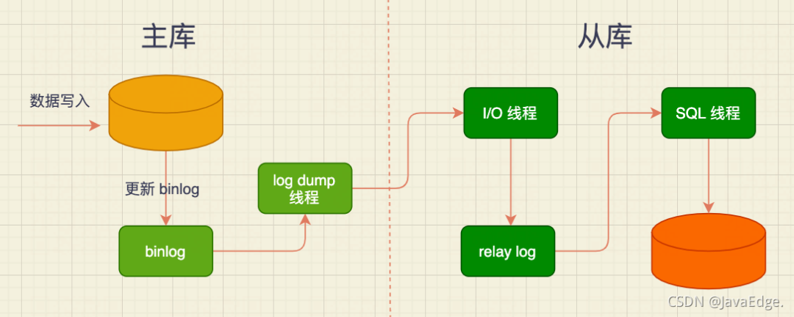

# 大表优化

当MySQL单表记录数过大时，数据库的CRUD性能会明显下降，一些常见的优化措施如下：

#### 1. 限定数据的范围

务必禁止不带任何限制数据范围条件的查询语句。比如：我们当用户在查询订单历史的时候，我们可以控制在一个月的范围内；

#### 2. 读/写分离

经典的数据库拆分方案，主库负责写，从库负责读；

#### 3. 垂直分区

 **根据数据库里面数据表的相关性进行拆分，很多字段拆分成多个表或者多个库。** 例如，用户表中既有用户的登录信息又有用户的基本信息，可以将用户表拆分成两个单独的表，甚至放到单独的库做分库。

 **简单来说垂直拆分是指数据表列的拆分，把一张列比较多的表拆分为多张表。** 一般来说，会将较少的访问频率很高的字段放到一个表里去，然后将较多的访问频率很低的字段放到另外一个表里去

- **垂直拆分的优点：** 可以使得列数据变小，在查询时减少读取的Block数，减少I/O次数。此外，垂直分区可以简化表的结构，易于维护。
- **垂直拆分的缺点：** 主键会出现冗余，需要管理冗余列，并会引起Join操作，可以通过在应用层进行Join来解决。此外，垂直分区会让事务变得更加复杂；

#### 4. 水平分区

**保持数据表结构不变，通过某种策略存储数据分片。这样每一片数据分散到不同的表或者库中，达到了分布式的目的。 水平拆分可以支撑非常大的数据量。** 

 水平拆分是指数据表行的拆分，表的行数超过==200万==行时，就会变慢，这时可以把一张的表的数据拆成多张表来存放。举个例子：我们可以将用户信息表拆分成多个用户信息表，这样就可以避免单一表数据量过大对性能造成影响。

水平拆分可以支持非常大的数据量。需要注意的一点是：分表仅仅是解决了单一表数据过大的问题，但由于表的数据还是在同一台机器上，其实对于提升MySQL并发能力没有什么意义，所以 **水平拆分最好分库** 。

水平拆分能够 **支持非常大的数据量存储，应用端改造也少**，但 **分片事务难以解决**  ，跨节点Join性能较差，逻辑复杂。《Java工程师修炼之道》的作者推荐 **尽量不要对数据进行分片，因为拆分会带来逻辑、部署、运维的各种复杂度** ，一般的数据表在优化得当的情况下支撑千万以下的数据量是没有太大问题的。如果实在要分片，尽量选择客户端分片架构，这样可以减少一次和中间件的网络I/O。

**数据库分片的两种常见方案：**

- **客户端代理：**  **分片逻辑在应用端，封装在jar包中，通过修改或者封装JDBC层来实现。** 当当网的 **Sharding-JDBC** 、阿里的TDDL是两种比较常用的实现。
- **中间件代理：** **在应用和数据中间加了一个代理层。分片逻辑统一维护在中间件服务中。** 我们现在谈的 **Mycat** 、360的Atlas、网易的DDB等等都是这种架构的实现。

详细内容可以参考： MySQL大表优化方案: [https://segmentfault.com/a/1190000006158186](https://segmentfault.com/a/1190000006158186)

# 分库分表

https://mp.weixin.qq.com/s/D9_nTfQJqr6ziJzPkl3l7A

## 业务分析

说白了，分库分表是两回事儿，大家可别搞混了，可能是光分库不分表，也可能是光分表不分库，都有可能。我先给大家抛出来一个场景。

业务发展迅猛，注册用户数达到了2000万！每天活跃用户数100万！每天单表数据量10万条！高峰期每秒最大请求达到1000！感觉压力已经有点大了，为啥呢？因为每天多10万条数据，一个月就多300万条数据，现在咱们单表已经几百万数据了，马上就破千万了。但是勉强还能撑着。高峰期请求现在是1000，咱们线上部署了几台机器，负载均衡搞了一下，数据库撑1000 QPS也还凑合。但是大家现在开始感觉有点担心了，接下来咋整呢。。。。。。

此时每天活跃用户数上千万，每天单表新增数据多达50万，目前一个表总数据量都已经达到了两三千万了！扛不住啊！数据库磁盘容量不断消耗掉！高峰期并发达到惊人的5000~8000！别开玩笑了，哥。我跟你保证，你的系统支撑不到现在，已经挂掉了！

看到你这里你差不多就理解分库分表是怎么回事儿了，实际上这是跟着公司业务发展走的，你公司业务发展越好，用户就越多，数据量越大，请求量越大，那你单个数据库一定扛不住。

比如你单表都几千万数据了，你确定你能抗住么？

绝对不行，单表数据量太大，会极大影响你的sql执行的性能，到了后面你的sql可能就跑的很慢了。一般来说，以经验来看，==单表到几百万==的时候，性能就会相对差一些了，你就得分表了。

## 分表

把一个表的数据放到多个表中，然后查询的时候你就查一个表

比如按照用户id来分表，将一个用户的数据就放在一个表中。然后操作的时候你对一个用户就操作那个表就好了。这样可以控制每个表的数据量在可控的范围内，比如每个表就固定在200万以内。

## 分库

分表解决数据量过大导致检索变慢的问题，但无法解决过多并发请求访问同一个库，导致数据库响应变慢的问题。所以通常`水平拆分都至少要采用分库`的方式，用于一并解决大数据量和`高并发`的问题。这也是部分开源的分片数据库中间件只支持分库的原因。

Mysql默认的最大连接数为100.这个连接连接数可以修改，而mysql服务允许的最大连接数为16384.虽然可以通过连接池可以一定程序上优化连接，但是当数据量过大时，单台数据库显示已经不能支撑应用服务器的访问

一个库一般我们经验而言，最多支撑到并发2000，一定要扩容了，而且一个健康的单库并发值你最好保持在每秒1000左右，不要太大。那么你可以将一个库的数据拆分到多个库中，访问的时候就访问一个库好了。


# 主从架构

读写分离，主库负责写，从库负责读，主从复制

主库将变更写binlog日志，然后从库连接到主库后，从库有一个I/O线程，将主库的binlog日志拷贝到本地，写入一个==中继日志==

接着从库中有一个SQL线程会从中继日志读取binlog，然后执行binlog日志中的内容

即在本地再次执行一遍SQL，确保跟主库的数据相同

## 主从配置

https://zhuanlan.zhihu.com/p/164944785

**master**：


1、修改数据库配置文件mysqld.cnf，开启binlog，指定server-id

2、重启mysql： mysql.server restart

查看配置是否生效：

> ```text
> show variables like 'log_bin';
> show variables like 'server_id';
> ```

**slaver**：


1、指定server-id，开启read-only只读

2、重启mysql

3、配置主从同步

> ​	change master to master_host='192.168.0.101',master_user='root',master_password='P@ssw0rd',master_log_file='mysql-bin.000001' ,master_log_pos=154;

 `master_host`表示主服务器 IP，`master_user`和`master_password`分别是主服务器的用户名和密码，`master_log_file`和`master_log_pos`在主服务器中通过`show master status`语句可以查到。

4、master给slaver授权

> ```
> grant REPLICATION SLAVE ON *.* to 'ayou'@'192.168.192.132' identified by '123456';
> ```

5、开启同步进程：start slave

6、查看同步状态：show slave status;

## 从库数量

从库连接上来的I/O线程越多，主库也要创建同样多log dump线程处理复制的请求，对于主库资源消耗较高，同时受限于主库的网络带宽，所以一般一个主库最多挂3～5个从库

## 主从复制

MySQL的主从复制依赖于binlog，即记录MySQL上的所有变化并以二进制形式保存在磁盘上二进制日志文件。

主从复制就是将binlog中的数据从主库传输到从库，一般异步：主库操作不会等待binlog同步完成

**主从复制的过程**

- 从库在连接到主节点时会创建一个I/O线程，以请求主库更新的binlog，并把接收到的binlog写入relay log文件，主库也会创建一个log dump线程发送binlog给从库
- 从库还会创建一个SQL线程，读relay log，并在从库中做回放，最终实现主从的一致性
- relay log目的是为了避免从库写入耗时造成主从延迟过长



## 主从数据延迟解决


# 案例方案

https://mp.weixin.qq.com/s/bSCZSeQ655zCBAj8aEhUGQ


方案一：优化现有mysql数据库。优点：不影响现有业务，源程序不需要修改代码，成本最低。缺点：有优化瓶颈，数据量过亿就玩完了。

方案二：升级数据库类型，换一种100%兼容mysql的数据库。优点：不影响现有业务，源程序不需要修改代码，你几乎不需要做任何操作就能提升数据库性能，缺点：多花钱

方案三：一步到位，大数据解决方案，更换newsql/nosql数据库。优点：扩展性强，成本低，没有数据容量瓶颈，缺点：需要修改源程序代码

以上三种方案，按顺序使用即可，数据量在亿级别一下的没必要换nosql，开发成本太高。三种方案我都试了一遍，而且都形成了落地解决方案。该过程心中慰问跑路的那几个开发者一万遍 :)

## 方案一详细说明：优化现有mysql数据库

跟阿里云数据库大佬电话沟通 and Google解决方案 and 问群里大佬，总结如下（都是精华）：

1.数据库设计和表创建时就要考虑性能

2.sql的编写需要注意优化

3.分区

4.分表

5.分库

**1.数据库设计和表创建时就要考虑性能**

mysql数据库本身高度灵活，造成性能不足，严重依赖开发人员能力。也就是说开发人员能力高，则mysql性能高。这也是很多关系型数据库的通病，所以公司的dba通常工资巨高。

**设计表时要注意：**

1.表字段避免null值出现，null值很难查询优化且占用额外的索引空间，推荐默认数字0代替null。

2.尽量使用INT而非BIGINT，如果非负则加上UNSIGNED（这样数值容量会扩大一倍），当然能使用TINYINT、SMALLINT、MEDIUM_INT更好。

3.使用枚举或整数代替字符串类型

4.尽量使用TIMESTAMP而非DATETIME

5.单表不要有太多字段，建议在20以内

6.用整型来存IP

**索引**

1.索引并不是越多越好，要根据查询有针对性的创建，考虑在WHERE和ORDER BY命令上涉及的列建立索引，可根据EXPLAIN来查看是否用了索引还是全表扫描

2.应尽量避免在WHERE子句中对字段进行NULL值判断，否则将导致引擎放弃使用索引而进行全表扫描

3.值分布很稀少的字段不适合建索引，例如"性别"这种只有两三个值的字段

4.字符字段只建前缀索引

5.字符字段最好不要做主键

6.不用外键，由程序保证约束

7.尽量不用UNIQUE，由程序保证约束

8.使用多列索引时主意顺序和查询条件保持一致，同时删除不必要的单列索引

**简言之就是使用合适的数据类型，选择合适的索引**

选择合适的数据类型（1）使用可存下数据的最小的数据类型，整型 < date,time < char,varchar < blob（2）使用简单的数据类型，整型比字符处理开销更小，因为字符串的比较更复杂。如，int类型存储时间类型，bigint类型转ip函数（3）使用合理的字段属性长度，固定长度的表会更快。使用enum、char而不是varchar（4）尽可能使用not null定义字段（5）尽量少用text，非用不可最好分表# 选择合适的索引列（1）查询频繁的列，在where，group by，order by，on从句中出现的列（2）where条件中<，<=，=，>，>=，between，in，以及like 字符串+通配符（%）出现的列（3）长度小的列，索引字段越小越好，因为数据库的存储单位是页，一页中能存下的数据越多越好（4）离散度大（不同的值多）的列，放在联合索引前面。查看离散度，通过统计不同的列值来实现，count越大，离散程度越高：

原开发人员已经跑路，该表早已建立，我无法修改，故：该措辞无法执行，放弃！

**2.sql的编写需要注意优化**

1.使用limit对查询结果的记录进行限定

2.避免select *，将需要查找的字段列出来

3.使用连接（join）来代替子查询

4.拆分大的delete或insert语句

5.可通过开启慢查询日志来找出较慢的SQL

6.不做列运算：SELECT id WHERE age + 1 = 10，任何对列的操作都将导致表扫描，它包括数据库教程函数、计算表达式等等，查询时要尽可能将操作移至等号右边

7.sql语句尽可能简单：一条sql只能在一个cpu运算；大语句拆小语句，减少锁时间；一条大sql可以堵死整个库

8.OR改写成IN：OR的效率是n级别，IN的效率是log(n)级别，in的个数建议控制在200以内

9.不用函数和触发器，在应用程序实现

10.避免%xxx式查询

11.少用JOIN

12.使用同类型进行比较，比如用'123'和'123'比，123和123比

13.尽量避免在WHERE子句中使用!=或<>操作符，否则将引擎放弃使用索引而进行全表扫描

14.对于连续数值，使用BETWEEN不用IN：SELECT id FROM t WHERE num BETWEEN 1 AND 5

15.列表数据不要拿全表，要使用LIMIT来分页，每页数量也不要太大


原开发人员已经跑路，程序已经完成上线，我无法修改sql，故：该措辞无法执行，放弃！

## 引擎

引擎

目前广泛使用的是MyISAM和InnoDB两种引擎：

MyISAM

MyISAM引擎是MySQL 5.1及之前版本的默认引擎，它的特点是：

1.不支持行锁，读取时对需要读到的所有表加锁，写入时则对表加排它锁

2.不支持事务

3.不支持外键

4.不支持崩溃后的安全恢复

5.在表有读取查询的同时，支持往表中插入新纪录

6.支持BLOB和TEXT的前500个字符索引，支持全文索引

7.支持延迟更新索引，极大提升写入性能

8.对于不会进行修改的表，支持压缩表，极大减少磁盘空间占用

InnoDB

InnoDB在MySQL 5.5后成为默认索引，它的特点是：

1.支持行锁，采用MVCC来支持高并发

2.支持事务

3.支持外键

4.支持崩溃后的安全恢复

5.不支持全文索引

**总体来讲，MyISAM适合SELECT密集型的表，而InnoDB适合INSERT和UPDATE密集型的表**

MyISAM速度可能超快，占用存储空间也小，但是程序要求事务支持，故InnoDB是必须的，故该方案无法执行，放弃！

**3.分区**

MySQL在5.1版引入的分区是一种简单的水平拆分，用户需要在建表的时候加上分区参数，对应用是透明的无需修改代码

对用户来说，分区表是一个独立的逻辑表，但是底层由多个物理子表组成，实现分区的代码实际上是通过对一组底层表的对象封装，但对SQL层来说是一个完全封装底层的黑盒子。MySQL实现分区的方式也意味着索引也是按照分区的子表定义，没有全局索引

用户的SQL语句是需要针对分区表做优化，SQL条件中要带上分区条件的列，从而使查询定位到少量的分区上，否则就会扫描全部分区，可以通过EXPLAIN PARTITIONS来查看某条SQL语句会落在那些分区上，从而进行SQL优化，我测试，查询时不带分区条件的列，也会提高速度，故该措施值得一试。

**分区的好处是：**

1.可以让单表存储更多的数据

2.分区表的数据更容易维护，可以通过清楚整个分区批量删除大量数据，也可以增加新的分区来支持新插入的数据。另外，还可以对一个独立分区进行优化、检查、修复等操作

3.部分查询能够从查询条件确定只落在少数分区上，速度会很快

4.分区表的数据还可以分布在不同的物理设备上，从而高效利用多个硬件设备

5.可以使用分区表赖避免某些特殊瓶颈，例如InnoDB单个索引的互斥访问、ext3文件系统的inode锁竞争

6.可以备份和恢复单个分区

**分区的限制和缺点：**

1.一个表最多只能有1024个分区

2.如果分区字段中有主键或者唯一索引的列，那么所有主键列和唯一索引列都必须包含进来

3.分区表无法使用外键约束

4.NULL值会使分区过滤无效

5.所有分区必须使用相同的存储引擎

**分区的类型：**

1.RANGE分区：基于属于一个给定连续区间的列值，把多行分配给分区

2.LIST分区：类似于按RANGE分区，区别在于LIST分区是基于列值匹配一个离散值集合中的某个值来进行选择

3.HASH分区：基于用户定义的表达式的返回值来进行选择的分区，该表达式使用将要插入到表中的这些行的列值进行计算。这个函数可以包含MySQL中有效的、产生非负整数值的任何表达式

4.KEY分区：类似于按HASH分区，区别在于KEY分区只支持计算一列或多列，且MySQL服务器提供其自身的哈希函数。必须有一列或多列包含整数值

5.具体关于mysql分区的概念请自行google或查询官方文档，我这里只是抛砖引玉了。

我首先根据月份把上网记录表RANGE分区了12份，查询效率提高6倍左右，效果不明显，故：换id为HASH分区，分了64个分区，查询速度提升显著。问题解决！

结果如下：PARTITION BY HASH (id)PARTITIONS 64

select count(**) from readroom_website; --11901336行记录**

**/** 受影响行数: 0 已找到记录: 1 警告: 0 持续时间 1 查询: 5.734 sec. **/**

**select \* from readroom_website where month(accesstime) =11 limit 10;**

**/** 受影响行数: 0 已找到记录: 10 警告: 0 持续时间 1 查询: 0.719 sec. */

**4.分表**

分表就是把一张大表，按照如上过程都优化了，还是查询卡死，那就把这个表分成多张表，把一次查询分成多次查询，然后把结果组合返回给用户。

分表分为垂直拆分和水平拆分，通常以某个字段做拆分项。比如以id字段拆分为100张表：表名为 tableName_id%100

但：分表需要修改源程序代码，会给开发带来大量工作，极大的增加了开发成本，故：只适合在开发初期就考虑到了大量数据存在，做好了分表处理，不适合应用上线了再做修改，成本太高！！！而且选择这个方案，都不如选择我提供的第二第三个方案的成本低！故不建议采用。

**5.分库**

把一个数据库分成多个，建议做个读写分离就行了，真正的做分库也会带来大量的开发成本，得不偿失！不推荐使用。

## 方案二详细说明：升级数据库，换一个100%兼容mysql的数据库

mysql性能不行，那就换个。为保证源程序代码不修改，保证现有业务平稳迁移，故需要换一个100%兼容mysql的数据库。

开源选择

1.tiDB https://github.com/pingcap/tidb

2.Cubrid https://www.cubrid.org/

3.开源数据库会带来大量的运维成本且其工业品质和MySQL尚有差距，有很多坑要踩，如果你公司要求必须自建数据库，那么选择该类型产品。

云数据选择

1.阿里云POLARDB

2.https://www.aliyun.com/product/polardb?spm=a2c4g.11174283.cloudEssentials.47.7a984b5cS7h4wH

官方介绍语：POLARDB 是阿里云自研的下一代关系型分布式云原生数据库，100%兼容MySQL，存储容量最高可达 100T，性能最高提升至 MySQL 的 6 倍。POLARDB 既融合了商业数据库稳定、可靠、高性能的特征，又具有开源数据库简单、可扩展、持续迭代的优势，而成本只需商用数据库的 1/10。

我开通测试了一下，支持免费mysql的数据迁移，无操作成本，性能提升在10倍左右，价格跟rds相差不多，是个很好的备选解决方案！

1.阿里云OcenanBase

2.淘宝使用的，扛得住双十一，性能卓著，但是在公测中，我无法尝试，但值得期待

3.阿里云HybridDB for MySQL (原PetaData)

4.https://www.aliyun.com/product/petadata?spm=a2c4g.11174283.cloudEssentials.54.7a984b5cS7h4wH

官方介绍：云数据库HybridDB for MySQL （原名PetaData）是同时支持海量数据在线事务（OLTP）和在线分析（OLAP）的HTAP（Hybrid Transaction/Analytical Processing）关系型数据库。

我也测试了一下，是一个olap和oltp兼容的解决方案，但是价格太高，每小时高达10块钱，用来做存储太浪费了，适合存储和分析一起用的业务。

1.腾讯云DCDB

2.https://cloud.tencent.com/product/dcdb_for_tdsql

官方介绍：DCDB又名TDSQL，一种兼容MySQL协议和语法，支持自动水平拆分的高性能分布式数据库——即业务显示为完整的逻辑表，数据却均匀的拆分到多个分片中；每个分片默认采用主备架构，提供灾备、恢复、监控、不停机扩容等全套解决方案，适用于TB或PB级的海量数据场景。

腾讯的我不喜欢用，不多说。原因是出了问题找不到人，线上问题无法解决头疼！但是他价格便宜，适合超小公司，玩玩。

## 方案三详细说明：去掉mysql，换大数据引擎处理数据

数据量过亿了，没得选了，只能上大数据了。

开源解决方案

hadoop家族。hbase/hive怼上就是了。但是有很高的运维成本，一般公司是玩不起的，没十万投入是不会有很好的产出的！

云解决方案

这个就比较多了，也是一种未来趋势，大数据由专业的公司提供专业的服务，小公司或个人购买服务，大数据就像水/电等公共设施一样，存在于社会的方方面面。

国内做的最好的当属阿里云。

我选择了阿里云的MaxCompute配合DataWorks，使用超级舒服，按量付费，成本极低。

MaxCompute可以理解为开源的Hive，提供sql/mapreduce/ai算法/python脚本/shell脚本等方式操作数据，数据以表格的形式展现，以分布式方式存储，采用定时任务和批处理的方式处理数据。DataWorks提供了一种工作流的方式管理你的数据处理任务和调度监控。

当然你也可以选择阿里云hbase等其他产品，我这里主要是离线处理，故选择MaxCompute，基本都是图形界面操作，大概写了300行sql，费用不超过100块钱就解决了数据处理问题。