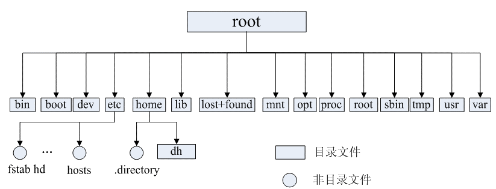

面试题：https://mp.weixin.qq.com/s/KhS7uE9tYQ4jsmwFrJswYA

## 目录结构

### 目录结构



- **/bin**：
  bin是Binary的缩写, 这个目录存放着最经常使用的命令。

- **/boot：**
  这里存放的是启动Linux时使用的一些核心文件，包括一些连接文件以及镜像文件。

- **/dev ：**
  dev是Device(设备)的缩写, 该目录下存放的是Linux的外部设备，在Linux中访问设备的方式和访问文件的方式是相同的。

- **/etc：**
  这个目录用来存放所有的系统管理所需要的配置文件和子目录。

- **/home**：
  用户的主目录，在Linux中，每个用户都有一个自己的目录，一般该目录名是以用户的账号命名的。

- **/lib**：
  这个目录里存放着系统最基本的动态连接共享库，其作用类似于Windows里的DLL文件。几乎所有的应用程序都需要用到这些共享库。

- **/lost+found**：
  这个目录一般情况下是空的，当系统非法关机后，这里就存放了一些文件。

- **/media**：
  linux系统会自动识别一些设备，例如U盘、光驱等等，当识别后，linux会把识别的设备挂载到这个目录下。

- **/mnt**：
  系统提供该目录是为了让用户临时挂载别的文件系统的，我们可以将光驱挂载在/mnt/上，然后进入该目录就可以查看光驱里的内容了。

- **/opt**：
   这是给主机额外安装软件所摆放的目录。比如你安装一个ORACLE数据库则就可以放到这个目录下。默认是空的。

- **/proc**：
  这个目录是一个虚拟的目录，它是系统内存的映射，我们可以通过直接访问这个目录来获取系统信息。
  这个目录的内容不在硬盘上而是在内存里，我们也可以直接修改里面的某些文件，比如可以通过下面的命令来屏蔽主机的ping命令，使别人无法ping你的机器：

  ```
  echo 1 > /proc/sys/net/ipv4/icmp_echo_ignore_all
  ```

- **/root**：
  该目录为系统管理员，也称作超级权限者的用户主目录。

- **/sbin**：
  s就是Super User的意思，这里存放的是系统管理员使用的系统管理程序。

- **/selinux**：
   这个目录是Redhat/CentOS所特有的目录，Selinux是一个安全机制，类似于windows的防火墙，但是这套机制比较复杂，这个目录就是存放selinux相关的文件的。

- **/srv**：
   该目录存放一些服务启动之后需要提取的数据。

- **/sys**：

   这是linux2.6内核的一个很大的变化。该目录下安装了2.6内核中新出现的一个文件系统 sysfs 。

  sysfs文件系统集成了下面3种文件系统的信息：针对进程信息的proc文件系统、针对设备的devfs文件系统以及针对伪终端的devpts文件系统。


  该文件系统是内核设备树的一个直观反映。

  当一个内核对象被创建的时候，对应的文件和目录也在内核对象子系统中被创建。

- **/tmp**：
  这个目录是用来存放一些临时文件的。

- **/usr**：
   这是一个非常重要的目录，用户的很多应用程序和文件都放在这个目录下，类似于windows下的program files目录。

- **/usr/bin：**
  系统用户使用的应用程序。

- **/usr/sbin：**
  超级用户使用的比较高级的管理程序和系统守护程序。

- **/usr/src：**
  内核源代码默认的放置目录。

- **/var**：
  这个目录中存放着在不断扩充着的东西，我们习惯将那些经常被修改的目录放在这个目录下。包括各种日志文件。

- **/run**：
  是一个临时文件系统，存储系统启动以来的信息。当系统重启时，这个目录下的文件应该被删掉或清除。如果你的系统上有 /var/run 目录，应该让它指向 run。

### 目录操作命令

#### ls 列出目录	

```javascript
[root@localhost oracle]# ls
```

选项参数： 

- -a, –all 列出目录下的所有文件，包括以 . 开头的隐含文件。
- -A同-a，但不列出“.”(表示当前目录)和“..”(表示当前目录的父目录)。
- -c 配合 -lt：根据 ctime 排序及显示 ctime (文件状态最后更改的时间)配合 -l：显示 ctime 但根据名称排序否则：根据 ctime 排序
- -C 每栏由上至下列出项目
- –color[=WHEN] 控制是否使用色彩分辨文件。WHEN 可以是’never’、’always’或’auto’其中之一
- -d, –directory 将目录象文件一样显示，而不是显示其下的文件。
- -D, –dired 产生适合 Emacs 的 dired 模式使用的结果
- -f 对输出的文件不进行排序，-aU 选项生效，-lst 选项失效
- -g 类似-l,但不列出所有者
- -G, –no-group 不列出任何有关组的信息
- -h, –human-readable 以容易理解的格式列出文件大小 (例如 1K 234M 2G)
- –si 类似 -h,但文件大小取 1000 的次方而不是 1024
- -H, –dereference-command-line 使用命令列中的符号链接指示的真正目的地
- –indicator-style=方式 指定在每个项目名称后加上指示符号<方式>：none (默认)，classify (-F)，file-type (-p)
- -i, –inode印出每个文件的 inode 号
- -I, –ignore=样式 不印出任何符合 shell 万用字符<样式>的项目
- -k 即 –block-size=1K,以 k 字节的形式表示文件的大小。
- ***-l 除了文件名之外，还将文件的权限、所有者、文件大小等信息详细列出来。***
- -L, –dereference 当显示符号链接的文件信息时，显示符号链接所指示的对象而并非符号链接本身的信息
- -m所有项目以逗号分隔，并填满整行行宽
- -o 类似 -l,显示文件的除组信息外的详细信息。
- -r, –reverse 依相反次序排列
- **-R, –recursive 同时列出所有子目录层 --递归 ** 
- -s, –size 以块大小为单位列出所有文件的大小
- -S 根据文件大小排序
- -t 以文件修改时间排序
- -u 配合 -lt:显示访问时间而且依访问时间排序- 配合` -l`:显示访问时间但根据名称排序
- -U 不进行排序;依文件系统原有的次序列出项目
- -v 根据版本进行排序
- -w, –width=COLS 自行指定屏幕宽度而不使用目前的数值
- -x 逐行列出项目而不是逐栏列出
- -X 根据扩展名排序
- -1 每行只列出一个文件
- –help 显示此帮助信息并离开
- –version 显示版本信息并离开
- –sort=WORD 以下是可选用的 WORD 和它们代表的相应选项：
  - extension -X status -c
  - none -U time -t
  - size -S atime -u
  - time -t access -u
  - version -v use -u

```shell
# 查看文件名以 t 开头的文件信息
ls -l t*
```

```shell
# 列出/usr/local 文件下的子目录
ls -F /usr/local/ |grep /$
```

```shell
# 列出/usr/local 文件下的子目录详细情况，包括权限等
ls -l /usr/local/ | grep "^d"
```

```shell
# 列出所有目录和档案，目录后加 / ，可执行文件后加 * 
ls -AF
```

```shell
# 目录文件个数
ls -l * |grep "^d"|wc -l
```

```shell
# 不论类型文件个数
ls -l * |grep "^-"|wc -l
```

```shell
# 列出当前目录下所有文件（包括隐藏文件）的绝对路径
find $PWD -maxdepth 1 | xargs ls ld
```

```shell
# 递归列出当前目录下所有文件绝对路径
find $PWD | xargs ls -ld
```

#### ll

​	可以看到该目录下的所有目录和文件的详细信息


#### cd 切换目录

- **cd usr：** 切换到该目录下usr目录
- **cd ..（或cd../）：** 切换到上一层目录
- **cd /：** 切换到系统根目录
- **cd ~：** 切换到用户主目录
- **cd -：** 切换到上一个操作所在目录


#### pwd 显示所在目录

**pwd -p 显示确实路径，非连结路径**

```javascript
[root@www ~]# cd /var/mail   <==注意，/var/mail是一个连结档
[root@www mail]# pwd
/var/mail         <==列出目前的工作目录
[root@www mail]# pwd -P
/var/spool/mail   <==怎么回事？有没有加 -P 差很多～
[root@www mail]# ls -ld /var/mail
lrwxrwxrwx 1 root root 10 Sep  4 17:54 /var/mail -> spool/mail
# 看到这里应该知道为啥了吧？因为 /var/mail 是连结档，连结到 /var/spool/mail 
# 所以，加上 pwd -P 的选项后，会不以连结档的数据显示，而是显示正确的完整路径啊！
```

#### mkdir 创建目录

```shell
mkdir 目录名称： #增加目录
```

```shell
mkdir -m 711 test2  #-m：直接配置文件权限
```

```shell
mkdir -p test1/test2/test3/test4   #-p：递归创建目录
```

```shell
mkdir -v test4  #创建新目录并显示信息
```

```shell
# 一个命令创建目录
mkdir -vp  project/{lib/,bin/,doc/{info,product},logs/{info,product},service/deploy/{info,product}}
```


#### cp 复制  

```shell
cp -r 目录名称 目录拷贝的目标位置
```

参数：

**-a：**相当於 -pdr 的意思，至於 pdr 请参考下列说明；(常用)

**-i：**若目标档(destination)已经存在时，在覆盖时会先询问动作的进行(常用)

**-p：**连同文件的属性一起复制过去，而非使用默认属性(备份常用)；

**-r：**递归持续复制，用於目录的复制行为；(常用)

**-d：**若来源档为连结档的属性(link file)，则复制连结档属性而非文件本身；

#### rm 移除文件或目录

   参数：

   - -f ：强行删除；
   - -i ：交互式删除，在删除前会询问使用者是否动作
   - -r ：递归删除啊！最常用在目录的删除了！这是非常危险的选项！！！

```shell
# 删除任何。txt文件并逐一询问
rm -i *.txt
```

```shell
# 删除以 -f 开头的文件
rm -- -f
```


#### mv 移动或改名

```shell
mv 目录名称 新目录名称： 修改目录的名称（改）
mv 目录名称 目录的新位置： 移动目录的位置---剪切（改）
```

   - -f ：force 强制的意思，如果目标文件已经存在，不会询问而直接覆盖；
   - -i ：若目标文件 (destination) 已经存在时，就会询问是否覆盖！
   - -u ：若目标文件已经存在，且 source 比较新，才会升级 (update)
   - -b：覆盖前先备份
   - -t：指定mv目录，适用于多个源文件移动到一个目录


## 文件内容查看

#### cat  

​	查看显示文件内容 ：cat filename

​	    从键盘创建文件：cat > filename只能创建不能编辑已有文件

​	    合并文件： cat file1 file2 > file 

- `-A`, `--show-all` 等价于 `-vET`
- `-b`, `--number-nonblank` 对非空输出行编号
- `-e` 等价于 `-vE`
- `-E`, `--show-ends` 在每行结束处显示`$`
- `-n`, `--number` 对输出的所有行编号,由1开始对所有输出的行数编号
- `-s`, `--squeeze-blank` 有连续两行以上的空白行，就代换为一行的空白行
- `-t` 与 `-vT` 等价
- `-T`, `--show-tabs` 将跳格字符显示为 `^I`
- `-u` (被忽略)
- `-v`, `--show-nonprinting` 使用 `^` 和 `M-` 引用，除了 `LFD` 和 `TAB` 之外

```shell
# mylog1文件内容加上行号后输入mylog2
cat -n mylog1.log mylog2.log
```

```shell
# log1和log2的非空行加上行号，添加到log
cat -b log1.log log2.log log.log
```


tac  从最后一行开始显示，可以看出 tac 是 cat 的倒著写！

nl   显示的时候，顺道输出行号！

####more 

一页一页的显示文件内容

可以显示百分比，回车可以向下一行， 空格可以向下一页，q可以退出查看

####less 

与 more 类似，但是比 more 更好的是，他可以往前翻页！

可以使用键盘上的PgUp和PgDn向上 和向下翻页，q结束查看

####head 

查看文件头部

####tail 

查看文件末尾

- **tail-10 ：** 查看文件的后10行，Ctrl+C结束


## 文件属性

```
ls -l
```

> ```
> total 64
> dr-xr-xr-x   2 root root 4096 Dec 14  2012 bin
> -rw-r--r--. 1 root root 1285396902 Nov 13 09:24 linux_11gR2_database_1of2.zip
> ```

- 第0个字符

  代表文件类型：[d]为目录，[ - ]为文件，[ l ]为链接文档，[ b ]为文件可随机存取装置，[ c ]为串行接口设备。

- 1~3个字符

  确认拥有者权限，[r]为读，[ w ]为写，[ x ]为有执行权限，[-]代表没有权限

- 4~6个字符

  确定属组权限

- 7~9个字符

  确定其他用户权限


### 更改文件属性

1. chgrp：更改文件属组

   ```
   chgrp [-R] 属组名 文件名
   ```

   -R：递归改文件属组

2. chown：更改文件拥有者，也可同时更改文件属组

   ```
   chown [–R] 属主名 文件名
   chown [-R] 属主名：属组名 文件名
   ```

3. chmod：更改文件9个属性

   权限对应数字：r：4；w：2；x：1

   owner = rwx = 4+2+1 = 7

   group = rwx = 4+2+1 = 7

   others= --- = 0+0+0 = 0

   ```shell
   chmod 777 .bashrc
   ```

   4.符号类型改变文件权限

   u代表user；g代表group；o代表others；a代表all

   |       | u    | + 加入 | r    |
   | ----- | ---- | ------ | ---- |
   | chmod | g    | - 除去 | w    |
   |       | o    | = 设定 | x    |
   |       | a    |        |      |

   ```
   chmod  a+x test1
   ```

   给test1 的所有用户添加执行权限


## 文件查找

### witch

查看可执行文件的位置，默认找PATH内所规范的目录

- `-n` -　指定文件名长度，指定的长度必须大于或等于所有文件中最长的文件名。
- `-p` - 与`-n`参数相同，但此处的包括了文件的路径。
- `-w` - 指定输出时栏位的宽度。
- `-V` - 显示版本信息

```shell
# 找出adduser命令
which adduser
/usr/bin/which: no adduser in (/usr/local/bin:/usr/bin:/usr/local/sbin:/usr/sbin:/home/yiibai/.local/bin:/home/yiibai/bin)
```

因为adduser是bash 内建命令，所以找不到

### whereis

定位可执行文件、源码文件、帮助文件

- `-b` - 定位可执行文件。
- `-m` - 定位帮助文件。
- `-s` - 定位源代码文件。
- `-u` - 搜索默认路径下除可执行文件、源代码文件、帮助文件以外的其它文件。
- `-B` - 指定搜索可执行文件的路径。
- `-M` - 指定搜索帮助文件的路径。
- `-S` - 指定搜索源代码文件的路径。

```shell
# 找出Python相关文件
whereis python
python: /usr/bin/python /usr/bin/python2.7 /usr/lib/python2.7 /usr/lib64/python2.7 /etc/python /usr/include/python2.7 /usr/share/man/man1/python.1.gz
```

### find

```
find pathname -options [-print -exec -ok ...]
```

**命令参数：**

- `pathname` - find命令所查找的目录路径。例如用.来表示当前目录，用/来表示系统根目录。
- `-print` - find命令将匹配的文件输出到标准输出。
- `-exec` - find命令对匹配的文件执行该参数所给出的shell命令。相应命令的形式为’command’ { } \;，注意{ }和\；之间的空格。
- `-ok` - 和`-exec`的作用相同，只不过以一种更为安全的模式来执行该参数所给出的shell命令，在执行每一个命令之前，都会给出提示，让用户来确定是否执行。

**命令选项：**

- `-name` 按照文件名查找文件。
- `-perm` 按照文件权限来查找文件。
- `-prune` 使用这一选项可以使`find`命令不在当前指定的目录中查找，如果同时使用`-depth`选项，那么`-prune`将被`find`命令忽略。
- `-user` 按照文件属主来查找文件。
- `-group` 按照文件所属的组来查找文件。
- `-mtime -n +n` 按照文件的更改时间来查找文件， - n表示文件更改时间距现在n天以内，+ n表示文件更改时间距现在n天以前。`find`命令还有`-atime`和`-ctime` 选项，但它们都和`-m time`选项。
- `-nogroup` 查找无有效所属组的文件，即该文件所属的组在`/etc/groups`中不存在。
- `-nouser` 查找无有效属主的文件，即该文件的属主在`/etc/passwd`中不存在。
- `-newer file1 ! file2` 查找更改时间比文件`file1`新但比文件`file2`旧的文件。
- `-type` 查找某一类型的文件，诸如：
- `b` - 块设备文件。
- `d` - 目录。
- `c` - 字符设备文件。
- `p` - 管道文件。
- `l` - 符号链接文件。
- `f` - 普通文件。
- `-size n：[c]` 查找文件长度为`n`块的文件，带有`c`时表示文件长度以字节计。`-depth`：在查找文件时，首先查找当前目录中的文件，然后再在其子目录中查找。
- `-fstype`：查找位于某一类型文件系统中的文件，这些文件系统类型通常可以在配置文件`/etc/fstab`中找到，该配置文件中包含了本系统中有关文件系统的信息。
- `-mount`：在查找文件时不跨越文件系统`mount`点。
- `-follow`：如果find命令遇到符号链接文件，就跟踪至链接所指向的文件。
- `-cpio`：对匹配的文件使用`cpio`命令，将这些文件备份到磁带设备中。

另外,下面三个的区别:

- `-amin n` 查找系统中最后`N`分钟访问的文件
- -`atime n` 查找系统中最后`n*24`小时访问的文件
- `-cmin n` 查找系统中最后`N`分钟被改变文件状态的文件
- `-ctime n` 查找系统中最后`n*24`小时被改变文件状态的文件
- `-mmin n` 查找系统中最后`N`分钟被改变文件数据的文件
- `-mtime n` 查找系统中最后`n*24`小时被改变文件数据的文件

```shell
# 找出2*24小时内修改过的文件
find -atime -2
```

```shell
# 关键字查找：找出当前目录以.log结尾的文件。“.”代表当前目录
find . -name "*.log"
```

```shell
# 按权限查找，找出权限777的文件
find /home/yiibai -perm 777
```

```shell
# 按类型查找，当前目录.log的普通文件
find . -type f -name "*.log"
```

```shell
# 查找当前所以目录，并排序
find . -type d | sort
```

```shell
# 按大小查找文件，当前目录大于1k的文件
find . -size +1000c -print
```

### find -exec参数

用于查找后的进一步操作，

- `-exec` 参数后面跟的是`command`命令，它的终止是以;为结束标志的，所以这句命令后面的分号是不可缺少的，考虑到各个系统中分号会有不同的意义，所以前面加反斜杠。
- `**{}`花括号代表前面`find`查找出来的文件名**

```shell
# ls-l命令
find . -type f -exec ls -l {} \;
```

```shell
# 查找更改时间在n日以前的文件并删除
find . -type f -mtime +14 -exec rm {} \;
```

```shell
# 查找更改时间在n日以前的文件并删除，删除之前提示
find . -name "*.log" -mtime +5 -ok rm {} \;
```

```shell
# 查找文件移动到指定目录
find . -name "*.log" -exec mv {} .. \;
```

### find -xargs参数

`find`命令把匹配到的文件传递给`xargs`命令，而`xargs`命令每次只获取一部分文件而不是全部，不像`-exec`选项那样。这样它可以先处理最先获取的一部分文件，然后是下一批，并如此继续下去

```shell
# 查找文件，用xargs测试他们分别属于哪类文件
find . -type f -print | xargs file
```

```shell
# 查找内存信息文件（coredump），保存tmpcore.log
find / -name "core" -print | xargs echo "" > /home/yiibai/tmpcore.log
```

```shell
#查找当前目录所有用户具有读写和执行权限的文件，并回收权限
find . -perm -7 -print | xargs chmod o-w
```

```
#用grep在当前目录下，所有普通文件中搜索import这词
find . -name \* -type f -print | xargs grep "import"
```


### find常用参数实例


## 文件编辑

**vim 文件**

vim 文件------>进入文件----->命令模式------>按i进入编辑模式----->编辑文件 ------->按Esc进入底行模式----->输入：wq/q! （输入wq代表写入内容并退出，即保存；输入q!代表强制退出不保存。）


## 用户和用户组

### 用户管理

1、添加

```
useradd 选项 用户名
```

- -c comment 指定一段注释性描述。

- -d 目录 指定用户主目录，如果此目录不存在，则同时使用-m选项，可以创建主目录。

  ```shell
  # useradd –d /usr/sam -m sam
  ```

- -g 用户组 指定用户所属的用户组。

- -G 用户组，用户组 指定用户所属的附加组。

- -s Shell文件 指定用户的登录Shell。

  ```shell
  # useradd -s /bin/sh -g group –G adm,root gem
  ```

  > 新建了一个用户gem，该用户的登录Shell是 `/bin/sh`，它属于group用户组，同时又属于adm和root用户组，其中group用户组是其主组

- -u 用户号 指定用户的用户号，如果同时有-o选项，则可以重复使用其他用户的标识号。

2、删除用户

```
userdel 选项 用户名
```

```
# userdel -r sam
```

> 用户的主目录一起删除
>
> 删除用户sam在系统文件中（主要是/etc/passwd, /etc/shadow, /etc/group等）的记录，同时删除用户的主目录

3、修改账号

4、用户口令管理

> ```
> passwd 选项 用户名
> ```

- -l 锁定口令，即禁用账号。
- -u 口令解锁。
- -d 使账号无口令。
- -f 强迫用户下次登录时修改口令

> 用户账号刚创建时没有口令，但是被系统锁定，无法使用，必须为其指定口令后才可以使用，即使是指定空口令


### 用户组管理

1、新增用户组

> ```
> groupadd 选项 用户组
> ```

- -g GID 指定新用户组的组标识号（GID）。
- -o 一般与-g选项同时使用，表示新用户组的GID可以与系统已有用户组的GID相同


```shell
# groupadd group1
```

增加新组group1，新组的组标识号是在当前已有的最大组标识号的基础上加1。

```shell
# groupadd -g 101 group2
```

新组group2，同时指定新组的组标识号是101。

2、删除用户组

> ```
> groupdel 用户组
> ```

3、修改用户组属性

> ```
> groupmod 选项 用户组
> ```

- -g GID   为用户组指定新的组标识号。

  ```
  # groupmod -g 102 group2
  ```

- -o 与-g选项同时使用，用户组的新GID可以与系统已有用户组的GID相同。

- -n新用户组   将用户组的名字改为新名字

```
# groupmod –g 10000 -n group3 group2
```

> 将组group2的标识号改为10000，组名修改为group3


## 磁盘管理

### df

列出文件系统的整体磁盘使用量

```
[root@CT1190 log]# df

文件系统               1K-块        已用     可用 已用% 挂载点
/dev/sda7             19840892    890896  17925856   5% /
/dev/sda9            203727156 112797500  80413912  59% /opt
/dev/sda8              4956284    570080   4130372  13% /var
/dev/sda6             19840892   1977568  16839184  11% /usr
/dev/sda3               988116     23880    913232   3% /boot
tmpfs                 16473212         0  16473212   0% /dev/shm
```

第一列：文件系统对应的设备文件路径名（硬盘的分区）

第二列：分区包含的数据块数目

第三四列：已用和可用数据块数目

最后列：文件系统的挂载点

### du

对文件和目录磁盘使用的空间的查看

```shell
#显示指定文件或目录占的空间
du log3.log
du /usr/local
```


### fdisk

用于磁盘分区

## yum命令

- 1.列出所有可更新的软件清单命令：yum check-update
- 2.更新所有软件命令：yum update
- 3.仅安装指定的软件命令：yum install <package_name>
- 4.仅更新指定的软件命令：yum update <package_name>
- 5.列出所有可安裝的软件清单命令：yum list
- 6.删除软件包命令：yum remove <package_name>
- 7.查找软件包 命令：yum search <keyword>
- 8.清除缓存命令:
  - yum clean packages: 清除缓存目录下的软件包
  - yum clean headers: 清除缓存目录下的 headers
  - yum clean oldheaders: 清除缓存目录下旧的 headers
  - yum clean, yum clean all (= yum clean packages; yum clean oldheaders) :清除缓存目录下的软件包及旧的headers

## 网络命令

### ifconfig

查看和配置网络设备 	**ifconfig    网络设备  参数 **

**命令参数**：

- `up` 启动指定网络设备/网卡。
- `down` 关闭指定网络设备/网卡。该参数可以有效地阻止通过指定接口的IP信息流，如果想永久地关闭一个接口，我们还需要从核心路由表中将该接口的路由信息全部删除。
- `arp` 设置指定网卡是否支持ARP协议。
- `-promisc` 设置是否支持网卡的`promiscuous`模式，如果选择此参数，网卡将接收网络中发给它所有的数据包
- `-allmulti` 设置是否支持多播模式，如果选择此参数，网卡将接收网络中所有的多播数据包
- `-a` 显示全部接口信息
- `-s` 显示摘要信息(类似于 netstat -i)
- `add` 给指定网卡配置IPv6地址
- `del` 删除指定网卡的IPv6地址
- `mtu`<字节数> 设置网卡的最大传输单元 (bytes)
- `netmask`<子网掩码> 设置网卡的子网掩码。掩码可以是有前缀0x的32位十六进制数，也可以是用点分开的4个十进制数。如果不打算将网络分成子网，可以不管这一选项；如果要使用子网，那么请记住，网络中每一个系统必须有相同子网掩码。
- `tunel` 建立隧道
- `dstaddr` 设定一个远端地址，建立点对点通信
- `-broadcast`<地址> 为指定网卡设置广播协议
- `-pointtopoint`<地址> 为网卡设置点对点通讯协议
- `multicast` 为网卡设置组播标志
- `address` 为网卡设置IPv4地址
- `txqueuelen`<长度> 为网卡设置传输列队的长度

```shell
# 为网卡配置和删除IPv6地址
ifconfig eth0 add 33ffe:3240:800:1005::2/64
ifconfig eth0 del 33ffe:3240:800:1005::2/64
```

```shell
#修改MAC地址
ifconfig eth0 hw ether 00:AA:BB:CC:DD:EE
```

### ping

- `-d` 使用Socket的SO_DEBUG功能。
- `-f` 极限检测。大量且快速地送网络封包给一台机器，看它的回应。
- `-n` 只输出数值。
- `-q` 不显示任何传送封包的信息，只显示最后的结果。
- `-r` 忽略普通的Routing Table，直接将数据包送到远端主机上。通常是查看本机的网络接口是否有问题。
- `-R` 记录路由过程。
- `-v` 详细显示指令的执行过程。
- `-c` 数目：在发送指定数目的包后停止。
- `-i` 秒数：设定间隔几秒送一个网络封包给一台机器，预设值是一秒送一次。
- `-I` 网络界面：使用指定的网络界面送出数据包。
- `-l` 前置载入：设置在送出要求信息之前，先行发出的数据包。
- `-p` 范本样式：设置填满数据包的范本样式。
- `-s` 字节数：指定发送的数据字节数，预设值是`56`，加上8字节的ICMP头，一共是64ICMP数据字节。
- `-t` 存活数值：设置存活数值`TTL`的大小。

### netstat -an

- 查看当前系统的端口使用

## 其他

### grep

强大的文本搜索工具，它能使用正则表达式搜索文本，并把匹 配的行打印出来

- **grep 要搜索的字符串 要搜索的文件 --color：** 搜索命令，--color代表高亮显示


### ln

> 为某一个文件在另一个位置建立一个同步链接

*当我们需要在不同的目录，用到相同的文件时，我们不需要在每一个需要的目录下都放一个必须相同的文件，我们只要在某个固定的目录，放上该文件，然后在 其它的目录下用`ln`命令链接(link)它就可以，不必重复的占用磁盘空间*

**硬链接**：一个档案可以有多个名称，存在同一个文件系统中

- 软链接，以路径的形式存在。类似于Windows操作系统中的快捷方式
- 软链接可以 跨文件系统 ，硬链接不可以
- 软链接可以对一个不存在的文件名进行链接
- 软链接可以对目录进行链接

**软链接**：产生一个特殊的档案，该档案的内容是指向另一个档案的位置。跨越不同的文件系统

1. 硬链接，以文件副本的形式存在。但不占用实际空间。
2. 不允许给目录创建硬链接
3. 硬链接只有在同一个文件系统中才能创建

**命令参数：**

​	**必要参数:**

- `-b` 删除，覆盖以前建立的链接
- `-d` 允许超级用户制作目录的硬链接
- `-f`强制执行
- `-i` 交互模式，文件存在则提示用户是否覆盖
- `-n` 把符号链接视为一般目录
- `-s` 软链接(符号链接)
- `-v` 显示详细的处理过程
  **选择参数:**
- `-S` “-S<字尾备份字符串> ”或 “`--suffix=`<字尾备份字符串>”
- `-V` “-V<备份方式>”或“`--version-control=`<备份方式>”
- `--help` 显示帮助信息
- `--version` 显示版本信息

```shell
#创建软链接，如果newlog丢失，则link2log失效
ln -s newlog.log link2log
```

```shell
#创建硬链接，移除run.py ln2run.py有效
ln run.py ln2run.py
```

### diff

用于比较文件的内容,支持二进制文件

diff的显示格式有：a（add），c（change），d（delete）

```shell
#3c3,4代表file1和file2的三四行不同
diff file1.txt file2.txt
3c3,4
< 1003
---
> 1003a
> 1004
```


### ps

- **ps -ef/ps -aux：** 这两个命令都是查看当前系统正在运行进程，两者的区别是展示格式不同。如果想要查看特定的进程可以使用这样的格式：**ps aux|grep redis** （查看包括redis字符串的进程），也可使用 `pgrep redis -a`。

  注意：如果直接用ps（（Process Status））命令，会显示所有进程的状态，通常结合grep命令查看某进程的状态。


### kill

​	==kill -9 进程的pid：==  杀死进程（-9 表示强制终止。）

​	先用ps查找进程，然后用kill杀掉


参考：

https://www.yiibai.com/linux


