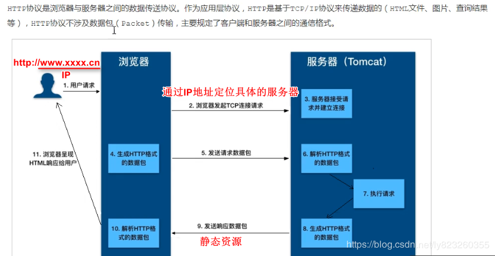
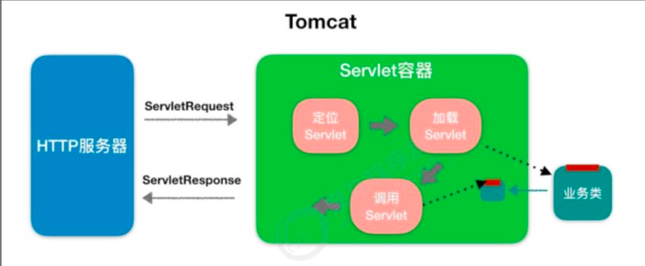
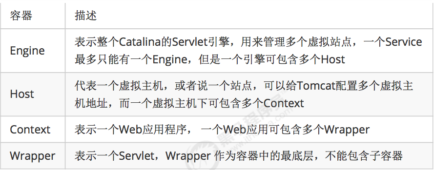

tomcat是一个sevlet容器


## sevlet

概念：运行在服务器端的小程序
* Servlet就是一个接口，定义了Java类被浏览器访问到(tomcat识别)的规则。
* 将来我们自定义一个类，实现Servlet接口，复写方法。


执行原理：
​	1. 当服务器接受到客户端浏览器的请求后，会解析请求URL路径，获取访问的Servlet的资源路径
​	2. 查找web.xml文件，是否有对应的<url-pattern>标签体内容。
​	3. 如果有，则在找到对应的<servlet-class>全类名
​	4. tomcat会将字节码文件加载进内存，并且创建其对象
​	5. 调用其方法

Servlet中的生命周期方法：
1. 被创建：执行init方法，只执行一次
  * Servlet什么时候被创建？
    * 默认情况下，第一次被访问时，Servlet被创建
    * 可以配置执行Servlet的创建时机。
      * 在<servlet>标签下配置
        1. 第一次被访问时，创建
           ​     * <load-on-startup>的值为负数
           ​      2. 在服务器启动时，创建
           ​       * <load-on-startup>的值为0或正整数

	* Servlet的init方法，只执行一次，说明一个Servlet在内存中只存在一个对象，Servlet是单例的
		* 多个用户同时访问时，可能存在线程安全问题。
		* 解决：尽量不要在Servlet中定义成员变量。即使定义了成员变量，也不要对修改值

2. 提供服务：执行service方法，执行多次
	* 每次访问Servlet时，Service方法都会被调用一次。
3. 被销毁：执行destroy方法，只执行一次
	* Servlet被销毁时执行。服务器关闭时，Servlet被销毁
	* 只有服务器正常关闭时，才会执行destroy方法。
	* destroy方法在Servlet被销毁之前执行，一般用于释放资源


Servlet3.0：

 * 好处：
    * 支持注解配置。可以不需要web.xml了。
    * 步骤：
      1. 创建JavaEE项目，选择Servlet的版本3.0以上，可以不创建web.xml
      2. 定义一个类，实现Servlet接口
      3. 复写方法
      4. 在类上使用@WebServlet注解，进行配置
        * @WebServlet("资源路径")


问题：

1、servlet接口中的doGet方法参数，HttpServletRequest req参数是如何实例化？

DispatchServlet 前端控制器，就是初始化servlet，然后调用doGet 方法。

部署tomcat，由tomcat实现HttpServletRequest接口，作为参数传入。RequestFacade


2、war包和jar包区别

都是class文件，


## tomcat

```
bin：脚本目录
	启动脚本：startup.bat
	停止脚本：shutdown.bat
	
conf：配置文件目录
	Catalina：存储每个针对每个虚拟机的Context配置
	context.xml：用于定义所有web应用需要加载的context配置，如果web应用指定了自己的context.xml，该文件被覆盖
	catalina.properties：tomcat环境变量配置
	catalina.policy：tomcat运行的安全策略配置
	logging.properties：tomcat日志配置文件，可修改tomcat日志级别和日志路径等
*	server.xml：核心配置文件
*	tomcat-users.xml：用户权限配置文件
*	web.xml：所有web项目默认配置文件，主要定义了基础servlet和MIMe映射
	
lib：依赖库，tomcat和web项目中需要使用的jar包

logs：日志文件.
	localhost_access_log.*.txt tomcat记录用户访问信息，星*表示时间。
	例如：localhost_access_log.2016-02-28.txt

temp：临时文件目录，文件夹内内容可以任意删除。

webapps：默认情况下发布WEB项目所存放的目录。

work：tomcat处理JSP的工作目录。
```


HTTP工作原理



1）用户通过浏览器进行了一个操作，比如输入网址并回车，或者是点击链接，接着浏览
器获取了这个事件。
2）浏览器向服务端发出TCP连接请求。
3）服务程序接受浏览器的连接请求，并经过TCP三次握手建立连接。
4）浏览器将请求数据打包成一个HTTP协议格式的数据包。
5）浏览器将该数据包推入网络，数据包经过网络传输，最终达到端服务程序。
6）服务端程序拿到这个数据包后，同样以HTTP协议格式解包，获取到客户端的意图。
7）得知客户端意图后进行处理，比如提供静态文件或者调用服务端程序获得动态结果。
8）服务器将响应结果（可能是HTML或者图片等）按照HTTP协议格式打包。
9）服务器将响应数据包推入网络，数据包经过网络传输最终达到到浏览器。
10）浏览器拿到数据包后，以HTTP协议的格式解包，然后解析数据，假设这里的数据是HTML。

## tomcat架构：

### 服务器处理HTTP请求

浏览器发给服务端的是一个HTTP格式的请求，HTTP服务器收到这个请求后，需要调用服务端程序来处理，所谓的服务端程序就是你写的Java类，一般来说不同的请求需要由不同的Java类来处理。


图2，HTTP服务器不直接调用业务类，而是把请求交给容器来处理，容器通过Servlet接口调用业务类。因此Servlet接口和Servlet容器的出现，达到了HTTP服务器与业务类解耦的目的。而Servlet接口和Servlet容器这一整套规范叫作Servlet规范。Tomcat按照Servlet规范的要求实现了Servlet容器，同时它们也具有HTTP服务器的功能。作为Java程序员，如果我们要实现新的业务功能，只需要实现一个Servlet，并把它注册到Tomcat（Servlet容器）中，剩下的事情就由Tomcat帮我们处理了。

当客户请求某个资源时，HTTP服务器会用一个ServletRequest对象把客户的请求信息封装起来，然后调用Servlet容器的service方法，Servlet容器拿到请求后，根据请求的URL和Servlet的映射关系，找到相应的Servlet，如果Servlet还没有被加载，就用反射机制创建这个Servlet，并调用Servlet的init方法来完成初始化，接着调用Servlet的service方法来处理请求，把ServletResponse对象返回给HTTP服务器，HTTP服务器会把响应发送给客户端。




tomcat两个核心功能：

1、处理Socket连接，负责网络字节流与Request和Response对象的转化。
2、加载和管理Servlet，以及具体处理Request请求。

因此Tomcat设计了两个核心组件连接器（Connector）和容器（Container）来分别做这两件事，connector负责对外交流，container负责内部处理。

一个容器可以有多个连接器；

连接器和容器不能单独对外提供服务；

容器和连接器组成的service才能对外提供服务


### 连接器-Coyote

Coyote 是Tomcat的连接器框架的名称 , 是Tomcat服务器提供的供客户端访问的外部接口。客户端通过Coyote与服务器建立连接、发送请求并接受响应。

Coyote 封装了底层的网络通信（Socket 请求及响应处理），为Catalina 容器提供了统一的接口，使Catalina 容器与具体的请求协议及IO操作方式完全解耦。Coyote 将Socket 输入转换封装为 Request 对象，交由Catalina 容器进行处理，处理请求完成后, Catalina 通过Coyote 提供的Response 对象将结果写入输出流。
Coyote 作为独立的模块，只负责具体协议和IO的相关操作，与Servlet 规范实现没有直接关系，因此即便是 Request 和 Response 对象也并未实现Servlet规范对应的接口，而是在Catalina 中将他们进一步封装为ServletRequest 和 ServletResponse 。


（1）Tomcat中只有一个Server，一个Server可以有多个Service，一个Service可以有多个Connector和一个Container； 
（2） Server掌管着整个Tomcat的生死大权； 
（4）Service 是对外提供服务的； 
（5）Connector用于接受请求并将请求封装成Request和Response来具体处理； 
（6）Container用于封装和管理Servlet，以及具体处理request请求；


RequestFacade 门面模式


Context

Host

Engine


##几张图片

###tomcat分层架构


###连接器 - Coyote

只负责具体协议和IO的相关操作，Coyote 将Socket 输入转换封装为 Request 对象，交由Catalina 容器进行处理，处理请求完成后, Catalina 通过Coyote  供的Response 对象将结果写入输出流


EndPoint：Socket接收发送处理器，用来实现TCP/IP协议的

Processor：Processor接收来自EndPoint的Socket，读取字节流解析成Tomcat Request和Response对象，并通过Adapter将其 交到容器处理，用来实现HTTP协议


###catalina架构


###container结构





###启动流程


1) 启动tomcat ， 需要调用 bin/startup.bat (在linux 目录下 , 需要调用 bin/startup.sh) 

， 在startup.bat 脚本中, 调用了catalina.bat。 

2) 在catalina.bat 脚本文件中，调用了BootStrap 中的main方法。 

3)在BootStrap 的main 方法中调用了 init 方法 ， 来创建Catalina 及 初始化类加载器。 

4)在BootStrap 的main 方法中调用了 load 方法 ， 在其中又调用了Catalina的load方 法。 

5)在Catalina 的load 方法中 , 需要进行一些初始化的工作, 并需要构造Digester 对象, 用 于解析 XML。 

6) 然后在调用后续组件的初始化操作 。。 


###请求流程


## tomcat安全策略

###安全配置

1) 删除webapps目录下的所有文件，禁用tomcat管理界面;

2) 注释或删除tomcat-users.xml文件内的所有用户权限;

3) 更改关闭tomcat指令或禁用;

4) 定义错误页面

​	在webapps/ROOT目录下定义错误页面 404.html，500.html;

​	然后在tomcat/conf/web.xml中进行配置 ， 配置错误页面:

​	出现异常不会看到堆栈信息

### 传输安全

​	HTTPS：在HTTP的基础上加入SSL/TLS来进行数据加密。

区别：

​	1) HTTPS协议需要到证书颁发机构CA申请SSL证书, 然后与域名进行绑定，HTTP不用申请证书;

​	 2) HTTP是超文本传输协议，属于应用层信息传输，HTTPS 则是具有SSL加密传安全性传输协议，对数据的传输进行加密，相当于HTTP的升级版;

 	3) HTTP和HTTPS使用的是完全不同的连接方式，用的端口也不一样，前者是8080，后者是8443。

​	 4) HTTP的连接很简单，是无状态的;HTTPS协议是由SSL+HTTP协议构建的可进行加密 传输、身份认证的网络协议，比HTTP协议安全。 


配置：

​	1) 生成秘钥库文件。

​	2) 将秘钥库文件 tomcatkey.keystore 复制到tomcat/conf 目录下。

​	3) 配置tomcat/conf/server.xml


## tomcat性能调优

###1、tomcat性能测试

1). 响应时间:如上所述，为执行某个操作的耗时。大多数情况下，我们需要针对同一个 操作测试多次，以获取操作的平均响应时间。

2). 吞吐量:即在给定的时间内，系统支持的事务数量，计算单位为 TPS。

测试工具：ApacheBench（免费）

测试性能：

```shell
ab ‐n 1000 ‐c 100 ‐p data.json ‐T application/json
http://localhost:9000/course/search.do?page=1&pageSize=10
```


##tomcat性能优化

Tomcat是一款Java应用，那么JVM的配置便与其运行性能密切相关，而JVM优化的重点则集中在内存分配和GC策略的调整上，因为内存会直接影响服务的运行效率和吞吐量，JVM垃圾回收机制则会不同程度地导致程序运行中断。可以根据应用程序的特点，选择不同的垃圾回收策略，调整JVM垃圾回收策略，可以极大减少垃圾回收次数， 升垃圾回收效率，改善程序运行性能

###JVM内存参数：


